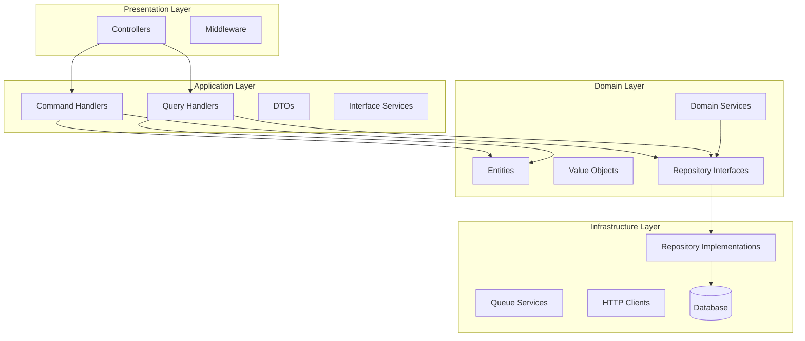
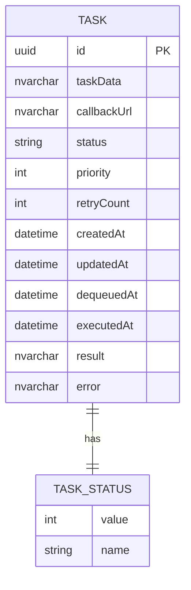

# Data Model Design: Task Management Platform

**Generated**: 2025-09-23
**Phase**: 1 - Domain Model & Entity Design

## Domain Architecture

### Clean Architecture 層級關係圖


## Core Entities

### 1. Task Entity
**Purpose**: 代表系統中的工作單位，包含完整的任務生命週期資訊

```csharp
namespace Lab.TaskManagement.Domain.Entities
{
    public class TaskEntity : BaseEntity
    {
        public Guid Id { get; private set; }
        public string TaskData { get; private set; }
        public string CallbackUrl { get; private set; }
        public TaskStatus Status { get; private set; }
        public int Priority { get; private set; }
        public int RetryCount { get; private set; }
        public DateTime CreatedAt { get; private set; }
        public DateTime? UpdatedAt { get; private set; }
        public DateTime? DequeuedAt { get; private set; }
        public DateTime? ExecutedAt { get; private set; }
        public string? Result { get; private set; }
        public string? Error { get; private set; }

        // 私有建構函式確保使用 Factory Method
        private TaskEntity() { }

        // Factory Method
        public static TaskEntity Create(string taskData, string callbackUrl, int priority = 5)
        {
            if (string.IsNullOrWhiteSpace(taskData))
                throw new ArgumentException("TaskData cannot be empty", nameof(taskData));

            if (!Uri.IsWellFormedUriString(callbackUrl, UriKind.Absolute))
                throw new ArgumentException("Invalid callback URL", nameof(callbackUrl));

            return new TaskEntity
            {
                Id = Guid.NewGuid(),
                TaskData = taskData,
                CallbackUrl = callbackUrl,
                Priority = Math.Clamp(priority, 0, 10),
                Status = TaskStatus.Queued,
                RetryCount = 0,
                CreatedAt = DateTime.UtcNow
            };
        }

        // 狀態轉換方法
        public void MarkAsDequeued()
        {
            if (Status != TaskStatus.Queued)
                throw new InvalidOperationException($"Cannot dequeue task in status {Status}");

            Status = TaskStatus.Dequeued;
            DequeuedAt = DateTime.UtcNow;
            UpdatedAt = DateTime.UtcNow;
        }

        public void MarkAsProcessing()
        {
            if (Status != TaskStatus.Dequeued && Status != TaskStatus.Retry)
                throw new InvalidOperationException($"Cannot process task in status {Status}");

            Status = TaskStatus.Processing;
            ExecutedAt = DateTime.UtcNow;
            UpdatedAt = DateTime.UtcNow;
        }

        public void MarkAsCompleted(string result)
        {
            if (Status != TaskStatus.Processing)
                throw new InvalidOperationException($"Cannot complete task in status {Status}");

            Status = TaskStatus.Completed;
            Result = result;
            UpdatedAt = DateTime.UtcNow;
        }

        public void MarkAsFailed(string error, int maxRetries = 3)
        {
            if (Status != TaskStatus.Processing)
                throw new InvalidOperationException($"Cannot fail task in status {Status}");

            Error = error;
            RetryCount++;

            if (RetryCount < maxRetries)
            {
                Status = TaskStatus.Retry;
            }
            else
            {
                Status = TaskStatus.Failed;
            }

            UpdatedAt = DateTime.UtcNow;
        }

        public void PrepareForRetry()
        {
            if (Status != TaskStatus.Retry)
                throw new InvalidOperationException($"Cannot retry task in status {Status}");

            Status = TaskStatus.Processing;
            UpdatedAt = DateTime.UtcNow;
        }

        public bool CanBeExecuted => Status == TaskStatus.Dequeued || Status == TaskStatus.Retry;
        public bool IsCompleted => Status == TaskStatus.Completed || Status == TaskStatus.Failed;
        public bool NeedsRetry => Status == TaskStatus.Retry;
    }
}
```

### 2. Task Status Enumeration
**Purpose**: 定義任務的所有可能狀態

```csharp
namespace Lab.TaskManagement.Domain.Enums
{
    public enum TaskStatus
    {
        /// <summary>
        /// 任務已建立，等待被取出處理
        /// </summary>
        Queued = 0,

        /// <summary>
        /// 任務已被取出，準備執行
        /// </summary>
        Dequeued = 1,

        /// <summary>
        /// 任務正在執行中
        /// </summary>
        Processing = 2,

        /// <summary>
        /// 任務執行完成
        /// </summary>
        Completed = 3,

        /// <summary>
        /// 任務執行失敗且無法重試
        /// </summary>
        Failed = 4,

        /// <summary>
        /// 任務執行失敗但可以重試
        /// </summary>
        Retry = 5
    }
}
```

### 3. Base Entity
**Purpose**: 提供共用的實體基礎功能

```csharp
namespace Lab.TaskManagement.Domain.Entities
{
    public abstract class BaseEntity
    {
        private readonly List<DomainEvent> _domainEvents = new();

        public IReadOnlyCollection<DomainEvent> DomainEvents => _domainEvents.AsReadOnly();

        public void AddDomainEvent(DomainEvent domainEvent)
        {
            _domainEvents.Add(domainEvent);
        }

        public void RemoveDomainEvent(DomainEvent domainEvent)
        {
            _domainEvents.Remove(domainEvent);
        }

        public void ClearDomainEvents()
        {
            _domainEvents.Clear();
        }
    }
}
```

## Value Objects

### 1. Callback URL Value Object
**Purpose**: 確保回調 URL 的有效性和安全性

```csharp
namespace Lab.TaskManagement.Domain.ValueObjects
{
    public class CallbackUrl : IEquatable<CallbackUrl>
    {
        public string Value { get; private set; }

        private CallbackUrl(string value)
        {
            Value = value;
        }

        public static CallbackUrl Create(string url)
        {
            if (string.IsNullOrWhiteSpace(url))
                throw new ArgumentException("Callback URL cannot be empty", nameof(url));

            if (!Uri.IsWellFormedUriString(url, UriKind.Absolute))
                throw new ArgumentException("Invalid callback URL format", nameof(url));

            var uri = new Uri(url);
            if (uri.Scheme != "https" && uri.Scheme != "http")
                throw new ArgumentException("Callback URL must use HTTP or HTTPS", nameof(url));

            return new CallbackUrl(url);
        }

        public bool Equals(CallbackUrl? other)
        {
            return other is not null && Value == other.Value;
        }

        public override bool Equals(object? obj)
        {
            return Equals(obj as CallbackUrl);
        }

        public override int GetHashCode()
        {
            return Value.GetHashCode();
        }

        public static implicit operator string(CallbackUrl callbackUrl)
        {
            return callbackUrl.Value;
        }
    }
}
```

### 2. Task Data Value Object
**Purpose**: 包裝任務資料並提供序列化/反序列化功能

```csharp
namespace Lab.TaskManagement.Domain.ValueObjects
{
    public class TaskData : IEquatable<TaskData>
    {
        public string JsonValue { get; private set; }

        private TaskData(string jsonValue)
        {
            JsonValue = jsonValue;
        }

        public static TaskData Create<T>(T data)
        {
            if (data == null)
                throw new ArgumentNullException(nameof(data));

            var json = JsonSerializer.Serialize(data);
            return new TaskData(json);
        }

        public static TaskData FromJson(string json)
        {
            if (string.IsNullOrWhiteSpace(json))
                throw new ArgumentException("Task data JSON cannot be empty", nameof(json));

            // 驗證 JSON 格式
            try
            {
                JsonDocument.Parse(json);
            }
            catch (JsonException ex)
            {
                throw new ArgumentException($"Invalid JSON format: {ex.Message}", nameof(json));
            }

            return new TaskData(json);
        }

        public T Deserialize<T>()
        {
            return JsonSerializer.Deserialize<T>(JsonValue)
                ?? throw new InvalidOperationException("Failed to deserialize task data");
        }

        public bool Equals(TaskData? other)
        {
            return other is not null && JsonValue == other.JsonValue;
        }

        public override bool Equals(object? obj)
        {
            return Equals(obj as TaskData);
        }

        public override int GetHashCode()
        {
            return JsonValue.GetHashCode();
        }

        public static implicit operator string(TaskData taskData)
        {
            return taskData.JsonValue;
        }
    }
}
```

## Domain Events

### 1. Task Created Event
```csharp
namespace Lab.TaskManagement.Domain.Events
{
    public class TaskCreatedEvent : DomainEvent
    {
        public Guid TaskId { get; }
        public string CallbackUrl { get; }
        public int Priority { get; }

        public TaskCreatedEvent(Guid taskId, string callbackUrl, int priority)
        {
            TaskId = taskId;
            CallbackUrl = callbackUrl;
            Priority = priority;
        }
    }
}
```

### 2. Task Status Changed Event
```csharp
namespace Lab.TaskManagement.Domain.Events
{
    public class TaskStatusChangedEvent : DomainEvent
    {
        public Guid TaskId { get; }
        public TaskStatus OldStatus { get; }
        public TaskStatus NewStatus { get; }

        public TaskStatusChangedEvent(Guid taskId, TaskStatus oldStatus, TaskStatus newStatus)
        {
            TaskId = taskId;
            OldStatus = oldStatus;
            NewStatus = newStatus;
        }
    }
}
```

## Repository Interfaces

### 1. Task Repository Interface
```csharp
namespace Lab.TaskManagement.Domain.Repositories
{
    public interface ITaskRepository
    {
        Task<TaskEntity?> GetByIdAsync(Guid id, CancellationToken cancellationToken = default);
        Task<TaskEntity?> DequeueNextTaskAsync(CancellationToken cancellationToken = default);
        Task<IEnumerable<TaskEntity>> GetTasksByStatusAsync(TaskStatus status, CancellationToken cancellationToken = default);
        Task<TaskEntity> AddAsync(TaskEntity task, CancellationToken cancellationToken = default);
        Task UpdateAsync(TaskEntity task, CancellationToken cancellationToken = default);
        Task<int> GetQueueCountAsync(CancellationToken cancellationToken = default);
        Task<IEnumerable<TaskEntity>> GetRetryTasksAsync(CancellationToken cancellationToken = default);
    }
}
```

### 2. Task Queue Interface
```csharp
namespace Lab.TaskManagement.Domain.Services
{
    public interface ITaskQueueService
    {
        Task EnqueueAsync(Guid taskId, int priority = 5, CancellationToken cancellationToken = default);
        Task<Guid?> DequeueAsync(CancellationToken cancellationToken = default);
        Task<int> GetQueueCountAsync(CancellationToken cancellationToken = default);
        Task<bool> IsEmptyAsync(CancellationToken cancellationToken = default);
    }
}
```

## Domain Services

### 1. Task Domain Service
```csharp
namespace Lab.TaskManagement.Domain.Services
{
    public class TaskDomainService
    {
        private readonly ITaskQueueService _queueService;

        public TaskDomainService(ITaskQueueService queueService)
        {
            _queueService = queueService;
        }

        public async Task<TaskEntity> CreateAndEnqueueTaskAsync(
            string taskData,
            string callbackUrl,
            int priority = 5,
            CancellationToken cancellationToken = default)
        {
            var task = TaskEntity.Create(taskData, callbackUrl, priority);

            // 加入領域事件
            task.AddDomainEvent(new TaskCreatedEvent(task.Id, task.CallbackUrl, task.Priority));

            // 加入佇列
            await _queueService.EnqueueAsync(task.Id, priority, cancellationToken);

            return task;
        }

        public async Task<bool> CanExecuteTaskAsync(TaskEntity task, CancellationToken cancellationToken = default)
        {
            return task.CanBeExecuted;
        }

        public void HandleTaskCompletion(TaskEntity task, string result)
        {
            var oldStatus = task.Status;
            task.MarkAsCompleted(result);

            // 加入狀態變更事件
            task.AddDomainEvent(new TaskStatusChangedEvent(task.Id, oldStatus, task.Status));
        }

        public void HandleTaskFailure(TaskEntity task, string error, int maxRetries = 3)
        {
            var oldStatus = task.Status;
            task.MarkAsFailed(error, maxRetries);

            // 加入狀態變更事件
            task.AddDomainEvent(new TaskStatusChangedEvent(task.Id, oldStatus, task.Status));
        }
    }
}
```

## Entity Framework Configuration

### 1. Task Entity Configuration
```csharp
namespace Lab.TaskManagement.Infrastructure.Persistence.Configurations
{
    public class TaskEntityConfiguration : IEntityTypeConfiguration<TaskEntity>
    {
        public void Configure(EntityTypeBuilder<TaskEntity> builder)
        {
            builder.ToTable("Tasks");

            builder.HasKey(t => t.Id);

            builder.Property(t => t.TaskData)
                .IsRequired()
                .HasColumnType("nvarchar(max)");

            builder.Property(t => t.CallbackUrl)
                .IsRequired()
                .HasMaxLength(2000);

            builder.Property(t => t.Status)
                .HasConversion<string>()
                .HasMaxLength(20);

            builder.Property(t => t.CreatedAt)
                .IsRequired();

            builder.Property(t => t.UpdatedAt)
                .IsRequired(false);

            builder.Property(t => t.Result)
                .HasColumnType("nvarchar(max)")
                .IsRequired(false);

            builder.Property(t => t.Error)
                .HasMaxLength(1000)
                .IsRequired(false);

            // 索引
            builder.HasIndex(t => t.Status)
                .HasDatabaseName("IX_Tasks_Status");

            builder.HasIndex(t => t.CreatedAt)
                .HasDatabaseName("IX_Tasks_CreatedAt");

            builder.HasIndex(t => new { t.Status, t.Priority })
                .HasDatabaseName("IX_Tasks_Status_Priority");
        }
    }
}
```

## Data Model 關係圖



## Validation Rules

### Entity Level Validations
1. **TaskEntity**:
   - Id 必須是有效的 GUID
   - TaskData 不可為 null 或空字串
   - CallbackUrl 必須是有效的 HTTP/HTTPS URL
   - Priority 範圍必須在 0-10 之間
   - RetryCount 不可為負數
   - 狀態轉換必須符合定義的規則

### Business Rules
1. 只有 `Queued` 狀態的任務可以被取出
2. 只有 `Dequeued` 或 `Retry` 狀態的任務可以執行
3. 任務重試次數不可超過設定的最大值
4. 任務一旦 `Completed` 或 `Failed`（非重試），狀態不可再變更

## Performance Considerations

### Database Indexing Strategy
```sql
-- 主要查詢索引
CREATE INDEX IX_Tasks_Status ON Tasks (Status);
CREATE INDEX IX_Tasks_Status_Priority ON Tasks (Status, Priority);
CREATE INDEX IX_Tasks_CreatedAt ON Tasks (CreatedAt);

-- 佇列操作最佳化
CREATE INDEX IX_Tasks_Queue_Optimized ON Tasks (Status, Priority DESC, CreatedAt ASC)
WHERE Status = 'Queued';
```

### Memory Usage Optimization
- TaskData 使用 JSON 字串儲存，避免複雜物件圖
- 實作 lazy loading 避免不必要的資料載入
- 使用 pagination 處理大量任務查詢

### Concurrency Handling
- 使用樂觀並行控制（Optimistic Concurrency Control）
- DequeueTask 操作使用資料庫層級的行鎖定
- 狀態轉換使用原子性操作確保一致性