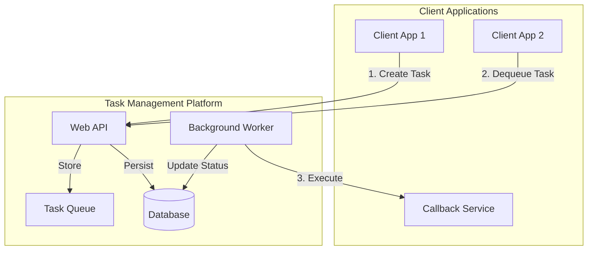

# Quick Start Guide: Task Management Platform

**Version**: 1.0.0
**Last Updated**: 2025-09-23

## 概述

Task Management Platform 是一個集中化的任務管理系統，提供 RESTful API 來建立、處理和追蹤任務執行狀態。本指南將引導您快速設置並驗證系統功能。

## 架構概覽



## 系統需求

- **.NET 8.0** SDK
- **SQL Server 2019+** 或 **PostgreSQL 12+**
- **Docker** (選用，用於本地開發)

## 快速安裝

### 1. 克隆專案並設置環境

```bash
# 克隆專案 (實作完成後)
git clone https://github.com/yaochangyu/Lab.TaskManagement.git
cd Lab.TaskManagement

# 建立開發環境設定
cp appsettings.Development.json.template appsettings.Development.json

# 使用 Docker 啟動資料庫 (選用)
docker-compose up -d sql-server
```

### 2. 設定資料庫連線

編輯 `appsettings.Development.json`：

```json
{
  "ConnectionStrings": {
    "DefaultConnection": "Server=localhost,1433;Database=TaskManagement;User Id=sa;Password=YourPassword123!;TrustServerCertificate=true;"
  },
  "TaskManagement": {
    "MaxRetryAttempts": 3,
    "CallbackTimeout": 30,
    "QueueProvider": "Memory"
  }
}
```

### 3. 執行資料庫遷移

```bash
# 安裝 EF Core CLI 工具
dotnet tool install --global dotnet-ef

# 執行遷移
dotnet ef database update --project src/Lab.TaskManagement.Infrastructure
```

### 4. 啟動 API 服務

```bash
# 啟動開發伺服器
dotnet run --project src/Lab.TaskManagement.WebApi

# 或使用 watch 模式進行開發
dotnet watch run --project src/Lab.TaskManagement.WebApi
```

API 將在 `https://localhost:5001` 啟動，Swagger UI 可在 `https://localhost:5001/swagger` 存取。

## 基本使用流程

### Step 1: 建立任務

```bash
curl -X POST "https://localhost:5001/api/v1/tasks" \
  -H "Content-Type: application/json" \
  -d '{
    "taskData": {
      "operation": "process-document",
      "documentId": "12345",
      "format": "pdf"
    },
    "callbackUrl": "https://your-app.com/callback/task-completed",
    "priority": 5
  }'
```

**回應範例**:
```json
{
  "taskId": "550e8400-e29b-41d4-a716-446655440000",
  "status": "Queued",
  "createdAt": "2025-09-23T10:00:00Z"
}
```

### Step 2: 取出任務進行處理

```bash
curl -X GET "https://localhost:5001/api/v1/tasks/dequeue"
```

**回應範例**:
```json
{
  "taskId": "550e8400-e29b-41d4-a716-446655440000",
  "taskData": {
    "operation": "process-document",
    "documentId": "12345",
    "format": "pdf"
  },
  "callbackUrl": "https://your-app.com/callback/task-completed",
  "status": "Dequeued",
  "dequeuedAt": "2025-09-23T10:01:00Z"
}
```

### Step 3: 執行任務

```bash
curl -X POST "https://localhost:5001/api/v1/tasks/550e8400-e29b-41d4-a716-446655440000/execute"
```

**回應範例**:
```json
{
  "taskId": "550e8400-e29b-41d4-a716-446655440000",
  "status": "Completed",
  "result": {
    "processedPages": 10,
    "outputUrl": "https://storage.example.com/processed-12345.pdf"
  },
  "executedAt": "2025-09-23T10:05:00Z"
}
```

### Step 4: 查詢任務狀態

```bash
curl -X GET "https://localhost:5001/api/v1/tasks/550e8400-e29b-41d4-a716-446655440000"
```

## 回調 API 範例

當任務執行完成時，系統會呼叫您指定的回調 URL。您的服務需要實作以下端點：

### 回調請求格式

```http
POST https://your-app.com/callback/task-completed
Content-Type: application/json

{
  "taskId": "550e8400-e29b-41d4-a716-446655440000",
  "status": "Completed|Failed",
  "result": { /* 執行結果 */ },
  "error": "錯誤訊息 (如果失敗)",
  "executedAt": "2025-09-23T10:05:00Z"
}
```

### 回調服務範例 (C#)

```csharp
[ApiController]
[Route("api/[controller]")]
public class CallbackController : ControllerBase
{
    [HttpPost("task-completed")]
    public async Task<IActionResult> OnTaskCompleted([FromBody] TaskCallbackDto callback)
    {
        try
        {
            // 處理任務完成通知
            await ProcessTaskResult(callback.TaskId, callback.Result);

            // 回傳成功狀態
            return Ok(new { message = "Callback processed successfully" });
        }
        catch (Exception ex)
        {
            // 記錄錯誤，系統將重試
            _logger.LogError(ex, "Failed to process callback for task {TaskId}", callback.TaskId);
            return StatusCode(500, new { error = "Failed to process callback" });
        }
    }
}
```

## 完整工作流程驗證

### 整合測試腳本

建立 `test-workflow.sh` 檔案：

```bash
#!/bin/bash
set -e

BASE_URL="https://localhost:5001/api/v1"

echo "=== Task Management Platform Workflow Test ==="

# 1. 建立任務
echo "Step 1: Creating task..."
CREATE_RESPONSE=$(curl -s -X POST "$BASE_URL/tasks" \
  -H "Content-Type: application/json" \
  -d '{
    "taskData": {
      "operation": "test-workflow",
      "testId": "quickstart-test"
    },
    "callbackUrl": "https://httpbin.org/post",
    "priority": 5
  }')

TASK_ID=$(echo $CREATE_RESPONSE | jq -r '.taskId')
echo "Created task: $TASK_ID"

# 2. 驗證任務已進入佇列
echo "Step 2: Verifying task status..."
sleep 1
STATUS_RESPONSE=$(curl -s -X GET "$BASE_URL/tasks/$TASK_ID")
echo "Task status: $(echo $STATUS_RESPONSE | jq -r '.status')"

# 3. 取出任務
echo "Step 3: Dequeuing task..."
DEQUEUE_RESPONSE=$(curl -s -X GET "$BASE_URL/tasks/dequeue")
DEQUEUED_TASK_ID=$(echo $DEQUEUE_RESPONSE | jq -r '.taskId')
echo "Dequeued task: $DEQUEUED_TASK_ID"

# 4. 執行任務
echo "Step 4: Executing task..."
EXECUTE_RESPONSE=$(curl -s -X POST "$BASE_URL/tasks/$TASK_ID/execute")
echo "Execution result: $(echo $EXECUTE_RESPONSE | jq -r '.status')"

# 5. 最終狀態確認
echo "Step 5: Final status check..."
sleep 2
FINAL_STATUS=$(curl -s -X GET "$BASE_URL/tasks/$TASK_ID")
echo "Final status: $(echo $FINAL_STATUS | jq -r '.status')"

echo "=== Workflow test completed ==="
```

執行測試：
```bash
chmod +x test-workflow.sh
./test-workflow.sh
```

## 效能基準測試

### 建立負載測試

使用 `k6` 進行負載測試：

```javascript
// load-test.js
import http from 'k6/http';
import { check } from 'k6';

export let options = {
  stages: [
    { duration: '30s', target: 10 },  // 暖身
    { duration: '1m', target: 50 },   // 增加負載
    { duration: '1m', target: 100 },  // 維持負載
    { duration: '30s', target: 0 },   // 降低負載
  ],
};

export default function() {
  const payload = JSON.stringify({
    taskData: {
      operation: 'load-test',
      timestamp: Date.now()
    },
    callbackUrl: 'https://httpbin.org/post',
    priority: Math.floor(Math.random() * 10)
  });

  const params = {
    headers: {
      'Content-Type': 'application/json',
    },
  };

  // 建立任務
  let createResponse = http.post('https://localhost:5001/api/v1/tasks', payload, params);
  check(createResponse, {
    'task created': (r) => r.status === 201,
    'response time < 500ms': (r) => r.timings.duration < 500,
  });

  // 取出任務 (25% 的請求)
  if (Math.random() < 0.25) {
    let dequeueResponse = http.get('https://localhost:5001/api/v1/tasks/dequeue');
    check(dequeueResponse, {
      'dequeue successful': (r) => r.status === 200 || r.status === 204,
    });
  }
}
```

執行負載測試：
```bash
k6 run load-test.js
```

## 監控與除錯

### 結構化日誌查詢

```bash
# 查看任務建立日誌
docker logs task-management-api | grep "TaskCreated"

# 查看執行失敗的任務
docker logs task-management-api | grep "TaskExecutionFailed"

# 查看效能指標
curl -X GET "https://localhost:5001/metrics"
```

### 健康檢查端點

```bash
# API 健康狀態
curl -X GET "https://localhost:5001/health"

# 詳細健康檢查
curl -X GET "https://localhost:5001/health/ready"
```

**回應範例**:
```json
{
  "status": "Healthy",
  "totalDuration": "00:00:00.0123456",
  "entries": {
    "database": {
      "status": "Healthy",
      "duration": "00:00:00.0012345"
    },
    "queue": {
      "status": "Healthy",
      "data": {
        "queueCount": 5
      }
    }
  }
}
```

## 常見問題排解

### Q: 任務建立後無法取出
**A**: 檢查資料庫連線和任務狀態，確認任務狀態為 `Queued`

### Q: 回調失敗但任務狀態未更新
**A**: 檢查回調 URL 的可達性和回應狀態碼，確認 HTTP 狀態為 2xx

### Q: 系統效能不如預期
**A**: 檢查資料庫索引、調整連線池大小，考慮啟用 Redis 佇列

### Q: 記憶體使用量過高
**A**: 檢查任務資料大小、調整垃圾回收設定，監控物件生命週期

## 下一步

1. **配置生產環境**: 設定生產資料庫、Redis、監控系統
2. **擴展功能**: 實作任務優先級、排程功能、批次處理
3. **整合認證**: 加入 JWT 或 API Key 認證機制
4. **效能優化**: 啟用分散式快取、資料庫讀寫分離

更多詳細資訊請參閱：
- [API 文檔](./contracts/openapi.yaml)
- [資料模型設計](./data-model.md)
- [實作計畫](./plan.md)