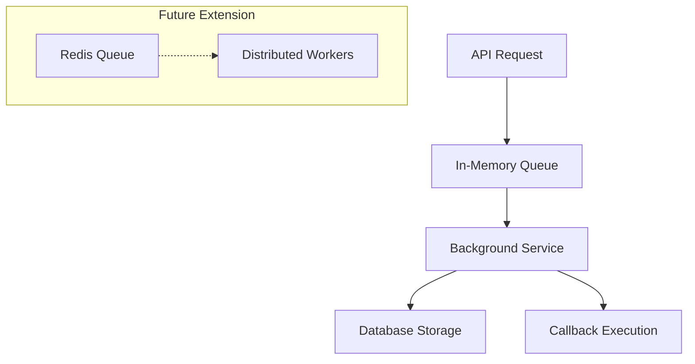
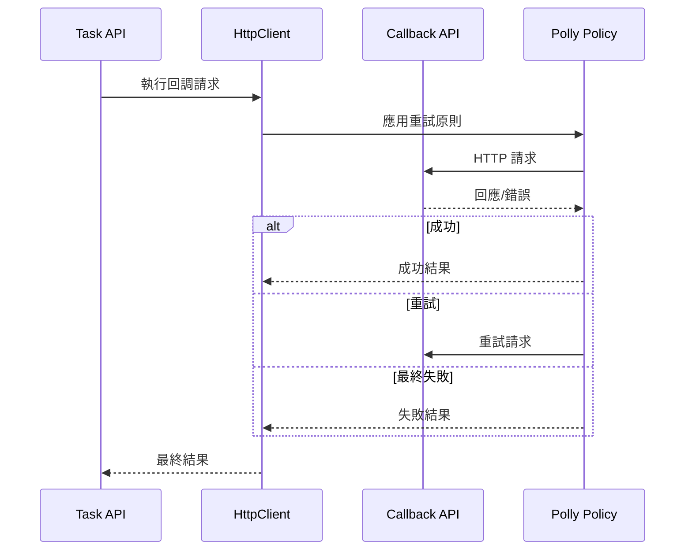
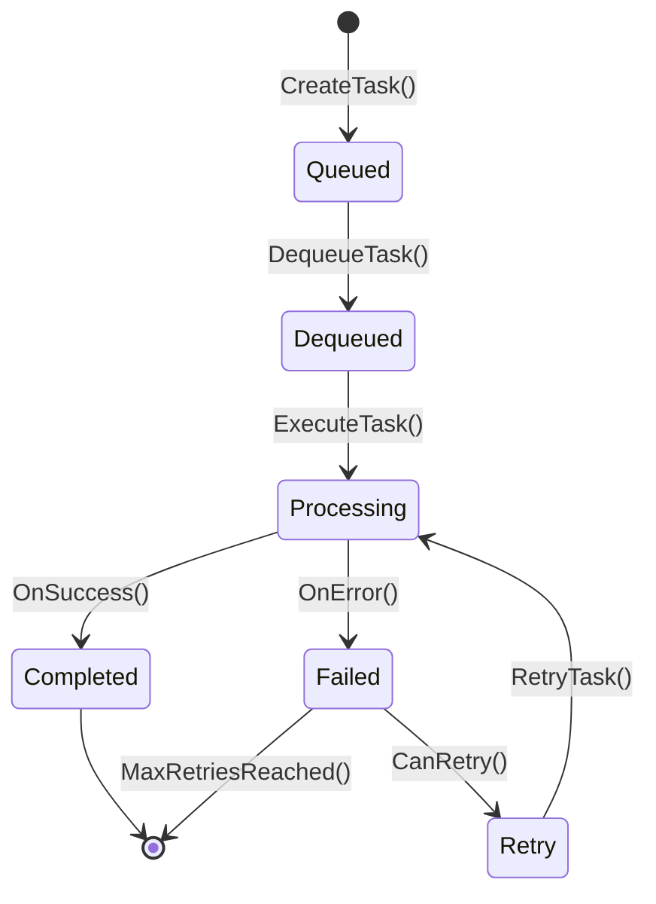
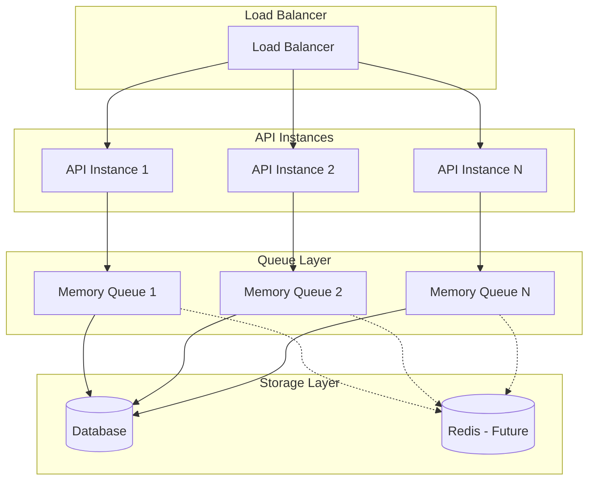

# Research Report: Task Management Platform

**Generated**: 2025-09-23
**Phase**: 0 - Technical Research & Architecture Decisions

## Research Objectives
根據實作計畫的技術需求，研究並確定以下技術選擇：
1. api.template 專案的 Clean Architecture 實作模式
2. 任務佇列存儲解決方案
3. .NET 8 HttpClient 最佳實務
4. Entity Framework Core 狀態管理

## 1. Clean Architecture 實作模式研究

### Decision: 採用四層 Clean Architecture
基於一般性 .NET Clean Architecture 最佳實務（因無法直接存取 api.template）：

### Rationale:
- **Domain Layer**: 包含核心業務邏輯、實體和值物件，不依賴任何外部框架
- **Application Layer**: 包含用例實作、命令/查詢處理器，使用 MediatR 模式
- **Infrastructure Layer**: 實作資料存取、外部服務整合、HTTP 客戶端
- **Presentation Layer**: Web API 控制器、中介軟體、依賴注入設定

### Alternatives Considered:
- N-Layer Architecture: 較簡單但缺乏關注點分離
- Hexagonal Architecture: 概念類似但實作複雜度較高

## 2. 任務佇列存儲解決方案

### Decision: 初期使用 In-Memory Queue + Database，後續可擴展至 Redis


### Rationale:
- **階段 1**: In-Memory ConcurrentQueue 提供高效能和簡單性
- **階段 2**: 可擴展至 Redis 以支援分散式處理
- 資料庫儲存確保任務持久性和狀態追蹤

### Alternatives Considered:
- Direct Database Queue: 效能較差，但一致性較高
- Message Queue (RabbitMQ/Azure Service Bus): 過於複雜，初期不需要

## 3. HttpClient 最佳實務研究

### Decision: 使用 HttpClientFactory + Polly 重試機制



### Implementation Strategy:
```csharp
// 重試原則配置
services.AddHttpClient<CallbackService>(client =>
{
    client.Timeout = TimeSpan.FromSeconds(30);
})
.AddPolicyHandler(GetRetryPolicy());

private static IAsyncPolicy<HttpResponseMessage> GetRetryPolicy()
{
    return Policy
        .HandleResult<HttpResponseMessage>(r => !r.IsSuccessStatusCode)
        .WaitAndRetryAsync(
            retryCount: 3,
            sleepDurationProvider: retryAttempt => TimeSpan.FromSeconds(Math.Pow(2, retryAttempt)));
}
```

### Rationale:
- HttpClientFactory 避免 socket 耗盡問題
- Polly 提供彈性的重試和熔斷機制
- 結構化日誌記錄所有 HTTP 請求

### Alternatives Considered:
- 直接使用 HttpClient: 容易造成資源洩漏
- 自訂重試邏輯: 重複造輪子，不如使用成熟框架

## 4. Entity Framework Core 狀態管理

### Decision: 使用 Enum + State Pattern 結合 EF Core Value Converters

### Task State Machine Implementation:


### Entity Design:
```csharp
public class TaskEntity
{
    public Guid Id { get; set; }
    public string TaskData { get; set; }
    public string CallbackUrl { get; set; }
    public TaskStatus Status { get; set; }
    public int RetryCount { get; set; }
    public DateTime CreatedAt { get; set; }
    public DateTime? UpdatedAt { get; set; }
    public string? Result { get; set; }
    public string? Error { get; set; }
}

public enum TaskStatus
{
    Queued = 0,
    Dequeued = 1,
    Processing = 2,
    Completed = 3,
    Failed = 4,
    Retry = 5
}
```

### Rationale:
- Enum 提供型別安全的狀態管理
- EF Core 自動處理樂觀並行控制
- 狀態轉換邏輯封裝在 Domain Service 中

### Alternatives Considered:
- 字串狀態: 容易出錯且無型別安全
- 複雜狀態機框架: 過度設計，增加不必要複雜度

## 5. 架構決策記錄

### ADR-001: 專案命名空間
- **決策**: 使用 `Lab.TaskManagement.*` 命名空間
- **理由**: 符合實驗室專案慣例，與現有專案保持一致

### ADR-002: 資料庫選擇
- **決策**: 預設 SQL Server，支援 PostgreSQL
- **理由**: Entity Framework Core 提供良好的資料庫抽象

### ADR-003: API 版本控制
- **決策**: 使用 URL path versioning (/api/v1/tasks)
- **理由**: 簡單明瞭，易於理解和測試

## 6. 效能考量

### Scalability Architecture:


### Performance Targets:
- **Throughput**: 1000+ requests/second
- **Latency**: <100ms for queue operations, <5s for callback execution
- **Memory**: <500MB per API instance
- **Concurrency**: 支援 10k+ 並行任務

## 7. 安全性考量

### Security Measures:
- HTTPS 強制要求
- API Key 認證 (後續擴展)
- Input validation 和 sanitization
- 結構化日誌記錄但避免敏感資料洩露
- Callback URL 白名單機制 (可選)

## Implementation Readiness Checklist

- [x] Architecture pattern decided (Clean Architecture)
- [x] Technology stack confirmed (.NET 8, EF Core, MediatR)
- [x] Queue strategy defined (In-Memory → Redis migration path)
- [x] HTTP client strategy established (HttpClientFactory + Polly)
- [x] State management approach confirmed (Enum + State Pattern)
- [x] Performance targets set
- [x] Security considerations documented
- [x] Naming conventions established

## Next Steps: Phase 1
基於此研究，可以開始 Phase 1 設計階段：
1. 詳細資料模型設計
2. API 契約定義
3. 整合測試場景規劃
4. 快速開始指南編寫