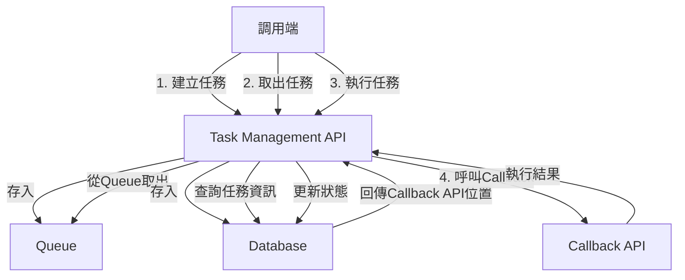
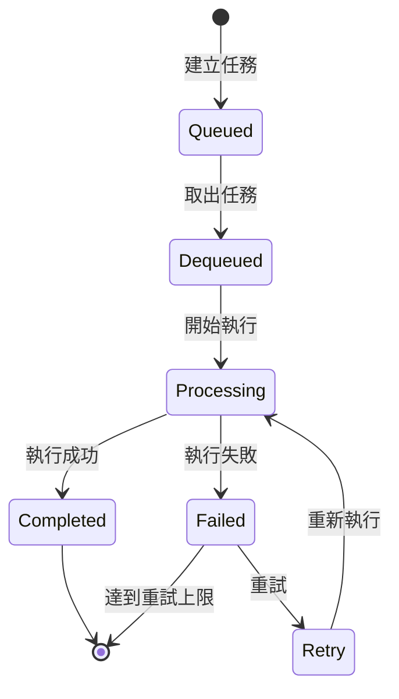
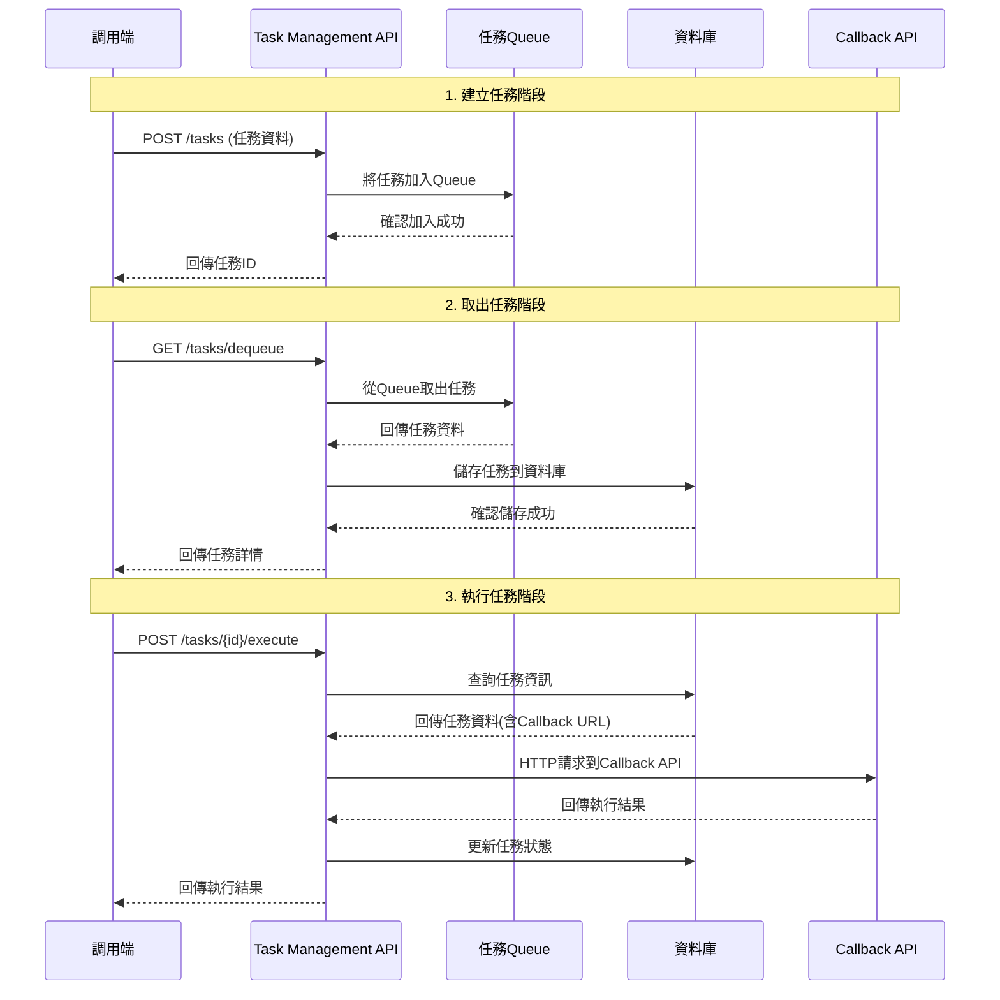

# Feature Specification: Task Management Platform 集中管理平台

**Feature Branch**: `001-task-management-platform`
**Created**: 2025-09-23
**Status**: Draft
**Input**: User description: "建立第一版的 Task Management Platform 集中管的理平台，需要以下 WebAPI 功能
1. 調用端呼叫建立任務 API，API 在 Queue 建立任務資訊
2. 調用端呼叫取出任務 API，API 從 Queue 取出任務資訊，並在資料庫新增任務資訊
3. 調用端呼叫執行任務 API，API 從資料庫取出任務資訊，欄位資訊包含了 Callback API 的位置
4. 調用端使用 HttpClient 呼叫 Callback API"

## 系統流程圖



## 任務狀態機



## 循序圖



## User Scenarios & Testing

### Primary User Story
作為系統開發者，我需要一個集中化的任務管理平台，讓我能夠建立、取出、執行任務，並透過回調機制處理任務結果，以便實現分散式任務處理架構。

### Acceptance Scenarios
1. **Given** 系統正常運作，**When** 調用端呼叫建立任務API並提供任務資料，**Then** 系統應將任務加入Queue並回傳唯一任務ID
2. **Given** Queue中有待處理任務，**When** 調用端呼叫取出任務API，**Then** 系統應從Queue取出一個任務並將其儲存到資料庫，同時回傳任務詳情
3. **Given** 資料庫中有已取出的任務，**When** 調用端呼叫執行任務API，**Then** 系統應查詢任務資訊並呼叫指定的Callback API
4. **Given** 任務執行完成，**When** Callback API回傳結果，**Then** 系統應更新任務狀態並記錄執行結果

### Edge Cases
- 當Queue為空時取出任務，系統應回傳適當的錯誤訊息
- 當Callback API無法連接時，系統應記錄錯誤並標記任務為失敗狀態
- 當執行不存在的任務時，系統應回傳404錯誤
- 當任務已經在執行中時，重複執行請求應被拒絕

## Requirements

### Functional Requirements
- **FR-001**: 系統必須提供建立任務API，接受任務資料並將其加入Queue
- **FR-002**: 系統必須提供取出任務API，從Queue取出任務並儲存到資料庫
- **FR-003**: 系統必須提供執行任務API，查詢任務資訊並呼叫Callback API
- **FR-004**: 系統必須支援任務狀態追蹤(Queued, Dequeued, Processing, Completed, Failed)
- **FR-005**: 系統必須記錄每個任務的Callback API位置
- **FR-006**: 系統必須使用HttpClient呼叫外部Callback API
- **FR-007**: 系統必須處理Callback API呼叫的成功和失敗情況
- **FR-008**: 系統必須為每個任務分配唯一識別碼
- **FR-009**: 系統必須確保Queue和資料庫操作的一致性
- **FR-010**: 系統必須提供任務查詢功能以追蹤任務狀態

### Key Entities
- **Task**: 代表一個工作單位，包含任務ID、任務資料、狀態、建立時間、Callback API URL、執行結果
- **Queue**: 暫存待處理任務的佇列結構
- **TaskExecution**: 任務執行記錄，包含執行時間、執行結果、錯誤訊息

## API 端點規劃

### 1. 建立任務
```
POST /api/tasks
Body: {
  "taskData": {},
  "callbackUrl": "string",
  "priority": "number"
}
Response: {
  "taskId": "string",
  "status": "Queued"
}
```

### 2. 取出任務
```
GET /api/tasks/dequeue
Response: {
  "taskId": "string",
  "taskData": {},
  "callbackUrl": "string",
  "status": "Dequeued"
}
```

### 3. 執行任務
```
POST /api/tasks/{taskId}/execute
Response: {
  "taskId": "string",
  "status": "Processing|Completed|Failed",
  "result": {},
  "error": "string"
}
```

### 4. 查詢任務狀態
```
GET /api/tasks/{taskId}
Response: {
  "taskId": "string",
  "status": "string",
  "taskData": {},
  "callbackUrl": "string",
  "createdAt": "datetime",
  "updatedAt": "datetime",
  "result": {}
}
```

## Review & Acceptance Checklist

### Content Quality
- [x] No implementation details (languages, frameworks, APIs)
- [x] Focused on user value and business needs
- [x] Written for non-technical stakeholders
- [x] All mandatory sections completed

### Requirement Completeness
- [x] No [NEEDS CLARIFICATION] markers remain
- [x] Requirements are testable and unambiguous
- [x] Success criteria are measurable
- [x] Scope is clearly bounded
- [x] Dependencies and assumptions identified

## Execution Status

- [x] User description parsed
- [x] Key concepts extracted
- [x] Ambiguities marked
- [x] User scenarios defined
- [x] Requirements generated
- [x] Entities identified
- [x] Review checklist passed