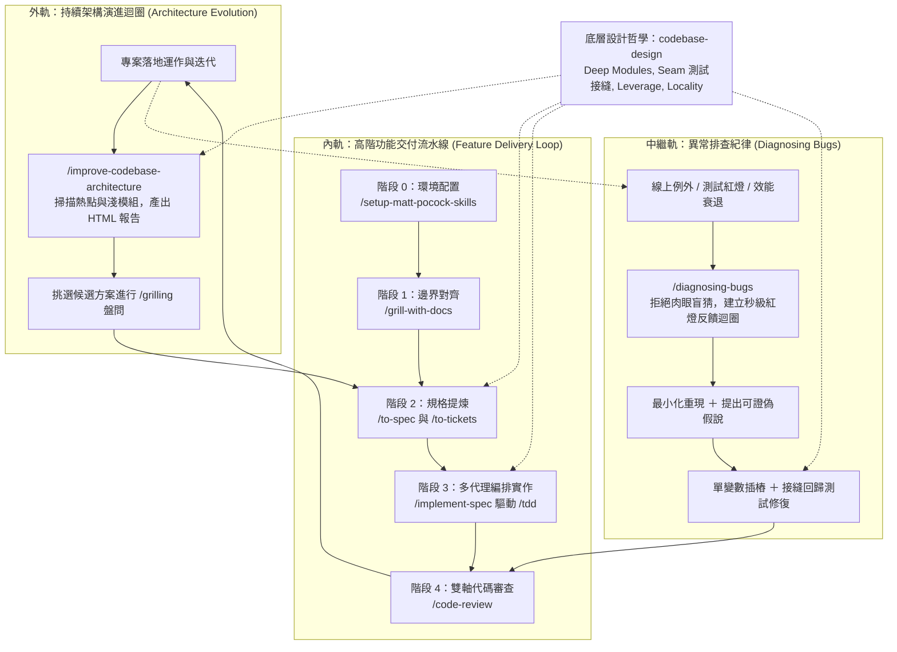

# Lab.Matt-Pocock: Matt Pocock Engineering Skills 實戰實驗室

本專案為深入實踐 [mattpocock/skills](https://github.com/mattpocock/skills) 軟體工程工作流程的落地實驗專案。以電商系統的「購物車折價券折扣計算模組（Coupon Discount Engine）」作為真實業務場景，完整示範從環境配置、領域建模、規格提煉、垂直切片、TDD 紅綠循環、雙軸代碼審查到架構深化的端到端閉環流程。

---

## 核心架構：全生命週期三軌閉環

本專案遵循 Matt Pocock 的工程技能規範，涵蓋「功能交付內軌」、「架構演進外軌」與「異常診斷中繼軌」：



---

## 目錄結構與工程產物

```text
.
├── CLAUDE.md                             # 專案規範與 Agent Skills 設定宣告
├── GLOSSARY.md                           # 領域名詞辭典（Domain Glossary）
├── docs/
│   ├── adr/
│   │   └── 0001-coupon-calculation-order.md # 架構決策紀錄（折扣順序與 0 元防護）
│   └── agents/
│       ├── domain.md                     # 單一上下文領域文件規範
│       └── issue-tracker.md              # 本地 Markdown 工單與看板狀態流轉規範
├── .scratch/
│   └── coupon-engine/
│       ├── spec.md                       # 結構化規格書（宣告公開接縫 Seam）
│       ├── code-review.md                # 雙軸代碼審查報告（Standards vs Spec）
│       └── issues/
│           ├── 01-fixed-amount-coupon.md # Ticket 01: 滿額現折貫穿切片
│           ├── 02-percentage-coupon.md   # Ticket 02: 百分比折扣券支援
│           └── 03-compound-discounts.md  # Ticket 03: 複合順序與明細彙整
├── src/
│   └── coupon-calculator.ts              # 深模組純運算實作代碼
├── tests/
│   └── coupon-calculator.spec.ts         # 公開接縫 Vitest 單元測試（8 項全綠）
├── blog-matt-pocock-skills-workflow.md   # 完整技術拆解專文（余小章寫作風格）
├── package.json
└── tsconfig.json
```

---

## 業務場景：購物車折價券計算模組 (Coupon Discount Engine)

模組以 `codebase-design` 的**深模組 (Deep Module)** 原則設計，拒絕洩漏內部複雜度的淺模組：
- **公開測試接縫 (Seam)**：`calculateDiscount(cart, coupons): CalculationResult`
- **核心決策 (ADR 0001)**：
  1. 複合折抵順序：先計算百分比折扣券（PERCENTAGE），再扣除滿額固定金額券（FIXED）。
  2. 0 元下限防護：當折扣大於購物車總計時，實付金額最低為 0 元，多餘折抵直接作廢不找零。
  3. 四捨五入精確度：避免 IEEE 754 浮點數精度誤差。

---

## 快速開始

### 1. 安裝依賴

```bash
npm install
```

### 2. 執行單元測試

專案使用 [Vitest](https://vitest.dev/) 進行測試驅動驗證：

```bash
npm test
# 或
npx vitest run
```

測試輸出範例：

```text
 ✓ tests/coupon-calculator.spec.ts (8 tests) 6ms
   ✓ Coupon Discount Engine (Seam: calculateDiscount) (8)
     ✓ Ticket 01: 基礎滿額現折 (Fixed Amount) (3)
       ✓ 01_滿額現折達到門檻應正確扣除金額
       ✓ 02_未達門檻時不扣除金額
       ✓ 03_折扣大於購物車金額時實付金額下限為零
     ✓ Ticket 02: 百分比折扣 (Percentage) (3)
       ✓ 04_單一百分比折價券達到門檻應正確計算折扣
       ✓ 05_百分比折價券未達門檻不予折抵
       ✓ 06_百分比計算應四捨五入至整數
     ✓ Ticket 03: 複合折扣順序與明細彙整 (Compound Discounts) (2)
       ✓ 07_複合折扣時應先依小計扣百分比再扣固定金額
       ✓ 08_多券疊加超過總額時實付為0且各券折抵不超額

 Test Files  1 passed (1)
      Tests  8 passed (8)
```

---

## 技能矩陣與工作流程對照

| 階段 | 技能名稱 | 作用與本專案對應產物 |
|---|---|---|
| **階段 0** | `/setup-matt-pocock-skills` | 初始化追蹤器與領域文件配置：`docs/agents/`、`CLAUDE.md` |
| **階段 1** | `/grill-with-docs` | 輪次邊界盤問並記錄：`GLOSSARY.md`、`docs/adr/0001-*.md` |
| **階段 2** | `/to-spec` | 提煉規格並鎖定公開接縫：`.scratch/coupon-engine/spec.md` |
| **階段 2** | `/to-tickets` | 拆解 Tracer-bullet 垂直工單圖：`.scratch/coupon-engine/issues/*.md` |
| **階段 3** | `/implement-spec` | 多代理 Git Worktree 隔離並行編排調度 |
| **階段 3** | `/tdd` | 嚴格紅綠循環實作代碼與測試：`src/` 與 `tests/` |
| **階段 4** | `/code-review` | Standards 軸 ＋ Spec 軸雙軸獨立審查：`.scratch/coupon-engine/code-review.md` |
| **外軌演進** | `/improve-codebase-architecture` | 掃描代碼熱點與淺模組，生成視覺化 HTML 報告 |
| **異常中繼** | `/diagnosing-bugs` | 遭遇線上 Bug 時遵守六階段紀律，先建秒級紅燈迴圈再排查 |

---

## 相關文件

- 完整工作流程解析技術專文：[blog-matt-pocock-skills-workflow.md](./blog-matt-pocock-skills-workflow.md)
- 上游技能庫：[mattpocock/skills](https://github.com/mattpocock/skills)
