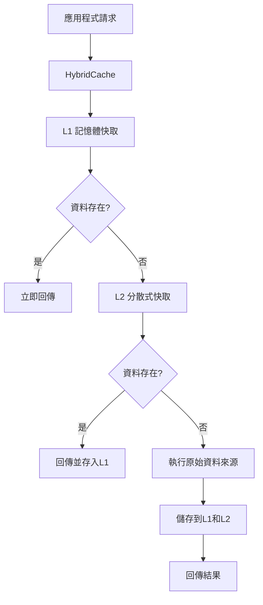

# .NET 9 HybridCache 完整介紹

## 概述

HybridCache 是 .NET 9 中新推出的快取程式庫，透過 `Microsoft.Extensions.Caching.Hybrid` 套件提供。它被稱為「混合快取」，因為能夠同時利用記憶體內快取（L1）和分散式快取（L2，如 Redis）來最佳化資料儲存和檢索效能。

## 核心概念和優勢

### 1. 雙層快取架構（L1/L2）



- **L1 快取**：運行在應用程式記憶體中，提供最快的存取速度
- **L2 快取**：可以是 Redis、SQL Server 或任何其他分散式快取
- **彈性配置**：可以只使用 L1 快取，無需分散式快取

### 2. 快取雪崩保護（Stampede Protection）

HybridCache 確保對於相同的鍵值，只有一個並發呼叫者會執行工廠方法，其他呼叫者等待該結果，防止快取雪崩問題。

### 3. 標籤管理功能

支援透過標籤來批量管理和失效快取資料：
- 可以用一個 API 呼叫刪除具有特定標籤的所有項目
- 支援同時刪除具有多個標籤的項目

### 4. 簡化的 API

- 將物件序列化、快取旁路模式實作和資料一致性簡化為單行程式碼
- 作為 `IDistributedCache` 和 `IMemoryCache` 的替代方案

### 5. 可配置的序列化

- 預設使用 `System.Text.Json` 處理字串和 `byte[]`
- 支援透過 `WithSerializer` 和 `WithSerializerFactory` 方法自訂序列化器
- 可配置為使用 protobuf 或 XML 等其他序列化器

## 套件安裝

### 使用 .NET CLI

```bash
dotnet add package Microsoft.Extensions.Caching.Hybrid
```

### 專案檔案配置

```xml
<Project Sdk="Microsoft.NET.Sdk.Web">
  <PropertyGroup>
    <TargetFramework>net9.0</TargetFramework>
    <Nullable>enable</Nullable>
    <ImplicitUsings>enable</ImplicitUsings>
  </PropertyGroup>

  <ItemGroup>
    <PackageReference Include="Microsoft.Extensions.Caching.Hybrid" Version="9.0.*" />
    <!-- 如果需要 Redis 支援 -->
    <PackageReference Include="Microsoft.Extensions.Caching.StackExchangeRedis" Version="9.0.*" />
  </ItemGroup>
</Project>
```

## 實作範例

### 1. 基本設定

```csharp
var builder = WebApplication.CreateBuilder(args);

// 註冊 HybridCache 服務（僅 L1 快取）
builder.Services.AddHybridCache();

var app = builder.Build();
```

### 2. 帶 Redis 的完整設定

```csharp
var builder = WebApplication.CreateBuilder(args);

// 設定 Redis 作為分散式快取
builder.Services.AddStackExchangeRedisCache(options =>
{
    options.Configuration = "localhost:6379";
});

// 註冊 HybridCache 服務（L1 + L2 快取）
builder.Services.AddHybridCache(options =>
{
    options.DefaultEntryOptions = new HybridCacheEntryOptions
    {
        Expiration = TimeSpan.FromMinutes(5),
        LocalCacheExpiration = TimeSpan.FromMinutes(1)
    };
});

var app = builder.Build();
```

### 3. 基本使用範例

```csharp
app.MapGet("/weather/{city}", async (string city, HybridCache cache) =>
{
    // 使用 HybridCache 獲取天氣資料
    var weather = await cache.GetOrCreateAsync(
        key: $"weather-{city}",
        factory: async token =>
        {
            // 模擬呼叫外部 API
            await Task.Delay(1000, token);
            return new WeatherInfo
            {
                City = city,
                Temperature = Random.Shared.Next(-10, 35),
                Description = "晴朗",
                LastUpdated = DateTime.UtcNow
            };
        },
        options: new HybridCacheEntryOptions
        {
            Expiration = TimeSpan.FromMinutes(10),
            LocalCacheExpiration = TimeSpan.FromMinutes(2)
        });

    return Results.Ok(weather);
});

record WeatherInfo(string City, int Temperature, string Description, DateTime LastUpdated);
```

### 4. 進階使用範例 - 產品快取服務

```csharp
public interface IProductService
{
    Task<Product?> GetProductAsync(int productId);
    Task<List<Product>> GetProductsByCategoryAsync(string category);
    Task InvalidateProductCacheAsync(int productId);
    Task InvalidateCategoryAsync(string category);
}

public class ProductService : IProductService
{
    private readonly HybridCache _cache;
    private readonly IProductRepository _repository;

    public ProductService(HybridCache cache, IProductRepository repository)
    {
        _cache = cache;
        _repository = repository;
    }

    public async Task<Product?> GetProductAsync(int productId)
    {
        return await _cache.GetOrCreateAsync(
            key: $"product-{productId}",
            factory: async token => await _repository.GetByIdAsync(productId, token),
            options: new HybridCacheEntryOptions
            {
                Expiration = TimeSpan.FromHours(1),
                LocalCacheExpiration = TimeSpan.FromMinutes(10),
                Tags = [$"product-{productId}", "products"]
            });
    }

    public async Task<List<Product>> GetProductsByCategoryAsync(string category)
    {
        return await _cache.GetOrCreateAsync(
            key: $"products-category-{category}",
            factory: async token => await _repository.GetByCategoryAsync(category, token),
            options: new HybridCacheEntryOptions
            {
                Expiration = TimeSpan.FromMinutes(30),
                LocalCacheExpiration = TimeSpan.FromMinutes(5),
                Tags = [$"category-{category}", "products"]
            });
    }

    public async Task InvalidateProductCacheAsync(int productId)
    {
        // 根據標籤清除特定產品的快取
        await _cache.RemoveByTagAsync($"product-{productId}");
    }

    public async Task InvalidateCategoryAsync(string category)
    {
        // 根據標籤清除特定類別的快取
        await _cache.RemoveByTagAsync($"category-{category}");
    }
}
```

### 5. 自訂序列化器範例

```csharp
builder.Services.AddHybridCache(options =>
{
    // 為特定類型設定自訂序列化器
    options.WithSerializer<WeatherInfo>(new JsonSerializer<WeatherInfo>());

    // 設定序列化器工廠
    options.WithSerializerFactory(type =>
    {
        if (type == typeof(Product))
            return new ProtobufSerializer<Product>();

        return null; // 使用預設序列化器
    });
});
```

### 6. 完整的 Web API 範例

```csharp
using Microsoft.Extensions.Caching.Hybrid;

var builder = WebApplication.CreateBuilder(args);

// 設定服務
builder.Services.AddStackExchangeRedisCache(options =>
{
    options.Configuration = builder.Configuration.GetConnectionString("Redis");
});

builder.Services.AddHybridCache(options =>
{
    options.DefaultEntryOptions = new HybridCacheEntryOptions
    {
        Expiration = TimeSpan.FromMinutes(5),
        LocalCacheExpiration = TimeSpan.FromMinutes(1)
    };
});

builder.Services.AddScoped<IProductService, ProductService>();

var app = builder.Build();

// API 端點
app.MapGet("/products/{id:int}", async (int id, IProductService productService) =>
{
    var product = await productService.GetProductAsync(id);
    return product is not null ? Results.Ok(product) : Results.NotFound();
})
.WithName("GetProduct")
.WithOpenApi();

app.MapGet("/products/category/{category}", async (string category, IProductService productService) =>
{
    var products = await productService.GetProductsByCategoryAsync(category);
    return Results.Ok(products);
})
.WithName("GetProductsByCategory")
.WithOpenApi();

app.MapPost("/products/{id:int}/invalidate", async (int id, IProductService productService) =>
{
    await productService.InvalidateProductCacheAsync(id);
    return Results.Ok(new { Message = $"產品 {id} 的快取已清除" });
})
.WithName("InvalidateProductCache")
.WithOpenApi();

app.Run();

record Product(int Id, string Name, string Category, decimal Price, DateTime LastModified);
```

## 設定選項

### HybridCacheEntryOptions

```csharp
public class HybridCacheEntryOptions
{
    // 總快取過期時間
    public TimeSpan? Expiration { get; set; }

    // 本地快取過期時間（L1）
    public TimeSpan? LocalCacheExpiration { get; set; }

    // 快取標籤
    public string[]? Tags { get; set; }

    // 快取大小
    public long? Size { get; set; }

    // 優先級
    public CacheItemPriority Priority { get; set; }
}
```

## 效能優勢

1. **記憶體快取的高速存取**：L1 快取提供毫秒級的存取速度
2. **分散式快取的可擴展性**：L2 快取支援多實例部署
3. **防止快取雪崩**：避免同時多個請求造成的系統負載峰值
4. **智慧快取管理**：透過標籤系統高效管理快取失效

## 最佳實踐

1. **合理設定過期時間**：L1 快取時間應小於 L2 快取時間
2. **使用標籤管理**：為相關資料設定適當的標籤以便批量清除
3. **監控快取效能**：定期檢查快取命中率和記憶體使用情況
4. **選擇適當的序列化器**：根據資料特性選擇最適合的序列化方式

## 參考資源

- [Microsoft Learn - HybridCache library in ASP.NET Core](https://learn.microsoft.com/en-us/aspnet/core/performance/caching/hybrid?view=aspnetcore-9.0)
- [.NET Blog - Hello HybridCache! Streamlining Cache Management for ASP.NET Core Applications](https://devblogs.microsoft.com/dotnet/hybrid-cache-is-now-ga/)
- [NuGet Package - Microsoft.Extensions.Caching.Hybrid](https://www.nuget.org/packages/Microsoft.Extensions.Caching.Hybrid/)

HybridCache 是 .NET 9 中一個重要的效能最佳化工具，特別適合需要高效能快取解決方案的 ASP.NET Core 應用程式。它結合了記憶體快取的速度和分散式快取的可擴展性，同時提供了強大的管理功能和簡潔的 API，是現代 .NET 應用程式中不可或缺的快取解決方案。