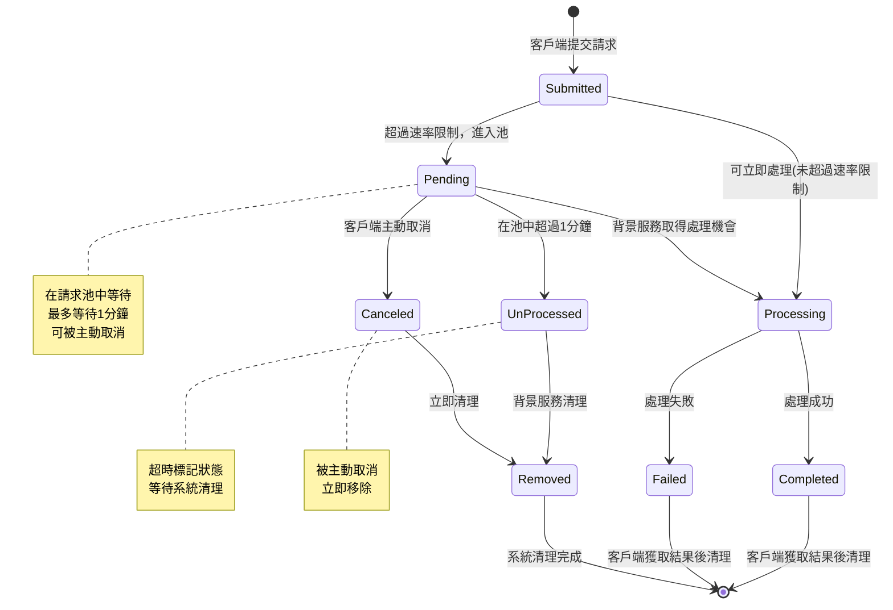

# CLAUDE.md

This file provides guidance to Claude Code (claude.ai/code) when working with code in this repository.

## 專案概述
這是一個具有排隊機制的 ASP.NET Core 9 Web API 專案，實現速率限制和請求池管理功能。

## 專案架構

### 核心設計原則
- 使用滑動視窗演算法實現速率限制（1分鐘內最多2個請求）
- 超過限制的請求進入記憶體中的請求池等待處理
- 提供 Request ID 機制供客戶端重試和狀態查詢
- 使用 BackgroundService 定期處理池中的請求

### 主要組件
- **Controllers**: API 端點實現（RequestController）
- **Services**: 核心業務邏輯
  - `IRateLimitService`: 速率限制服務
  - `IRequestPool`: 請求池管理
  - `IRequestProcessor`: 請求處理邏輯
  - `RequestProcessorService`: 背景服務處理池中請求
- **Models**: 資料模型定義
- **Configuration**: 可配置的參數

### API 端點設計
- `POST /api/requests/submit` - 提交請求處理
- `GET /api/requests/retry/{requestId}` - 使用 Request ID 重試
- `GET /api/requests/status/{requestId}` - 查詢請求狀態
- `DELETE /api/requests/cancel/{requestId}` - 取消指定的請求

## 開發命令

### 建置與執行
```bash
# 建置專案
dotnet build

# 執行專案
dotnet run

# 執行開發模式（hot reload）
dotnet watch run
```

### 測試
```bash
# 執行所有測試
dotnet test

# 執行特定測試檔案
dotnet test --filter "FullyQualifiedName~RateLimitServiceTests"
```

## 配置參數
所有限流相關參數都應設為全域變數並可透過配置檔案調整：
- `MaxRequestsPerMinute`: 每分鐘最大請求數（預設：2）
- `TimeWindow`: 時間視窗（預設：1分鐘）
- `MaxPoolSize`: 最大池容量（預設：1000）
- `RequestTimeout`: 請求超時時間（預設：5分鐘）

## 實作注意事項
- 使用 `ConcurrentDictionary` 確保線程安全的請求池操作
- 實現適當的記憶體清理機制防止記憶體洩漏
- 所有時間相關操作使用 `DateTime.UtcNow` 確保一致性
- 回應格式統一使用 JSON 並包含適當的 HTTP 狀態碼

## 背景處理規則
- **請求超時機制**：池中存放超過1分鐘的請求將被標記為 "UnProcessed" 狀態
- **自動清理機制**：將 "UnProcessed" 狀態的請求從池中移除以釋放記憶體
- **清理頻率**：背景服務每30秒執行一次清理作業
- **狀態轉換**：Pending → Processing → Completed 或 Pending → UnProcessed → Removed

## 請求取消規則
- **取消端點**：`DELETE /api/requests/cancel/{requestId}` - 取消指定請求
- **取消條件**：只有處於 "Pending" 狀態的請求可以被取消
- **取消流程**：
  - 若 Request ID 存在且狀態為 Pending，標記為 "Canceled" 狀態並從池中移除
  - 若 Request ID 不存在，返回 404 Not Found
  - 若 Request ID 存在但狀態非 Pending（如 Processing、Completed），返回 409 Conflict
- **狀態轉換**：Pending → Canceled → Removed

## 請求狀態機



### 狀態說明
- **Submitted**: 初始狀態，請求剛提交
- **Processing**: 正在處理中，受速率限制保護
- **Pending**: 在池中等待處理，可被取消
- **Completed**: 處理完成，等待客戶端取得結果
- **Failed**: 處理失敗，等待客戶端取得結果
- **UnProcessed**: 超時未處理，等待清理
- **Canceled**: 被主動取消，立即清理
- **Removed**: 已從系統移除（終態）