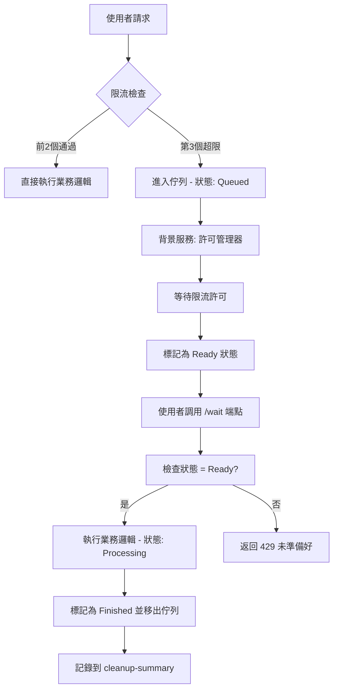
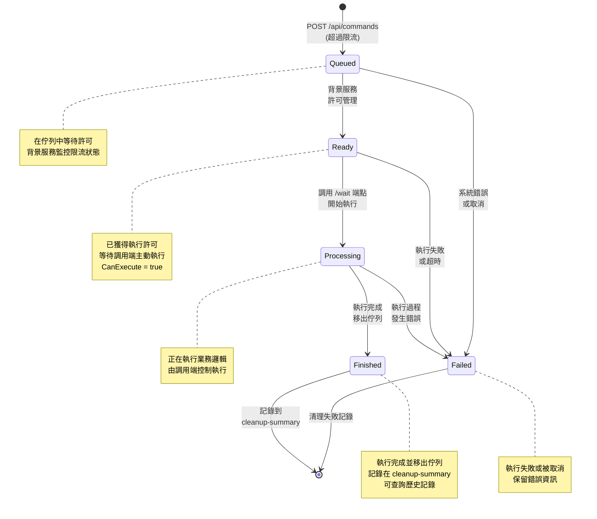

# CLAUDE.md

This file provides guidance to Claude Code (claude.ai/code) when working with code in this repository.

## 專案概述

這是一個 ASP.NET Core 9 Web API 專案，實作了具有速率限制和佇列機制的排隊系統。專案使用滑動視窗演算法進行限流，超出限制的請求會自動進入佇列等待許可。**關鍵特色：調用端主動控制執行時機，背景服務只負責許可管理，不執行業務邏輯**。

## 建置和執行命令

### 建置專案
```bash
dotnet build
```

### 執行專案（開發模式）
```bash
dotnet run
```
API 將在 `http://localhost:5001` 啟動，Swagger UI 可在根路徑存取。

### 執行測試
```bash
# 執行自動化測試腳本
chmod +x test_api.sh
./test_api.sh
```

### 發布建置
```bash
# 建置發布版本
dotnet publish -c Release -o ./publish

# 建置自包含版本
dotnet publish -c Release -r linux-x64 --self-contained -o ./publish
```

## 架構設計

### 業務流程



### 核心組件

1. **速率限制層 (Rate Limiting)**
   - `IRateLimiter` / `SlidingWindowRateLimiter`: 滑動視窗限流實作
   - 設定：每分鐘最多 2 個請求
   - 位置：`src/Services/`

2. **佇列系統 (Queue System)**
   - `ICommandQueueProvider` / `ChannelCommandQueueProvider`: 請求佇列提供者
   - `ChannelCommandQueueService`: 背景服務**只負責許可管理**
   - 使用 .NET Channel 實作生產者-消費者模式
   - 位置：`src/Services/`

3. **API 控制器**
   - `CommandController`: 主要 API 端點控制器
   - 路由：`/api/commands/*`, `/api/health`
   - 位置：`src/Commands/`

### 狀態管理

#### 狀態機圖



#### 狀態轉換說明

**主要路徑（成功流程）**：
`Queued` → `Ready` → `Processing` → `Finished`

**異常路徑**：
- `Queued` → `Failed`（系統錯誤）
- `Ready` → `Failed`（執行前失敗）
- `Processing` → `Failed`（執行中錯誤）

**關鍵控制點**：

1. **Queued → Ready**
   - 由背景服務 `ChannelCommandQueueService` 控制
   - 檢查限流條件，符合時自動轉換

2. **Ready → Processing**
   - 由調用端透過 `/wait` 端點主動觸發
   - 只有 `Ready` 狀態可執行

3. **Processing → Finished**
   - 業務邏輯執行完成後自動轉換
   - 請求從佇列移除，記錄到歷史

**搶票系統應用**：
- `Queued`: 排隊等待搶票許可
- `Ready`: 獲得搶票資格，可開始搶票
- `Processing`: 正在執行搶票動作
- `Finished`: 搶票完成（成功或失敗都算完成）

### 設計模式

- **依賴注入 (DI)**: 所有服務透過 ASP.NET Core DI 容器註冊
- **介面隔離**: 使用介面定義服務契約 (`IRateLimiter`, `ICommandQueueProvider`)
- **背景服務**: 使用 `IHostedService` 實作背景許可管理
- **Channel 模式**: 使用 .NET Channel 實作並發安全的佇列
- **調用端控制**: 使用者主動決定何時執行業務邏輯

### 重要配置

在 `Program.cs` 中的關鍵服務註冊：
```csharp
// 限流器設定（每分鐘 2 個請求）
builder.Services.AddSingleton<IRateLimiter>(provider =>
    new SlidingWindowRateLimiter(maxRequests: 2, timeWindow: TimeSpan.FromMinutes(1)));

// 佇列提供者（容量 100）
builder.Services.AddSingleton<ICommandQueueProvider>(provider =>
    new ChannelCommandQueueProvider(capacity: 100));

// 背景服務
builder.Services.AddHostedService<ChannelCommandQueueService>();
```

## API 端點

### 主要端點

- `POST /api/commands` - 提交請求（支援限流和排隊）
  - 前2個請求：直接執行並回傳結果
  - 第3+請求：進入佇列，返回 429 和 requestId

- `GET /api/commands/{requestId}/status` - 查詢請求狀態
  - 回傳狀態：`Queued`, `Ready`, `Processing`, `Failed`, `Finished`
  - 包含 `CanExecute` 標示是否可執行

- `GET /api/commands/{requestId}/wait` - **執行業務邏輯**
  - 只有 `Ready` 狀態的請求可執行
  - 執行完成後狀態變為 `Finished` 並移出佇列
  - 非 `Ready` 狀態返回 429

### 輔助端點

- `GET /api/commands` - 列出所有佇列中的請求
- `GET /api/commands/cleanup-summary` - 查看所有完成的記錄
- `GET /api/health` - 系統健康檢查

## 專案結構

```
src/
├── Commands/           # API 控制器和請求/回應模型
│   ├── CommandController.cs
│   ├── CreateCommandRequest.cs
│   ├── QueuedCommandResponse.cs
│   └── QueuedContext.cs
├── Services/           # 核心業務邏輯服務
│   ├── IRateLimiter.cs
│   ├── SlidingWindowRateLimiter.cs
│   ├── ICommandQueueProvider.cs
│   ├── ChannelCommandQueueProvider.cs
│   └── ChannelCommandQueueService.cs
└── Program.cs          # 應用程式進入點和 DI 設定
```

## 開發注意事項

### 關鍵設計原則

1. **背景服務職責分離**
   - `ChannelCommandQueueService` **只負責許可管理**
   - 不執行業務邏輯，只將狀態從 `Queued` 改為 `Ready`
   - 調用端透過 `/wait` 端點主動執行業務邏輯

2. **狀態流轉控制**
   - 只有 `Ready` 狀態的請求可被執行
   - 執行後立即變為 `Finished` 並從佇列移除
   - 移除的請求記錄在 `cleanup-summary` 中

3. **搶票系統適配**
   - 系統每分鐘處理 2 個請求（可調整）
   - 第 3 人的請求自動進入佇列
   - 使用者主動決定何時搶票（調用 `/wait`）

### 修改限流設定
若需調整限流參數，修改 `Program.cs` 中的 `SlidingWindowRateLimiter` 設定：
```csharp
new SlidingWindowRateLimiter(maxRequests: 5, timeWindow: TimeSpan.FromMinutes(1))
```

### 修改佇列容量
調整 `ChannelCommandQueueProvider` 的容量參數：
```csharp
new ChannelCommandQueueProvider(capacity: 200)
```

### 並發安全
- 所有服務都設計為執行緒安全
- 使用 `ConcurrentQueue` 和 `ConcurrentDictionary` 確保並發操作安全
- Channel 提供了內建的並發安全保證

### 錯誤處理
- 所有控制器方法都包含完整的 try-catch 錯誤處理
- 使用結構化日誌記錄關鍵操作和錯誤
- 適當的 HTTP 狀態碼回應（200, 429, 404, 500）

## 測試策略

### 功能測試流程

使用提供的 `test_api.sh` 腳本進行完整功能測試：

1. **健康檢查端點測試**
   - 驗證系統基本運作

2. **限流機制測試**
   - 前兩個請求：直接處理並回傳結果
   - 第三個請求：進入佇列，返回 429 和 requestId

3. **狀態查詢測試**
   - 查詢佇列中請求的狀態變化：`Queued` → `Ready`

4. **主動執行測試**
   - 調用 `/wait` 端點執行業務邏輯
   - 驗證狀態：`Ready` → `Processing` → `Finished`
   - 確認請求從佇列中移除

5. **完成記錄驗證**
   - 透過 `/cleanup-summary` 查看完成的記錄

### 搶票系統測試場景

```bash
# 模擬 3 人同時搶票
curl -X POST /api/commands -d '{"data":"user1_ticket"}'  # 直接執行
curl -X POST /api/commands -d '{"data":"user2_ticket"}'  # 直接執行
curl -X POST /api/commands -d '{"data":"user3_ticket"}'  # 進入佇列

# 等待背景服務許可
sleep 65  # 等待超過1分鐘

# user3 主動搶票
curl /api/commands/{requestId}/wait  # 執行搶票邏輯
```

## 使用案例：搶票系統

### 完美適配場景

此系統專為搶票類應用設計，具備以下特色：

1. **公平排隊**：每分鐘只處理固定數量的請求
2. **用戶控制**：排隊用戶主動決定何時執行搶票
3. **狀態透明**：隨時查詢排隊狀態和位置
4. **歷史記錄**：完整的搶票記錄可查詢

### 實際應用流程

```
1. 演唱會開搶 → 大量用戶同時請求
2. 系統限流 → 前N個直接搶票，其餘進入佇列
3. 背景許可 → 依序發放搶票許可給排隊用戶
4. 用戶主動 → 收到許可通知後，主動執行搶票
5. 完成移除 → 搶票完成後從佇列移除，記錄歷史
```

### 技術優勢

- **避免系統崩潰**：限流機制保護後端服務
- **用戶體驗佳**：排隊狀態透明，主動控制執行
- **可擴展性強**：分離架構易於水平擴展
- **數據完整性**：完整的操作日誌和歷史記錄

## 部署相關

- 支援多種部署方式：開發環境、Docker、Linux 服務、雲端部署
- 詳細部署指南請參考 `DEPLOYMENT.md`
- 生產環境需要關閉 Swagger UI 並設定適當的日誌等級

---

## 重要提醒

**此系統的核心設計理念**：
- 背景服務只負責許可管理，不執行業務邏輯
- 調用端透過 `/wait` 端點主動控制執行時機
- 適合需要用戶主動控制的場景（如搶票、預約等）