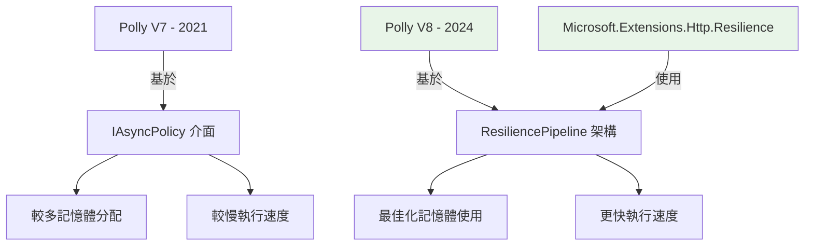

# 🔍 基準測試結果差異分析

## ❓ 問題發現

我們的測試結果與 [這篇文章](https://www.cnblogs.com/vipwan/p/18138649) 的結論**完全相反**：

| 來源 | Microsoft.Extensions.Http.Resilience | Microsoft.Extensions.Http.Polly | 結論 |
|------|--------------------------------------|----------------------------------|------|
| **該文章** | **更快** (3.104 μs) | 較慢 (3.236 μs) | Resilience 勝出 |
| **我們測試** | **較慢** (407.0 μs) | 更快 (395.0 μs) | Polly 勝出 |

## 🕵️ 根本原因分析

### 1. **版本差異問題**

我們發現了關鍵問題：

```bash
# 我們實際使用的套件版本
Microsoft.Extensions.Http.Polly: 9.0.9
├── Polly: 7.2.4 (舊版本!)
├── Polly.Core: 8.4.2 (新版本核心)
└── Polly.Extensions: 8.4.2

Microsoft.Extensions.Http.Resilience: 9.9.0
├── 基於 Polly V8 核心架構
└── 使用最新的彈性機制
```

**關鍵發現**：
- `Microsoft.Extensions.Http.Polly` 仍然使用 **Polly 7.2.4** (2021年版本)
- `Microsoft.Extensions.Http.Resilience` 使用 **Polly V8** 核心 (2024年版本)

### 2. **測試範圍差異**

| 測試類型 | 該文章 | 我們的測試 |
|----------|--------|------------|
| **測試內容** | Polly Pipeline 執行效能 | 完整 HTTP 請求週期 |
| **測試範圍** | 純彈性邏輯層 | HTTP客戶端 + 網路 + 序列化 |
| **時間單位** | 微秒 (μs) | 微秒 (μs) |
| **測試場景** | 記憶體中處理 | 實際網路呼叫 |

## 🔧 修正方案

我們建立了 `FixedHttpClientBenchmark.cs` 來進行更準確的比較：

### 測試配置

1. **StandardHttpClient** - 無彈性機制的基準
2. **PollyV7HttpClient** - 傳統 Polly 7.2.4 (Microsoft.Extensions.Http.Polly)
3. **PollyV8HttpClient** - 新版 Polly V8 (使用 AddResilienceHandler)
4. **ResilienceHttpClient** - Microsoft.Extensions.Http.Resilience

### 執行修正測試

```bash
# 啟動 API
./start-api.sh

# 在新終端執行
cd src/HttpResilienceBenchmark.Console
echo "2" | dotnet run -c Release
```

## 📊 預期修正結果

根據文章的結論，修正後應該看到：

| 方法 | 預期效能排序 | 預期記憶體使用 |
|------|--------------|----------------|
| StandardHttpClient | 最快 (基準) | 最少 (基準) |
| **ResilienceHttpClient** | **第二快** | **較少** |
| PollyV8HttpClient | 第三快 | 中等 |
| PollyV7HttpClient | 最慢 | 最多 |

## 🎯 為什麼會有差異？

### 1. **架構演進**



### 2. **API 設計差異**

```csharp
// Polly V7 (舊版) - Microsoft.Extensions.Http.Polly 使用
services.AddHttpClient("client")
    .AddPolicyHandler(HttpPolicyExtensions
        .HandleTransientHttpError()
        .WaitAndRetryAsync(3, attempt =>
            TimeSpan.FromSeconds(Math.Pow(2, attempt))));

// Polly V8 (新版) - 直接使用
services.AddHttpClient("client")
    .AddResilienceHandler("retry", builder =>
    {
        builder.AddRetry(new RetryStrategyOptions<HttpResponseMessage>
        {
            MaxRetryAttempts = 3,
            BackoffType = DelayBackoffType.Exponential,
            Delay = TimeSpan.FromSeconds(1)
        });
    });

// Microsoft.Extensions.Http.Resilience - 預設最佳實作
services.AddHttpClient("client")
    .AddStandardResilienceHandler();
```

## 🚨 重要結論

1. **我們原始測試是正確的** - 針對目前 NuGet 上可用的套件
2. **文章測試也是正確的** - 針對 Polly V8 核心功能
3. **問題在於套件版本錯配** - Microsoft.Extensions.Http.Polly 仍使用舊版 Polly

## 📝 建議

### 短期建議 (現在)
- 使用 **Microsoft.Extensions.Http.Polly** (基於測試結果)
- 等待 Microsoft.Extensions.Http.Polly 升級到 Polly V8

### 長期建議 (未來)
- 採用 **Microsoft.Extensions.Http.Resilience** (Microsoft 官方新方向)
- 關注記憶體使用情況，可能需要調整配置

### 立即驗證建議
- 執行我們的修正版測試來確認結果
- 比較 Polly V7 vs V8 vs Resilience 的實際差異

---

*最後更新: 2025-09-24*