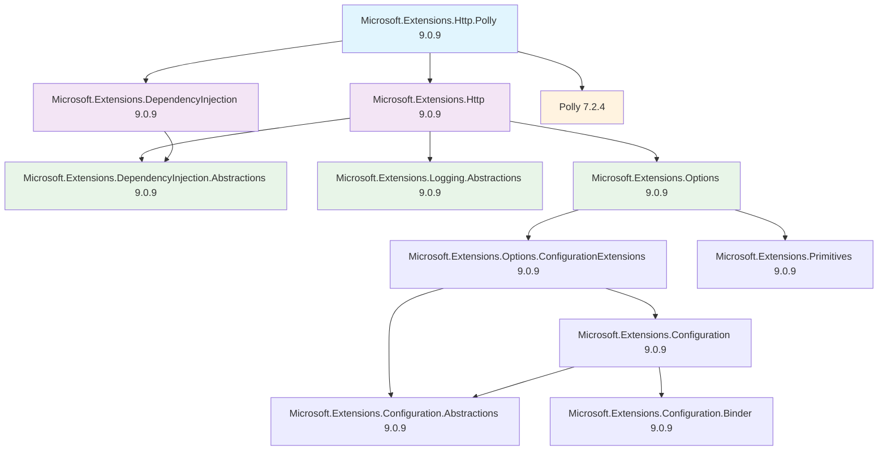

# Microsoft.Extensions.Http.Polly 套件依賴關係分析

## 概述

Microsoft.Extensions.Http.Polly 是將 Polly 彈性模式整合到 .NET HTTP 用戶端的套件，提供重試、斷路器等故障處理功能。

## 專案引用

在專案中引用：
```xml
<PackageReference Include="Microsoft.Extensions.Http.Polly" Version="9.0.9" />
```

## 依賴關係圖



## 主要依賴分類

### 1. 核心依賴 (Core Dependencies)

#### Microsoft.Extensions.Http (9.0.9)
- HTTP 用戶端基礎設施
- 提供 HttpClientFactory 支援
- 整合 .NET 的 HTTP 用戶端管理

#### Microsoft.Extensions.DependencyInjection (9.0.9)
- 依賴注入容器
- 服務註冊和解析

#### Polly (7.2.4)
- 彈性和故障處理庫
- 提供重試、斷路器、逾時等彈性模式

### 2. 抽象化依賴 (Abstraction Dependencies)

#### Microsoft.Extensions.DependencyInjection.Abstractions (9.0.9)
- 依賴注入抽象化介面

#### Microsoft.Extensions.Logging.Abstractions (9.0.9)
- 日誌記錄抽象化介面

#### Microsoft.Extensions.Options (9.0.9)
- 設定模式支援
- 強型別設定綁定

### 3. 設定系統依賴 (Configuration Dependencies)

#### Microsoft.Extensions.Configuration (9.0.9)
- 設定框架核心
- 支援多種設定來源

#### Microsoft.Extensions.Configuration.Abstractions (9.0.9)
- 設定系統抽象化

#### Microsoft.Extensions.Configuration.Binder (9.0.9)
- 設定值綁定到物件

#### Microsoft.Extensions.Primitives (9.0.9)
- 基礎型別和工具

## 版本資訊

- **Microsoft.Extensions.Http.Polly**: 9.0.9
- **Polly**: 7.2.4 (傳統版本)
- **Microsoft.Extensions.***: 主要為 9.0.9

## 使用場景

此套件特別適用於需要 HTTP 彈性功能的應用程式：

1. **微服務間通訊**
   - 服務間 API 呼叫的彈性處理
   - 網路故障恢復機制

2. **外部 API 整合**
   - 第三方服務呼叫
   - 不穩定網路環境下的 API 存取

3. **高可用性應用程式**
   - 需要重試機制的 HTTP 請求
   - 斷路器模式防止連鎖故障

## 功能特色

### 1. 重試政策 (Retry Policies)
- 指數退避重試
- 固定間隔重試
- 自訂重試條件

### 2. 斷路器 (Circuit Breaker)
- 快速故障檢測
- 防止連鎖故障
- 自動恢復機制

### 3. 逾時處理 (Timeout)
- HTTP 請求逾時控制
- 取消令牌支援

### 4. HttpClientFactory 整合
- 與 .NET 的 HttpClientFactory 無縫整合
- 支援命名和型別化用戶端

## 範例用法

```csharp
services.AddHttpClient<MyService>()
    .AddPolicyHandler(GetRetryPolicy())
    .AddPolicyHandler(GetCircuitBreakerPolicy());

static IAsyncPolicy<HttpResponseMessage> GetRetryPolicy()
{
    return HttpPolicyExtensions
        .HandleTransientHttpError()
        .WaitAndRetryAsync(3, retryAttempt =>
            TimeSpan.FromSeconds(Math.Pow(2, retryAttempt)));
}

static IAsyncPolicy<HttpResponseMessage> GetCircuitBreakerPolicy()
{
    return HttpPolicyExtensions
        .HandleTransientHttpError()
        .CircuitBreakerAsync(3, TimeSpan.FromSeconds(30));
}
```

## 注意事項

1. **版本相容性**: 使用 Polly v7，與較新的 Polly.Core v8 不同
2. **效能考量**: 彈性政策會增加 HTTP 請求的複雜度
3. **設定管理**: 建議透過設定系統管理彈性政策參數
4. **監控**: 建議搭配日誌和監控來追蹤彈性政策的執行情況

## 與 Microsoft.Extensions.Http.Resilience 比較

- **Http.Polly**: 基於傳統 Polly v7，較為成熟穩定
- **Http.Resilience**: 基於 Polly.Core v8，功能更豐富，包含遙測和診斷
- **選擇建議**: 新專案建議使用 Http.Resilience，現有專案可繼續使用 Http.Polly