# Microsoft.Extensions.Http.Resilience 套件依賴關係分析

## 概述

Microsoft.Extensions.Http.Resilience 是 .NET 9 中新增的套件，整合了 Polly 的彈性模式與 .NET 的 HTTP 用戶端基礎設施，提供完整的 HTTP 彈性解決方案。

## 專案引用

在專案中引用：
```xml
<PackageReference Include="Microsoft.Extensions.Http.Resilience" Version="9.9.0" />
```

## 依賴關係圖

```mermaid
graph TD
    A[Microsoft.Extensions.Http.Resilience 9.9.0] --> B[Microsoft.Extensions.Http 9.0.9]
    A --> C[Microsoft.Extensions.Resilience 9.9.0]
    A --> D[Microsoft.Extensions.Http.Diagnostics 9.9.0]
    A --> E[Polly.Extensions.Http 3.0.0]

    B --> F[Microsoft.Extensions.DependencyInjection 9.0.9]
    B --> G[Microsoft.Extensions.Logging 9.0.9]
    B --> H[Microsoft.Extensions.Options 9.0.9]

    C --> I[Polly.Core 8.4.2]
    C --> J[Polly.Extensions 8.4.2]
    C --> K[Microsoft.Extensions.Telemetry 9.9.0]
    C --> L[Microsoft.Extensions.Compliance.Abstractions 9.9.0]

    D --> M[Microsoft.Extensions.Diagnostics 9.0.9]
    D --> N[Microsoft.Extensions.Telemetry.Abstractions 9.9.0]

    E --> O[Polly 7.2.4]
    E --> I
    E --> P[Polly.RateLimiting 8.4.2]

    F --> Q[Microsoft.Extensions.DependencyInjection.Abstractions 9.0.9]
    G --> R[Microsoft.Extensions.Logging.Abstractions 9.0.9]
    H --> S[Microsoft.Extensions.Options.ConfigurationExtensions 9.0.9]
    H --> T[Microsoft.Extensions.Primitives 9.0.9]

    I --> U[System.Threading.RateLimiting 8.0.0]
    J --> I

    K --> N
    K --> V[Microsoft.Extensions.AmbientMetadata.Application 9.9.0]
    K --> W[Microsoft.Extensions.DependencyInjection.AutoActivation 9.9.0]

    M --> X[Microsoft.Extensions.Diagnostics.Abstractions 9.0.9]

    P --> I
    P --> U

    S --> Y[Microsoft.Extensions.Configuration 9.0.9]

    Y --> Z[Microsoft.Extensions.Configuration.Abstractions 9.0.9]
    Y --> AA[Microsoft.Extensions.Configuration.Binder 9.0.9]

    style A fill:#e1f5fe
    style B fill:#f3e5f5
    style C fill:#f3e5f5
    style D fill:#f3e5f5
    style E fill:#f3e5f5
    style I fill:#fff3e0
    style O fill:#fff3e0
```



## 主要依賴分類

### 1. 核心依賴 (Core Dependencies)

#### Microsoft.Extensions.Http (9.0.9)
- HTTP 用戶端基礎設施
- 提供 HttpClientFactory 支援
- 依賴於 DI、Logging、Options 框架

#### Microsoft.Extensions.Resilience (9.9.0)
- 彈性模式核心功能
- 整合 Polly.Core 和 Polly.Extensions
- 提供遙測和合規性抽象化

#### Microsoft.Extensions.Http.Diagnostics (9.9.0)
- HTTP 診斷和遙測功能
- 與 Microsoft.Extensions.Diagnostics 整合

### 2. Polly 相關依賴 (Polly-related Dependencies)

#### Polly.Extensions.Http (3.0.0)
- Polly 的 HTTP 專用擴充功能
- 依賴 Polly.Core 和傳統 Polly 套件
- 支援限流功能

#### Polly.Core (8.4.2)
- Polly 的新一代核心引擎
- 支援 System.Threading.RateLimiting

#### Polly (7.2.4)
- 傳統 Polly 套件（向後相容性）

### 3. 遙測與診斷 (Telemetry & Diagnostics)

#### Microsoft.Extensions.Telemetry (9.9.0)
- 遙測基礎設施
- 包含環境中繼資料和自動啟用功能

#### Microsoft.Extensions.Diagnostics (9.0.9)
- 診斷抽象化和基礎設施

### 4. 基礎設施依賴 (Infrastructure Dependencies)

#### Microsoft.Extensions.DependencyInjection (9.0.9)
- 依賴注入容器

#### Microsoft.Extensions.Logging (9.0.9)
- 日誌記錄框架

#### Microsoft.Extensions.Options (9.0.9)
- 設定模式支援
- 整合設定系統

#### System.Threading.RateLimiting (8.0.0)
- .NET 內建的限流功能

## 版本資訊

- **Microsoft.Extensions.Http.Resilience**: 9.9.0
- **Polly.Core**: 8.4.2 (最新版本)
- **Polly**: 7.2.4 (傳統版本，向後相容)
- **Microsoft.Extensions.***: 主要為 9.0.9 或 9.9.0

## 使用場景

此套件特別適用於需要 HTTP 彈性功能的應用程式，例如：
- 微服務間通訊
- 外部 API 呼叫
- 需要重試、斷路器、限流等彈性模式的 HTTP 用戶端

## 注意事項

1. 此套件同時依賴 Polly v7 和 Polly.Core v8，確保向後相容性
2. 整合了 .NET 9 的遙測和診斷功能
3. 支援現代的限流功能 (System.Threading.RateLimiting)
4. 與 .NET 的 DI、Logging、Configuration 系統完整整合