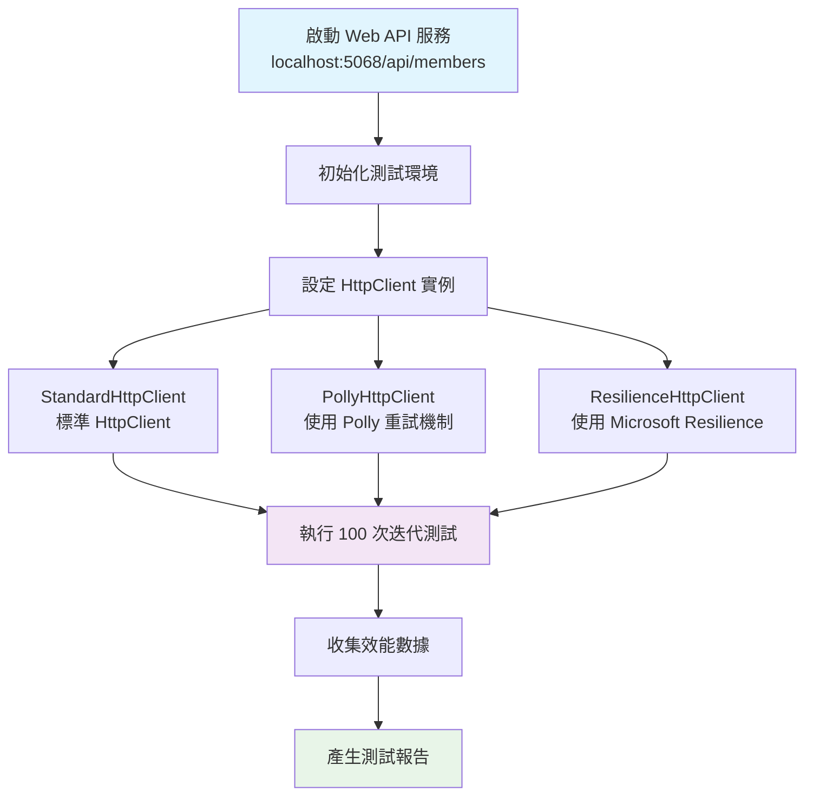
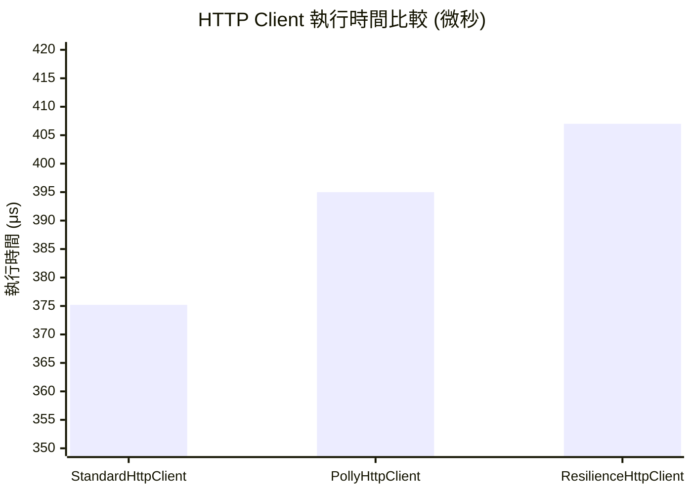
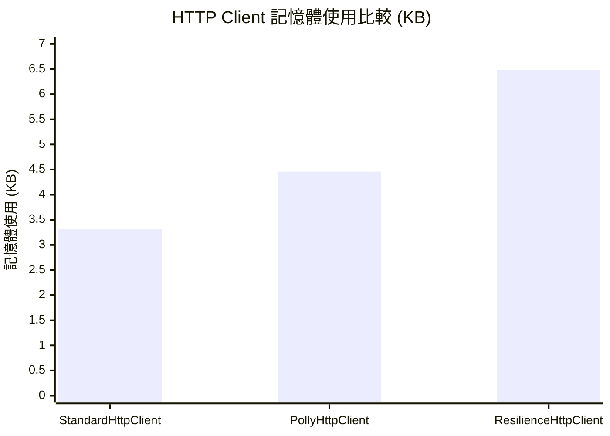
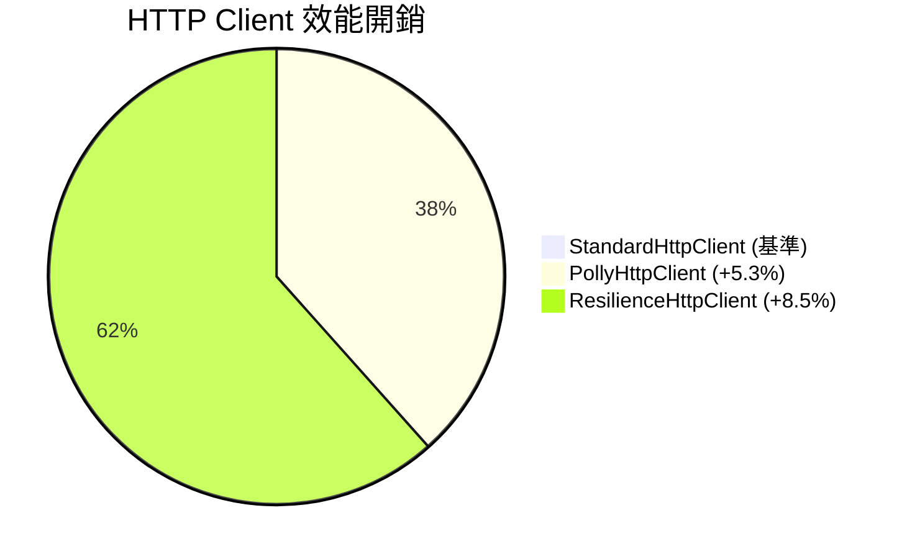
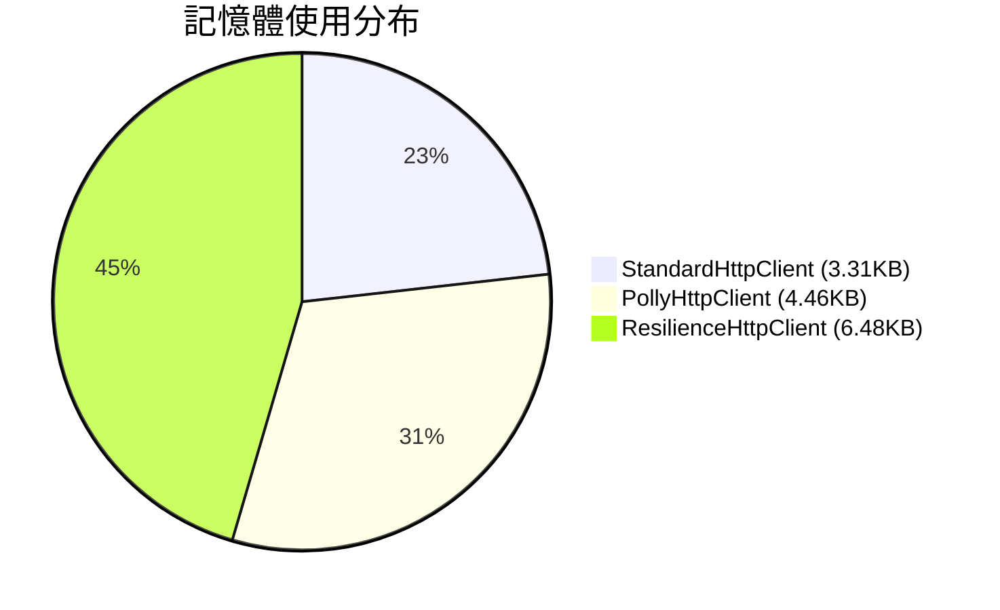
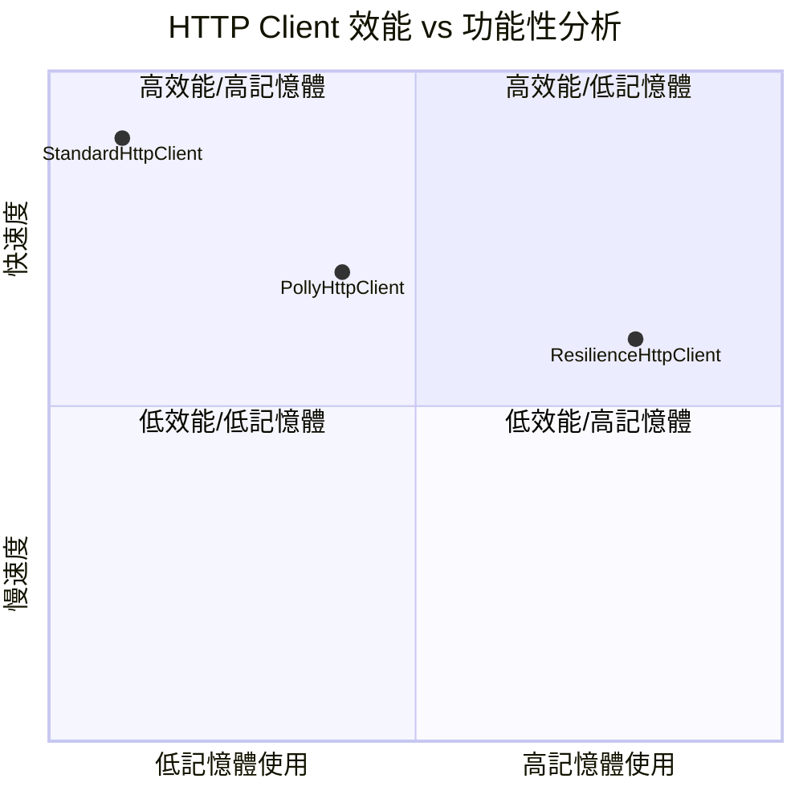
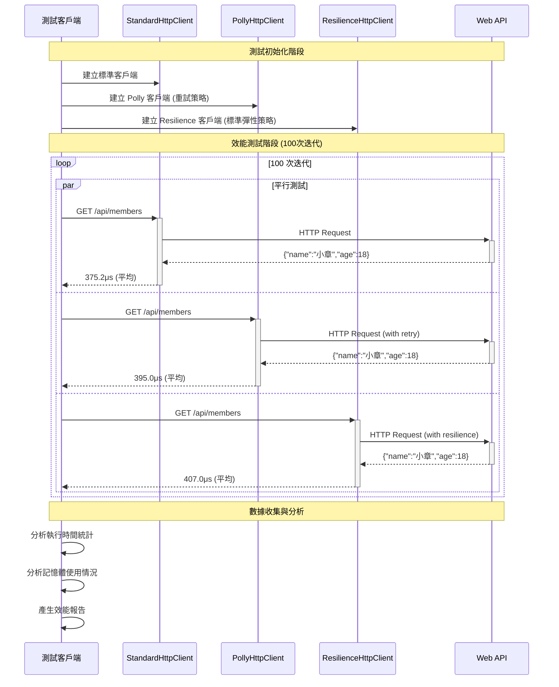
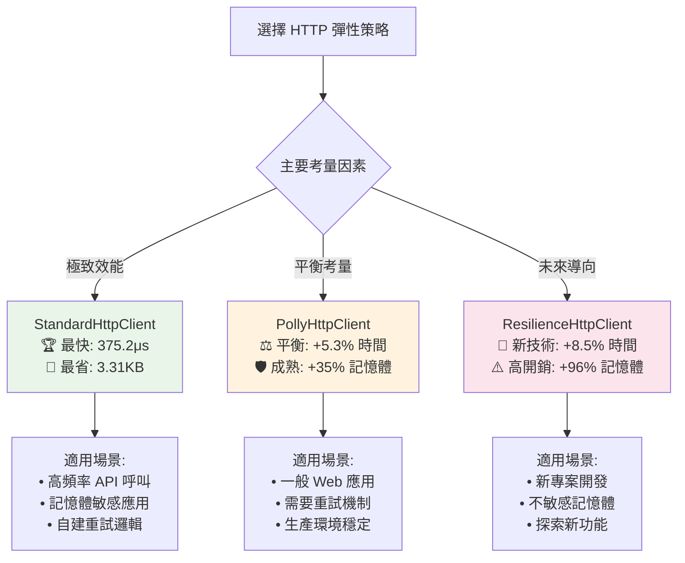

# 效能比較視覺化圖表

## 🚀 測試流程



## ⏱️ 執行時間比較



## 🧠 記憶體使用比較



## 📊 效能差異百分比



## 💾 記憶體開銷分析



## 🎯 效能與功能平衡



## 🔄 測試架構流程



## 📈 趨勢分析

```mermaid
gitgraph
    commit id: "StandardHttpClient"
    commit id: "基準測試: 375.2μs"

    branch polly-client
    commit id: "PollyHttpClient"
    commit id: "增加 5.3% 延遲"
    commit id: "增加 35% 記憶體"

    checkout main
    branch resilience-client
    commit id: "ResilienceHttpClient"
    commit id: "增加 8.5% 延遲"
    commit id: "增加 96% 記憶體"

    checkout main
    merge polly-client
    merge resilience-client
    commit id: "效能測試完成"
```

## 🎉 總結建議

