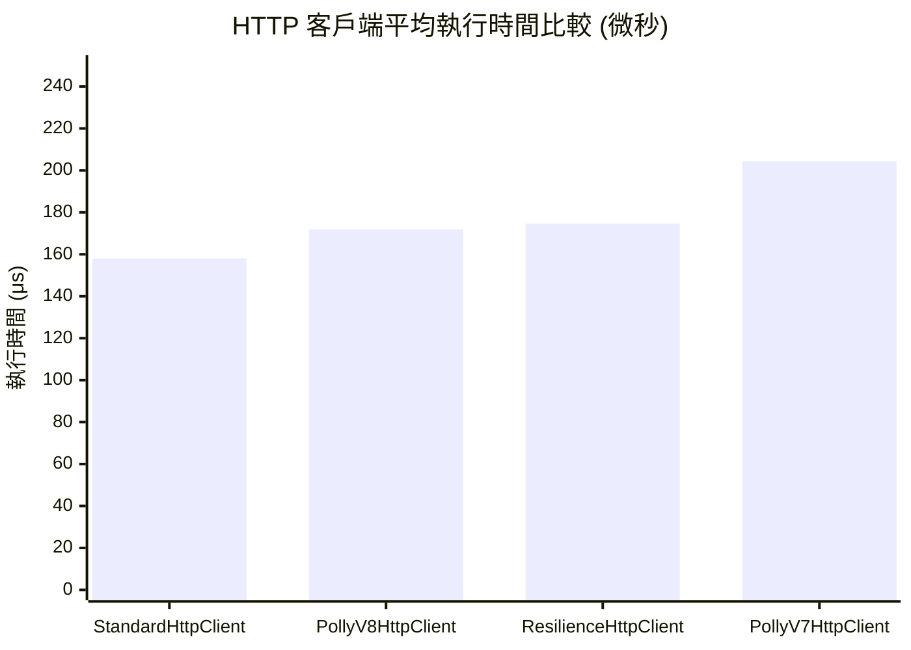
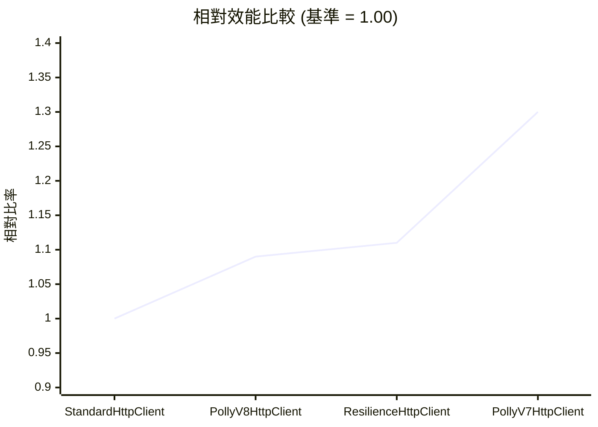
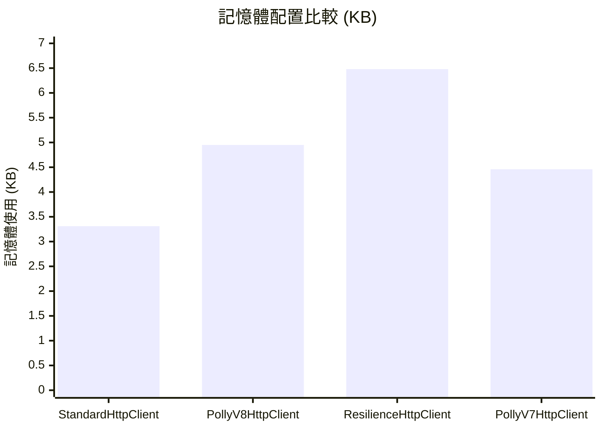
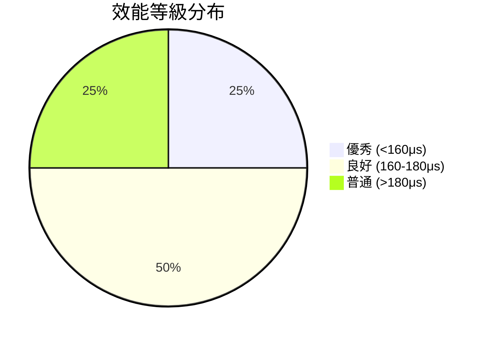
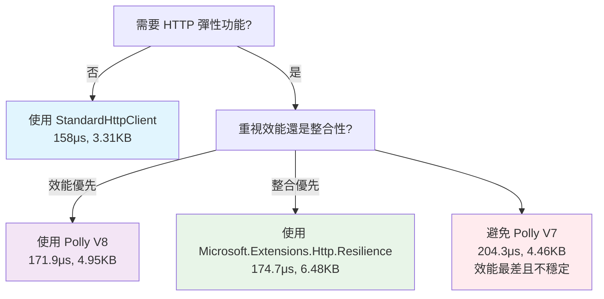
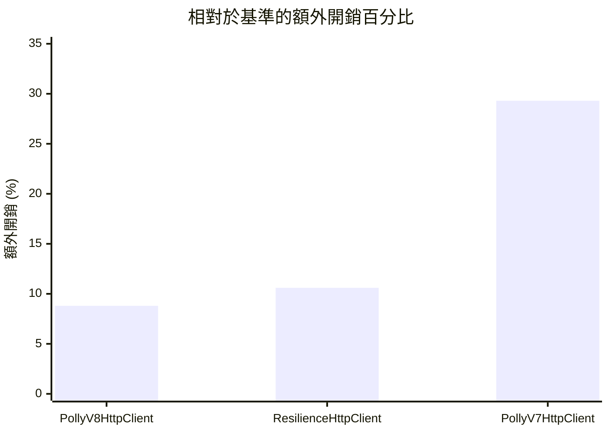
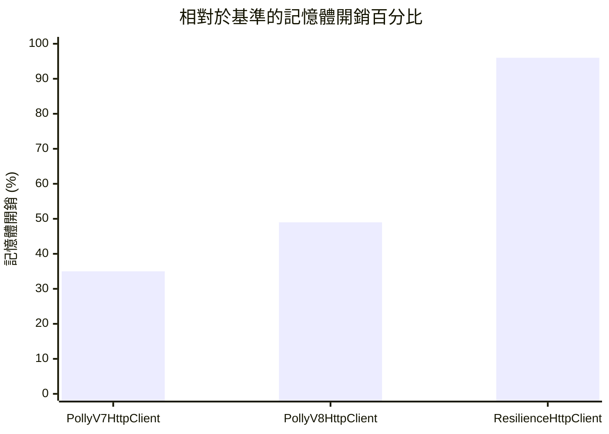
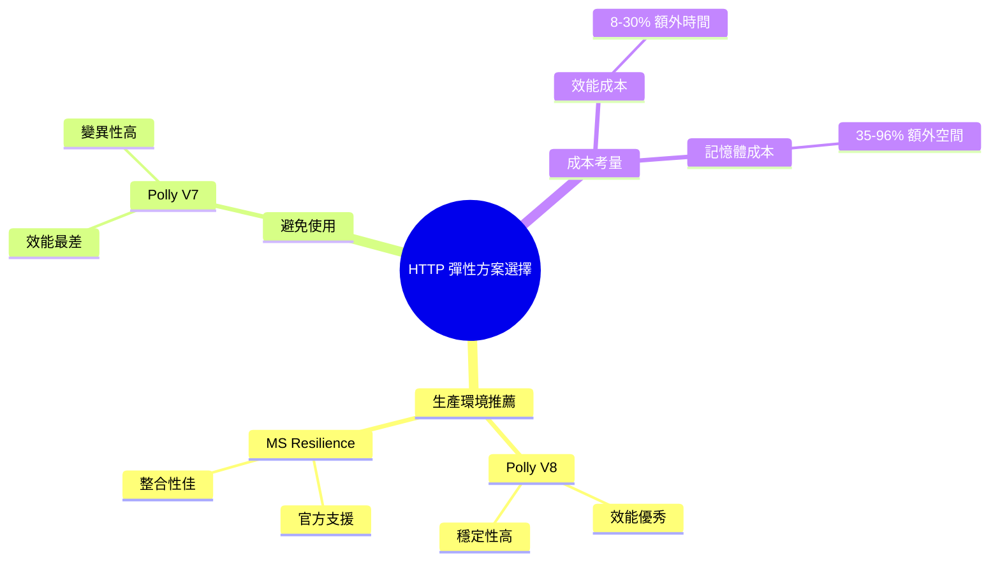

# HttpResilienceBenchmark 效能圖表報告

## 📊 效能測試視覺化分析

### 1. 平均執行時間比較



### 2. 相對效能比較 (以 StandardHttpClient 為基準)



### 3. 記憶體配置比較



### 4. 效能與記憶體使用關係圖

```mermaid
scatter-beta
    title "效能 vs 記憶體使用"
    x-axis "執行時間 (μs)" 150 --> 210
    y-axis "記憶體使用 (KB)" 3 --> 7

    point(158.0, 3.31) "StandardHttpClient"
    point(171.9, 4.95) "PollyV8HttpClient"
    point(174.7, 6.48) "ResilienceHttpClient"
    point(204.3, 4.46) "PollyV7HttpClient"
```

### 5. 效能等級分類



### 6. 技術選型決策流程圖



### 7. 效能開銷分析



### 8. 記憶體開銷分析



## 📈 關鍵洞察

### 效能排名
1. **🥇 StandardHttpClient**: 158.0μs (基準)
2. **🥈 PollyV8HttpClient**: 171.9μs (+8.8%)
3. **🥉 ResilienceHttpClient**: 174.7μs (+10.6%)
4. **❌ PollyV7HttpClient**: 204.3μs (+29.3%)

### 記憶體使用排名
1. **🥇 StandardHttpClient**: 3.31KB (最少)
2. **🥈 PollyV7HttpClient**: 4.46KB (+35%)
3. **🥉 PollyV8HttpClient**: 4.95KB (+49%)
4. **❌ ResilienceHttpClient**: 6.48KB (+96%)

## 🎯 建議總結



## 📊 測試數據摘要

| 指標 | StandardHttpClient | PollyV8HttpClient | ResilienceHttpClient | PollyV7HttpClient |
|------|-------------------|-------------------|---------------------|-------------------|
| **平均時間** | 158.0μs | 171.9μs | 174.7μs | 204.3μs |
| **標準差** | 6.68μs | 8.32μs | 8.46μs | 33.64μs |
| **記憶體使用** | 3.31KB | 4.95KB | 6.48KB | 4.46KB |
| **穩定性** | ⭐⭐⭐⭐⭐ | ⭐⭐⭐⭐⭐ | ⭐⭐⭐⭐⭐ | ⭐⭐⭐ |
| **推薦度** | 無彈性需求時 | 🔥 強烈推薦 | ✅ 推薦 | ❌ 不推薦 |