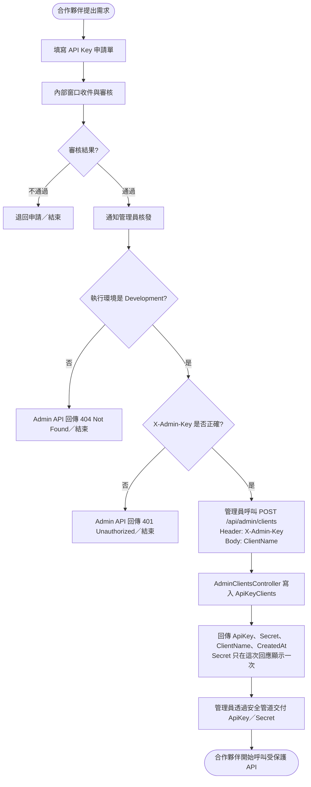
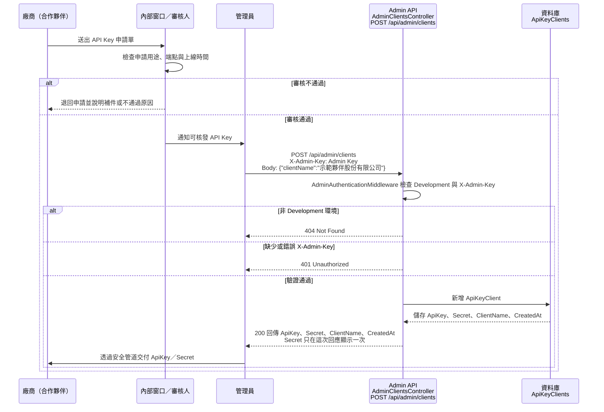

# API Key 申請流程

## 申請流程

| 步驟 | 負責角色 | 說明 |
| --- | --- | --- |
| 1. 提出需求 | 合作夥伴 | 填寫 API Key 申請單，說明使用單位、用途、端點與預計上線時間，送交內部窗口 |
| 2. 收件與審核 | 內部窗口／審核人 | 確認申請目的、使用範圍、聯絡資料與上線時程；需要補充資料時退回申請 |
| 3. 內部核發 | 管理員 | 審核通過後，在 Development 環境使用內部 Admin API `POST /api/admin/clients`，Request Body 只需提供 `ClientName` |
| 4. 記錄核發結果 | 管理員 | 保存核發的 `ApiKey`、合作夥伴名稱與核發時間；`Secret` 不應放入一般申請紀錄或 Log |
| 5. 安全交付 | 管理員／內部窗口 | `Secret` 只會在核發 API 的這次回應中顯示一次，必須透過核准的安全管道交付，不使用 Email 明碼寄送 |
| 6. 開始串接 | 合作夥伴 | 收到 `ApiKey` 與 `Secret` 後，依 API 規格產生四個必要 Header，開始呼叫受保護 API |

### 申請流程圖

下圖將人工審核流程與實際的 Admin API 呼叫放在同一條流程中。管理員呼叫
`POST /api/admin/clients` 時，必須帶 `X-Admin-Key` Header，且只在 Development
環境可用；非 Development 環境會回傳 404，缺少或錯誤的 Admin Key 會回傳 401。

### 申請流程循序圖

下圖說明申請單核准後，管理員如何實際呼叫 Admin API。Admin API 的 Request Body
只需帶 `ClientName`；成功回應包含 `ApiKey`、`Secret`、`ClientName` 與 `CreatedAt`，
其中 `Secret` 只有這次核發回應會顯示。

管理員核發時使用的 Admin API 是內部管理工具，不是合作夥伴可以直接使用的申請入口。此 API
需要 `X-Admin-Key`，且只有 Development 環境可用；非 Development 環境的請求會回傳 404。

合作夥伴收到的兩項資料用途不同：

- **ApiKey**：用來辨識是哪一個合作夥伴在呼叫 API。
- **Secret**：只有合作夥伴與 API 伺服器應知道，用來產生每次請求的 HMAC 簽章；不能放在瀏覽器、
  前端程式碼、申請單、Log 或公開版本庫。
