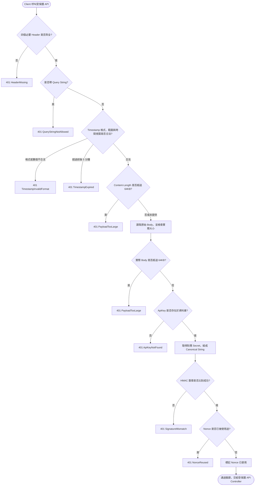
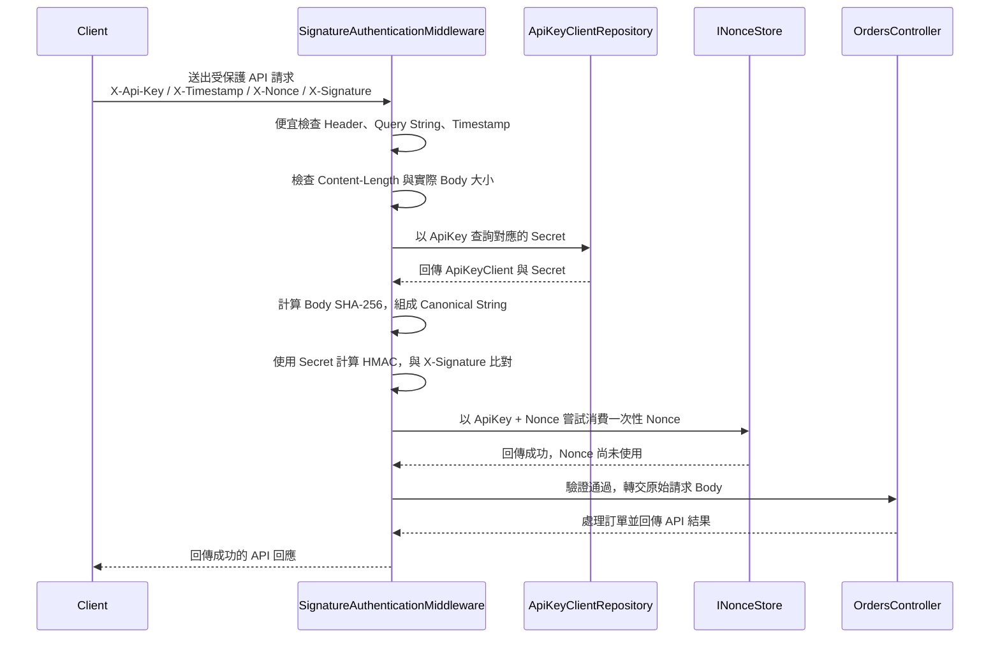

# 受保護 API 驗證流程

## 驗證 Key 流程圖

下圖依照 `SignatureAuthenticationMiddleware` 與 `SignatureValidationHandler` 的實際順序，
說明一次受保護 API 請求如何被檢查。教學 Lab 為了方便觀察結果，失敗回應會帶出具體原因；
正式環境應考慮對外統一回覆一般性的未授權訊息，詳細原因只寫入受控的伺服器紀錄。

必要術語：

- **HMAC**：使用合作夥伴的 `Secret`，把請求內容算成一段只有持有相同 Secret 的雙方才能重現的簽章。
- **Nonce**：每次請求使用的一次性識別值，避免同一個請求被重送。
- **Canonical String**：伺服器與呼叫端共同約定的固定文字格式，內容包含 HTTP 方法、路徑、
  Timestamp、Nonce、ApiKey 與 Body 的 SHA-256 雜湊，雙方必須用完全相同的內容計算 HMAC。

## 驗證 Key 循序圖

以下循序圖展示一次成功呼叫的互動順序。Client 送出的 Body 必須維持原始內容，因為伺服器會
用原始 Body 計算雜湊；驗證成功後，Middleware 才會把請求交給 `OrdersController`。

如果其中任一步驟失敗，Middleware 會直接回傳 HTTP 401，不會呼叫 `OrdersController`。例如：
缺少必要 Header 會是 `HeaderMissing`，簽章內容不一致會是 `SignatureMismatch`，同一個 Nonce
再次使用會是 `NonceReused`。
