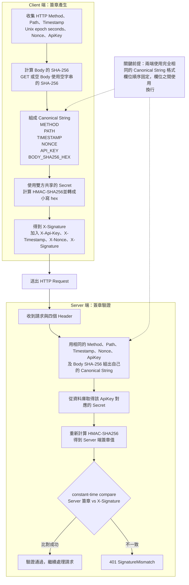

# Client 產生與 Server 驗證簽章

這個機制使用的是 **HMAC-SHA256 簽章**，不是資料還原機制。Client 與 Server 各自獨立計算
HMAC：Client 產生 `X-Signature`，Server 使用資料庫中該 `ApiKey` 對應的 `Secret`，
依完全相同的規則重新計算，再用 constant-time compare 比對兩個結果。Server 不會把資料
還原成另一份簽章結果。

雙方能否得到相同結果，關鍵在於 `Canonical String` 必須完全一致：六個欄位的順序固定，
並且使用 `\n` 換行分隔。Body Hash 也必須針對相同的原始 Body bytes 計算；GET 或空 Body
使用空字串的 SHA-256。

## 流程重點

- Client 與 Server 是**各自獨立計算** HMAC，Server 不會還原 Client 的簽章。
- 比對使用 `constant-time compare`，避免因比較時間差異造成 timing attack。
- 只有 HMAC 結果一致時才算驗證通過；不一致會回傳 `401 SignatureMismatch`。
