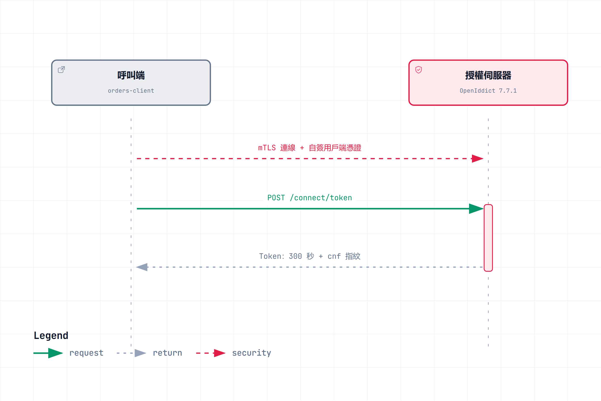
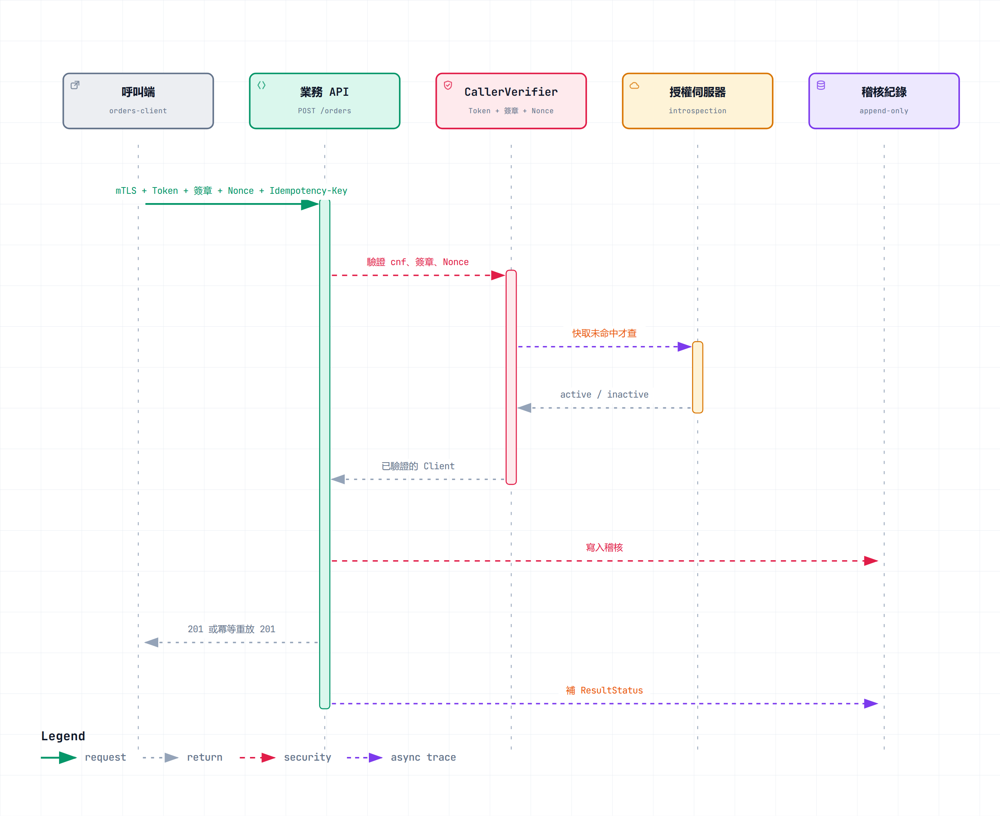
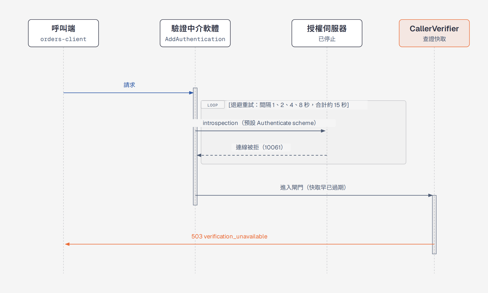
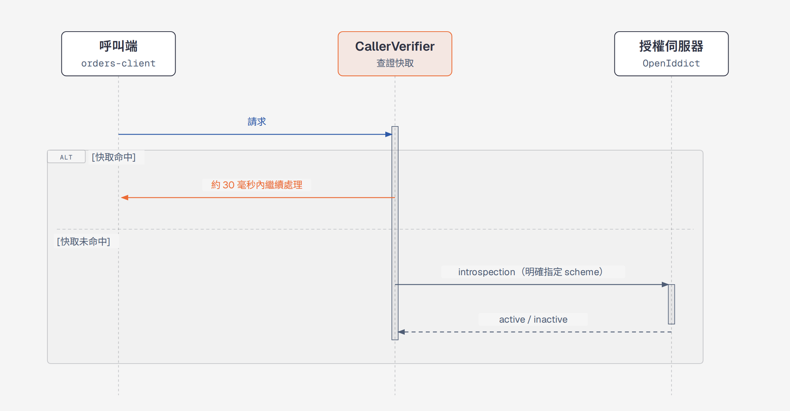

# [.NET] 服務對服務的 API 保護：mTLS 綁定 Token、請求簽章與 BDD 驗收

服務對服務 (Server-to-Server) 的 API 常見做法是發一組 API Key 或 Client Secret，被偷走就能直接呼叫，而且事後很難追查是誰呼叫的。這篇用一個「建立訂單」的 Lab，把 Token 綁憑證、請求簽章、防重放、冪等、撤銷、稽核串起來，並且全部用 BDD 的 Scenario 驗收。

## 開發環境

- OS：Windows 11 + WSL2 (Ubuntu)
- .NET 10 / ASP.NET Core 10
- OpenIddict 7.7.1
- Reqnroll 3.3.4 + xUnit

NOTE：這是 Lab，授權伺服器的資料用 EF Core InMemory，憑證是測試用的自簽憑證，不能直接拿去上正式環境。

## 要解決的問題

原本的規格把保護拆成幾層，每一層擋不同的事：

| 層 | 擋什麼 |
|---|---|
| mTLS + 綁定憑證的 Token | Token 被偷走，換一台機器就不能用 |
| 請求簽章 (HTTP Message Signatures) | 請求內容被改，或冒充別的 Client |
| Nonce | 同一個請求被重放 |
| Idempotency Key + 業務唯一鍵 | 合法重試、併發造成重複建立訂單 |
| 撤銷 + Fail Closed | 憑證洩漏後停用，查證服務壞掉時不放行 |
| 稽核 | 事後知道是哪個已驗證的 Client 做了什麼 |

Gateway 這一層我先不做，所有跟 Gateway 有關的驗收項目都標成「本 lab 不實作，略過（非完成）」，沒有假裝完成。

## 整體呼叫流程

先看一次完整的呼叫怎麼跑。第一張圖是取得 Token：



第二張圖是帶著 Token 呼叫建立訂單，業務 API 依序做的檢查都在這裡。快取命中時不會連到授權伺服器：



## 1. 選型（OpenIddict）

授權伺服器不手刻 OAuth，用 OpenIddict。這裡先做一個最小的驗證專案，確認它能跑通 mTLS Client Credentials，核發綁定憑證的 Opaque Token，再用 introspection 查證。

- 只支援自簽憑證模式 (`self_signed_tls_client_auth`)
- CA 型的 `tls_client_auth` 我試了兩種做法都回 `ID2197`（無效的 TLS 客戶端憑證），這是 Lab，就不往下追了
- Token 效期 300 秒
- 開發方式採 API First，契約放在 `doc/openapi.yml`，但不用 NSwag 產生程式碼，路由是手寫的 Minimal API

NOTE：沒有 NSwag 就沒有機制保證 `openapi.yml` 和路由一致，這個例外有記在 `docs/adr/0001-lab-poc-exceptions.md`。

## 2. 憑證綁定的 Token

呼叫端用自己的憑證向授權伺服器要 Token，Token 裡帶著憑證指紋 (`cnf`)。業務 API 收到請求時，除了查 Token 是否有效，還要比對這次連線的用戶端憑證指紋。

驗收的 Scenario 長這樣：

- mTLS 認證成功後核發短效且綁定憑證的 Token
- 以 Client Secret 要求 Token 不核發
- 以 API Key 呼叫建立訂單不被接受
- 未附用戶端憑證的呼叫端不能查詢 Token 內省

沒有憑證、或用了別張憑證，呼叫都會失敗。呼叫端的身分 (`clientId`) 一律從已驗證的 Token 取得，Request Body 和 `X-Client-Id` 標頭都不採信。

## 3. 請求簽章

Token 只證明「這個 Client 能呼叫」，不證明「這份內容沒被改」。所以每個業務請求還要簽章，採用 RFC 9421 的 `ecdsa-p256-sha256`。

- 每個 Client 有獨立的 ECDSA P-256 簽章金鑰，和 mTLS 的金鑰分開
- POST 涵蓋 method、target-uri、query、authorization、content-type、content-digest、idempotency-key
- GET 涵蓋 method、target-uri、query、authorization
- 業務 API 用實際收到的 Body 重算 `Content-Digest` 來核對
- 簽章的 `keyid` 必須屬於已驗證 Token 的 `client_id`
- `created` 不能比現在超前超過 30 秒，`expires` 是 60 秒

這些數值是我提的 Lab 暫定值，issue 裡都標了「待使用者確認」。

## 4. 防重放與冪等

簽章裡帶 Nonce，同一個 Nonce 第二次出現就拒絕。合法的重試要重簽（換新的 Nonce 和時間），所以防重放和重試不衝突。

重試最後不能多建訂單，這靠兩件事：

1. `Idempotency-Key`：保存 24 小時，最長重試窗 10 分鐘
2. 業務唯一鍵：Body 的 `orderReference`，同一個 Client 底下不能重複，不受 Key 過期影響

處理中的請求有 30 秒的租約，併發的第二個請求會拿到 409。結果相同的重試回 201，並帶 `Idempotent-Replayed: true`。

NOTE：取消訂單的 POST 本來被我要求一定要帶 Idempotency-Key，Code Review 時被抓到這個要求沒有對應的去重語意。取消天生是冪等的，後來就拿掉了。

## 5. 撤銷與 Fail Closed

憑證洩漏時要能停用，而且要在 60 秒內生效。業務 API 會快取查證結果（上限 10 秒），所以撤銷最慢就是等快取過期。實測 Token 撤銷約 10 秒，Client、憑證、簽章金鑰撤銷則是立刻生效。

查證服務壞掉時不能放行，也不能誤判成憑證失效：

```gherkin
Scenario Outline: introspection 回應 <情境> 時回 503 而非 401
  Given 查證服務以假的授權伺服器取代，introspection 行為為 "<行為>"
  When 呼叫端持任意 Token 查詢訂單
  Then 查證故障情境的回應為 <狀態>

  Examples:
    | 情境        | 行為       | 狀態 |
    | 502         | status-502 | 503  |
    | 500         | status-500 | 503  |
    | 壞掉的 JSON | bad-json   | 503  |
    | 空內容      | empty      | 503  |
    | inactive    | inactive   | 401  |
```

只有 Token 明確是 inactive 才回 401，其他任何異常一律回 503 `verification_unavailable`。

## 6. 稽核

稽核記錄的是「已驗證」的呼叫者：Client、簽章金鑰識別、操作、結果。簽章沒通過的請求，Token 裡的 Client 只能標成「未驗證」。稽核不記 Token、標頭值、簽章基底、私鑰和 Body。

寫入稽核失敗時回 503 `audit_unavailable`，不建立訂單，這也是 Fail Closed。

最初的版本在簽章通過後、業務處理前就寫稽核，Code Review 發現這樣缺了「結果」。後來在回應送出時補上最終的 HTTP 狀態碼 (`ResultStatus`)。

## 7. 用 BDD 驗收

每個驗收項目都要有對應的 Scenario，Scenario 先寫、先看到紅燈再實作。Cucumber 的保留字（Feature、Scenario、Given、When、Then）用英文，步驟用中文。測試跑在真實的 Kestrel TLS 上，不是用 mock 的 HttpClient。

最後的結果是 162 個通過、0 失敗、2 個略過（Gateway 的 `@ignore`）。

有些項目只是決策或紀錄（例如 Token 效期有沒有被確認），沒辦法用行為驗證。這類 Scenario 我標成 `@record`，在 issue 的對應表裡獨立列出來，不冒充行為驗證。一開始我偷懶把它們勾成完成，被 Code Review 抓到，後來才改成這樣。

## 8. 踩雷：每個請求多等 15 秒

撤銷的測試有一個情境要把授權伺服器停掉，確認快取過期前還能放行，過期後回 503。結果快取只有 4 秒，第一個請求卻要等約 15 秒才進到業務邏輯，快取早就過期，測試一直失敗。

我一開始懷疑是 HttpClient、mTLS 憑證鏈或 DNS，量測後都排除了。分段量測的結果是：

- Kestrel 收到請求是 11:26:24.350，進到驗證閘門是 11:26:39.372
- 中間對授權伺服器的 `POST /connect/introspect` 重試了好幾次：24.353、25.360、27.361、31.363
- 每次都是 `ConnectFailed 10061`（連線被拒），間隔剛好 1、2、4、8 秒，合計約 15 秒

先用循序圖看修正前後的差別。修正前，驗證中介軟體在每個請求都先去查授權伺服器：



修正後，快取命中的請求不碰授權伺服器：



根因是這段設定：

```csharp
builder.Services.AddAuthentication(OpenIddictValidationAspNetCoreDefaults.AuthenticationScheme);
```

這等於設了預設的 Authenticate scheme，ASP.NET Core 的驗證中介軟體會在每個請求進到我自己的 `CallerVerifier` 之前，先自動對授權伺服器做一次 introspection。後果有兩個：

1. 查證快取形同虛設，就算快取命中，中介軟體照樣去查，結果還被丟掉
2. 授權伺服器掛掉時，每個請求都先吃完 OpenIddict 的指數退避重試

修正是不設預設的 Authenticate scheme，只保留 Challenge 和 Forbid，並且在快取未命中時才明確指定 scheme 呼叫：

```csharp
builder.Services.AddAuthentication(options =>
{
    options.DefaultChallengeScheme = OpenIddictValidationAspNetCoreDefaults.AuthenticationScheme;
    options.DefaultForbidScheme = OpenIddictValidationAspNetCoreDefaults.AuthenticationScheme;
});

// CallerVerifier：快取未命中時才查
result = await context.AuthenticateAsync(OpenIddictValidationAspNetCoreDefaults.AuthenticationScheme);
```

修正後同一個快取命中的查詢從約 15 秒降到約 30 毫秒。我另外加了一個 Scenario，檢查快取命中的查詢在 2 秒內完成。

NOTE：快取未命中而且授權伺服器真的掛掉時，單一請求還是要等約 15 秒才回 503，這是 OpenIddict 預設的重試。要縮短可以用 `SetHttpResiliencePipeline`，這個 Lab 我沒動。

## 心得

- 把保護拆成多層，每一層都有獨立的 Scenario，出問題時比較好定位是哪一層沒擋住
- Fail Closed 要逐一列出異常情況去測，502、500、壞掉的 JSON、空內容都測過才算數
- 不能做的事情要老實標成「略過」，不要為了勾選好看假裝完成
- 驗收項目如果只能用文字紀錄證明，就標成 `@record`，不要讓人誤以為是行為驗證
- 這個專案的「跨執行個體」是同一個程序內共用物件模擬的，防重放的鎖也只是程序內的 `lock`，真正跨程序或跨機器沒有驗證

這個 Lab 是用 Claude Code 的 subagent 依 issue 逐一實作，完成後再做 Standards 與 Spec 兩個面向的 Code Review。前面提到的稽核缺結果、`@record` 都是 Review 抓出來的，可以對照 commit 紀錄看修正過程。

完整代碼位置: https://github.com/yaochangyu/sample.dotblog/tree/master/Security/Lab.Creds.WebApi
