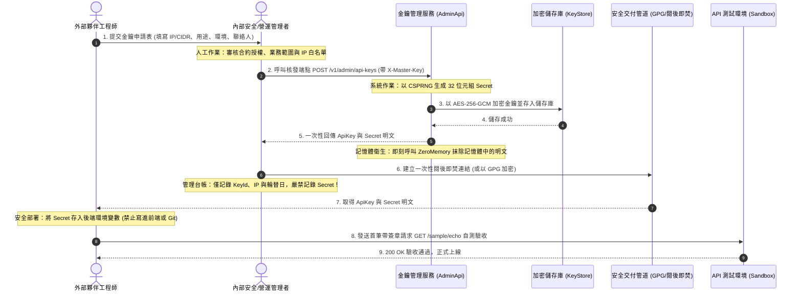
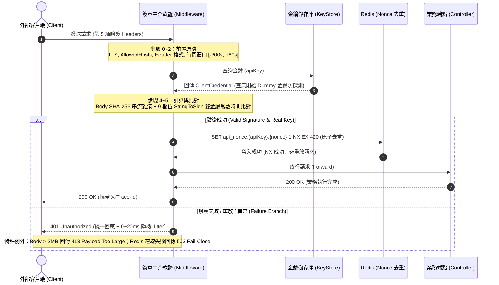

# [.NET] 使用 HMAC-SHA256 打造防重放與防篡改的 API 簽章驗證（API Signature）

> **注意**：本文描述的是進階版設計（9 欄位待簽字串、Redis Nonce 去重、金鑰管理服務與雙金鑰輪替等），與本資料夾 `Lab.Signature.WebApi/` 實際的教學 Lab 程式碼（6 欄位 Canonical String、`IMemoryCache` Nonce、單一固定金鑰）**不是同一套實作**，屬於延伸參考文章，請勿依此文件對照除錯目前的程式碼。實際程式碼的規格請見 [`README.md`](./README.md)。

API 簽章 (API Signature) 是一個在開放平台或跨系統串接時，用來確保請求完整性與身分合法性的安全機制。過去常見的作法只在 Header 帶一把靜態 API Key，但只要請求在傳輸過程被截獲，內容就可能遭到竄改，甚至被惡意人士反覆重放。這次來看看如何透過 HMAC-SHA256 結合非對稱時間窗口與 Nonce，在 ASP.NET Core 中實作一套兼具防篡改、防重放與防時序攻擊的 API 簽章防護體系。

## 開發環境

- 作業系統：Ubuntu 24.04 LTS (或 macOS / Windows 11)
- 開發工具：.NET 10 SDK (C# 14)
- 應用框架：ASP.NET Core (Controllers / Minimal API)
- 快取資料庫：Redis 7.x (用於 Nonce 去重)
- 測試工具：Testcontainers (Docker / Podman)

*(此為建議版本，非強制)*

---

## 核心安全概念

在進入程式碼實作之前，先釐清這套簽章機制要解決的幾項核心問題：

1. **防篡改 (Integrity)**：客戶端將 HTTP Method、URL 路徑、排序後的 Query String、Content-Type、Body 雜湊值 (SHA-256)、Timestamp 與 Nonce 依序組裝成「待簽字串」，並用只有雙方知道的 Secret 算出一組 HMAC-SHA256 簽章。只要中間有人動過任何一個欄位，驗簽就會失敗。
2. **防重放 (Anti-Replay)**：透過兩道關卡防止攻擊者側錄合法請求後重複送出：
   - 第一道是**非對稱時間窗口 (Time Window)**（允許過去 300 秒、未來 60 秒），時間偏差過大就直接丟棄。
   - 第二道是 **一次性隨機數 (Nonce)**，伺服端透過 Redis 的原子操作 `SET api_nonce:{apiKey}:{nonce} 1 NX EX 420` 去重，只要 Nonce 重複出現就拒絕。
3. **時序攻擊防護 (Timing Attack Protection)**：字串比對簽章如果直接用 `==`，比對耗時會因為前幾個字元相符程度不同而有微妙差異。這裡一律使用 `CryptographicOperations.FixedTimeEquals` 進行常數時間比對；同時若金鑰不存在，也不會提早結束，而是繼續跑完 Dummy 金鑰的雜湊運算，避免攻擊者藉由響應時間反推金鑰是否存在。

---

## 金鑰頒發與安全交付循序圖（Key Provisioning）

在開始計算簽章之前，外部夥伴必須先取得合法的 `ApiKey` 與 `Secret`。金鑰管理是整個簽章體系的第一道防線，如果金鑰在發放時就直接用 Email 明文傳送，那後面的 HMAC-SHA256 基本上就白做了。

這裡整理一張金鑰申請、審核、AES-GCM 加密儲存與一次性安全交付的循序圖 (Sequence Diagram)：



NOTE：系統只在核發與輪替的當下顯示一次 Secret 明文，隨後記憶體便立刻抹除，底層資料庫只會保留 AES-256-GCM 密文。也就是說，即便日後進資料庫也「無法反查明文」；外部夥伴若是遺失了 Secret，只能重新發起輪替 (Rotate) 發放新金鑰。

---

## 驗簽流程循序圖 (Sequence Diagram)

在進入各模組實作前，這裡先附上一張執行期的循序圖 (Sequence Diagram)，展示客戶端請求送達時，中介軟體 (Middleware)、金鑰庫 (KeyStore)、Redis 與業務端點之間的完整互動時序：



---

## 典型使用場景與角色分工

在實際企業架構中，API 簽章體系主要服務於「外部 B2B 系統串接」與「開放平台對接」。參考專案內部的快速入門指南 (`quickstart.md`)，整個體系明確劃分為兩大角色與五種典型使用場景：

### 1. 雙角色分工與責任邊界

- **外部合作夥伴工程師 (Partner Backend)**：
  - **核心職責**：妥善保管核發的 Secret，存入後端環境變數（禁止放進前端或寫進 Git）。
  - **串接流程**：發送請求時，嚴格將 9 個欄位組裝為待簽字串，計算出 64 字元的 HMAC-SHA256 簽章，並攜帶 5 個必要 Headers（`X-Api-Key`、`X-Signature-Version`、`X-Timestamp`、`X-Nonce`、`X-Signature`）。
  - **上線前檢驗**：先在 Sandbox 測試環境以 `GET /sample/echo` 自測，確認無誤後才切換至正式環境。
- **內部管理與安全團隊 (Admin Team)**：
  - **核心職責**：維運獨立部署的金鑰管理服務 (AdminApi)，負責 IP 白名單、速率限制 (Rate Limit) 與合約授權審核。
  - **安全交付**：核發或輪替時，系統僅在記憶體中顯示一次明文 Secret，管理員必須透過 GPG 加密或閱後即焚連結安全交付，且離線台帳絕不記錄 Secret。
  - **生命週期維護**：負責每 180 天的例行雙金鑰平滑輪替 (Rotation) 與異常洩漏時的緊急撤銷 (Revoke)。

### 2. 五大典型使用場景

| 使用場景 | 建議環境 | 業務與技術特點 |
|---|---|---|
| **場景 1：離線開發與演算法對帳** | 本機 (Local) | 使用官方測試向量（固定 Secret 與 Request），在尚未呼叫 API 前先對帳 9 欄位待簽字串順序與雜湊值，避免上線後踩坑。 |
| **場景 2：端到端 Sandbox 連線自測** | 測試 (Sandbox) | 取得 `ak_test_...` 金鑰後呼叫 `/sample/echo`，驗證本機時鐘 (NTP) 誤差是否在時間窗口內、UUIDv4 Nonce 格式與網路連線。 |
| **場景 3：正式業務流量與防篡改** | 正式 (Production) | 使用獨立的 `ak_live_...` 金鑰對接正式端點（如 `POST /v1/jobs` 職缺同步），防範中間人篡改 Body 資料與偽造身分。 |
| **場景 4：雲端動態 IP 夥伴防護** | 正式 (Production) | 針對部署於 AWS / GCP / Azure 或 K8s 叢集、出站 IP 頻繁變動的外部夥伴，支援免填固定 IP 白名單，改由「TLS + HMAC + 時間窗口 + Nonce + Rate Limit」五層縱深防禦替代。 |
| **場景 5：180 天例行無痛金鑰輪替** | 正式 (Production) | 金鑰屆期時，透過 AdminApi 產生 Secondary 新金鑰 K2，新舊金鑰並存過渡（24~48 小時），待夥伴更新環境變數後一鍵 Promote，達到零停機切換。 |

---

## 1. 規範待簽字串（StringToSign）

待簽字串是整個簽章驗證的地基，兩端只要有一個空白或換行不一致，簽出來的值就完全對不上。

這裡我們規定待簽字串固定由 9 個欄位以換行字元 (`\n`) 連接，結尾不換行：

```text
SIG1
HTTP_METHOD
CANONICAL_HOST
CANONICAL_PATH
CANONICAL_QUERY_STRING
CONTENT_TYPE
BODY_SHA256_HEX
X_TIMESTAMP
X_NONCE
```

底下記錄組裝待簽字串的具體實作。

```csharp
public static class SignatureHelper
{
    // 組裝 9 個欄位的標準待簽字串
    public static string _01_組裝待簽字串(
        string httpMethod,
        string host,
        string rawPath,
        string queryString,
        string contentType,
        string bodySha256Hex,
        long timestamp,
        string nonce)
    {
        // NOTE：Path 必須取自原始未解碼路徑 (RawTarget)，避免 URL 解碼造成的語義歧異
        var canonicalPath = string.IsNullOrEmpty(rawPath) ? "/" : rawPath;
        var canonicalHost = host.ToLowerInvariant();
        var canonicalContentType = contentType?.Split(';')[0].Trim().ToLowerInvariant() ?? string.Empty;

        return string.Join("\n",
            "SIG1",
            httpMethod.ToUpperInvariant(),
            canonicalHost,
            canonicalPath,
            queryString,
            canonicalContentType,
            bodySha256Hex.ToLowerInvariant(),
            timestamp,
            nonce.ToLowerInvariant());
    }
}
```

NOTE：若請求沒有 Body（例如 GET 或 DELETE），`BODY_SHA256_HEX` 固定填入空字串的 SHA-256 雜湊值（也就是 `e3b0c44298fc1c149afbf4c8996fb92427ae41e4649b934ca495991b7852b855`）。

---

## 2. 客戶端計算簽章（ComputeSignature）

待簽字串備妥後，接下來就是用客戶端保管的 SecretBytes 計算 HMAC-SHA256，並轉為 64 字元的小寫十六進位字串。

底下示範客戶端計算簽章的標準寫法。

```csharp
public static class SignatureHelper
{
    // 使用 HMAC-SHA256 計算 64 字元小寫 Hex 簽章
    public static string _02_計算客戶端簽章(string stringToSign, byte[] secretBytes)
    {
        using var hmac = new HMACSHA256(secretBytes);
        var hashBytes = hmac.ComputeHash(Encoding.UTF8.GetBytes(stringToSign));
        return Convert.ToHexStringLower(hashBytes);
    }
}
```

客戶端送出 HTTP 請求時，必須在 Header 帶入以下 5 個欄位：
- `X-Api-Key`：公開金鑰識別碼
- `X-Signature-Version`：版本號（固定為 `1`）
- `X-Timestamp`：當前 Unix Epoch 秒數
- `X-Nonce`：隨機生成的 UUIDv4（全小寫）
- `X-Signature`：前面算出來的 64 字元簽章值

---

## 3. 實作驗簽中介軟體（ApiSignatureMiddleware）

到了伺服端，我們透過 ASP.NET Core 的 Middleware 攔截每個請求，依序執行安全檢查。

底下是中介軟體的簡化驗簽流程。

```csharp
public sealed class ApiSignatureMiddleware
{
    private readonly RequestDelegate _next;
    private readonly ApiSignatureOptions _options;

    public ApiSignatureMiddleware(RequestDelegate next, IOptions<ApiSignatureOptions> options)
    {
        _next = next;
        _options = options.Value;
    }

    public async Task InvokeAsync(
        HttpContext context,
        IKeyStore keyStore,
        INonceStore nonceStore)
    {
        // 1. 檢查必要 Header 是否齊全
        if (!TryExtractHeaders(context.Request, out var apiKey, out var timestamp, out var nonce, out var signature))
        {
            context.Response.StatusCode = StatusCodes.Status401Unauthorized;
            return;
        }

        // 2. 檢查時間窗口（過去 300 秒、未來 60 秒）
        var now = DateTimeOffset.UtcNow.ToUnixTimeSeconds();
        if (now - timestamp > _options.PastToleranceSeconds || timestamp - now > _options.FutureToleranceSeconds)
        {
            context.Response.StatusCode = StatusCodes.Status401Unauthorized;
            return;
        }

        // 3. 查詢金鑰；若找不到金鑰使用 Dummy 金鑰，避免時序側通道洩漏
        var credential = await keyStore.FindActiveAsync(apiKey, context.RequestAborted) 
                         ?? ClientCredential.Dummy;

        // 4. 重放攻擊檢查：嘗試取得 Nonce
        var acquired = await nonceStore.TryAcquireAsync(apiKey, nonce, TimeSpan.FromSeconds(420));
        if (!acquired)
        {
            context.Response.StatusCode = StatusCodes.Status401Unauthorized;
            return;
        }

        // 5. 驗證 HMAC 簽章
        var isValid = _03_常數時間比對簽章(context.Request, credential, signature);
        if (!isValid)
        {
            context.Response.StatusCode = StatusCodes.Status401Unauthorized;
            return;
        }

        await _next(context);
    }

    // 採用固定時間比較，防止時序攻擊
    private static bool _03_常數時間比對簽章(HttpRequest request, ClientCredential cred, string clientSig)
    {
        var expectedSig = CalculateExpectedSignature(request, cred.PrimarySecretBytes);
        var clientBytes = Encoding.UTF8.GetBytes(clientSig);
        var expectedBytes = Encoding.UTF8.GetBytes(expectedSig);

        return CryptographicOperations.FixedTimeEquals(clientBytes, expectedBytes);
    }
}
```

NOTE：在驗證時，若是金鑰不存在或 Nonce 重複，不要在對外錯誤訊息中明確告知「金鑰錯誤」或「Nonce 已被使用」，一律回應統一的 401 狀態碼並搭配少許隨機延遲（Jitter），讓攻擊者無法摸清系統邊界。

---

## 4. 實作 Nonce 原子去重（RedisNonceStore）

為了保證在高並發情況下同一個 Nonce 只能被消費一次，使用 Redis 的 `SET ... NX EX` 是最簡單有效的手段。

底下是透過 Redis 實現 Nonce 原子去重的程式碼。

```csharp
public sealed class RedisNonceStore : INonceStore
{
    private readonly IConnectionMultiplexer _redis;

    public RedisNonceStore(IConnectionMultiplexer redis)
    {
        _redis = redis;
    }

    public async Task<bool> _04_嘗試鎖定隨機數(
        string apiKey,
        string nonce,
        TimeSpan ttl,
        CancellationToken cancellationToken = default)
    {
        var db = _redis.GetDatabase();
        var key = $"api_nonce:{apiKey}:{nonce}";

        // 使用 Redis NX (Not Exists) 原子操作寫入，過期時間設定 420 秒
        var acquired = await db.StringSetAsync(
            key,
            "1",
            expiry: ttl,
            when: When.NotExists);

        return acquired;
    }
}
```

至於為什麼 TTL 設定 420 秒？因為時間窗口允許過去 300 秒與未來 60 秒（合計 360 秒），再加上 60 秒的時鐘偏移緩衝，420 秒剛好能覆蓋所有有效窗口內的請求，時間一過就算攻擊者拿舊 Nonce 來敲門，也會在第二步的「時間窗口檢查」就被直接擋下丟棄，完全不會浪費 Redis 資源。

---

## 5. 註冊服務與套用中介軟體（Program.cs）

在 ASP.NET Core 中，我們只要把中介軟體加入管線即可啟用全域防護。

底下示範在管線中註冊與套用簽章防護。

```csharp
var builder = WebApplication.CreateBuilder(args);

// 註冊簽章設定與相關相依服務
builder.Services.AddApiSignature(builder.Configuration);

// 註冊金鑰庫與 Redis Nonce 儲存庫
builder.Services.AddSingleton<IKeyStore, DatabaseKeyStore>();
builder.Services.AddSingleton<INonceStore, RedisNonceStore>();

var app = builder.Build();

// 套用簽章驗證中介軟體
app.UseApiSignature();

// 免簽章的健康檢查路徑
app.MapGet("/healthz", () => Results.Ok(new { status = "healthy" }));

// 受簽章保護的業務端點
app.MapGet("/sample/echo", () => Results.Ok(new { message = "pong" }));

app.Run();
```

若有內部監控需要的 `/healthz`，可以在設定檔中透過 `ExemptPaths` 將其排除，這樣就不必每次打健康檢查還要算一次簽章，不然監控程式可就噴掉了啦!!!

---

## 心得

實作 API 簽章雖然在前期會增加客戶端的對接成本，但比起單純只用 static API Key 或 Bearer Token，它帶來的安全性優勢非常明確：

- **優點**：
  1. 金鑰永不落地於網路傳輸，即使封包被竊聽，攻擊者也拿不到 Secret。
  2. 簽章範圍涵蓋 Method、Path、Query 與 Body，任何參數篡改都會立即被識破。
  3. Nonce 與時間窗口結合，徹底封殺重放攻擊路徑。
  4. 支援雙金鑰（Primary/Secondary）並存，可以在不中斷服務的情況下無痛輪替金鑰。

- **使用場景**：
  - 外部 B2B 合作夥伴串接
  - 金融交易或涉及敏感個資的資料交換 API
  - 雲端動態 IP 或無法設定固定 IP 白名單的公開 Webhook / Open API

對於一般的內部微服務調用，若已在安全的 VPC 內部且有 mTLS 防護，或許不需要每個請求都執行完整簽章驗證（這不是這一篇的重點，就不多說了）；但若要面向外部公網或未受信任的網路環境，這套 API Signature 防護設計會是一道非常堅固的防線。
