# WebAPI 防濫用機制 - Token 驗證實作

## 📋 專案說明

本專案實作基於 Token 的 Web API 防濫用機制，使用 ASP.NET Core Web API (.NET 10) 建立。透過自訂 Token 產生、儲存與驗證機制，防止 API 被濫用或遭受 CSRF 攻擊。

## 🎯 核心功能

### 1. Token 管理
- ✅ 動態產生 GUID 格式 Token
- ✅ 可設定 Token 過期時間
- ✅ 可設定 Token 使用次數限制
- ✅ Server 端使用 IMemoryCache 儲存 Token

### 2. API 端點
- **GET /api/token** - 取得新的 Token
  - 參數：`maxUsage` (最大使用次數，預設 1)
  - 參數：`expirationMinutes` (過期時間，預設 5 分鐘)
  - 回應：在 Response Header 的 `X-CSRF-Token` 中回傳 Token

- **POST /api/protected** - 受保護的 API 端點
  - 需在 Request Header 帶入 `X-CSRF-Token`
  - 驗證 Token 有效性、過期時間與使用次數

### 3. 安全防護
- ✅ Token 過期自動失效
- ✅ Token 使用次數達上限後自動失效
- ✅ 無效或偽造 Token 拒絕存取
- ✅ 缺少 Token 拒絕存取
- ✅ CORS 支援，允許瀏覽器跨域呼叫

## 🏗️ 專案架構

```
Lab.CSRF2.WebAPI/
├── Controllers/
│   ├── TokenController.cs        # Token 產生端點
│   └── ProtectedController.cs    # 受保護的 API 端點
├── Services/
│   ├── ITokenService.cs          # Token 服務介面
│   └── TokenService.cs           # Token 服務實作
├── Filters/
│   └── ValidateTokenAttribute.cs # Token 驗證 ActionFilter
├── wwwroot/
│   └── test.html                 # HTML 測試頁面
└── Program.cs                    # 應用程式進入點
```

## 🚀 快速開始

### 1. 編譯與執行

```powershell
cd Lab.CSRF2.WebAPI
dotnet build
dotnet run
```

預設執行於：
- HTTPS: `https://localhost:7001`
- HTTP: `http://localhost:5000`

### 2. 測試方式

#### 方式一：使用 PowerShell 腳本
```powershell
.\test-api.ps1
```

#### 方式二：使用瀏覽器測試頁面
開啟瀏覽器訪問：
```
https://localhost:7001/test.html
```

#### 方式三：手動使用 cURL 或 PowerShell

**取得 Token:**
```powershell
$response = Invoke-WebRequest -Uri "https://localhost:7001/api/token?maxUsage=2&expirationMinutes=5" -SkipCertificateCheck
$token = $response.Headers['X-CSRF-Token']
```

**呼叫受保護的 API:**
```powershell
$headers = @{
    "X-CSRF-Token" = $token
    "Content-Type" = "application/json"
}
$body = @{ data = "測試資料" } | ConvertTo-Json

Invoke-WebRequest -Uri "https://localhost:7001/api/protected" -Method Post -Headers $headers -Body $body -SkipCertificateCheck
```

## 🧪 安全性測試案例

執行 `test-api.ps1` 會自動測試以下情境：

1. ✅ **取得 Token** - 驗證 Token 產生機制
2. ✅ **有效 Token 第一次使用** - 驗證正常流程
3. ✅ **有效 Token 第二次使用** - 驗證使用次數計數
4. ❌ **Token 使用次數超過限制** - 應回傳 401 Unauthorized
5. ❌ **使用無效 Token** - 應回傳 401 Unauthorized
6. ❌ **缺少 Token Header** - 應回傳 401 Unauthorized

## 🔧 技術選型

| 項目 | 技術 |
|------|------|
| 框架 | ASP.NET Core Web API (.NET 10) |
| Token 儲存 | IMemoryCache |
| Token 格式 | GUID |
| 驗證方式 | Custom ActionFilter |
| CORS | 允許所有來源 (開發環境) |

## 📝 使用範例

### JavaScript 呼叫範例

```javascript
// 1. 取得 Token
const tokenResponse = await fetch('https://localhost:7001/api/token?maxUsage=1&expirationMinutes=5');
const token = tokenResponse.headers.get('X-CSRF-Token');

// 2. 呼叫受保護的 API
const response = await fetch('https://localhost:7001/api/protected', {
    method: 'POST',
    headers: {
        'Content-Type': 'application/json',
        'X-CSRF-Token': token
    },
    body: JSON.stringify({ data: '測試資料' })
});

const result = await response.json();
console.log(result);
```

## ⚠️ 注意事項

1. **開發環境設定**：目前 CORS 設定為允許所有來源，生產環境請限制特定來源
2. **HTTPS 憑證**：開發環境使用自簽憑證，測試時需加入 `-SkipCertificateCheck` 參數
3. **Token 儲存**：使用 IMemoryCache，應用程式重啟後 Token 會消失
4. **擴充性**：可改用 Redis 或資料庫儲存 Token 以支援分散式環境

## 📊 驗證流程

```mermaid
sequenceDiagram
    participant Client
    participant API
    participant TokenService
    participant Cache

    Client->>API: GET /api/token
    API->>TokenService: GenerateToken()
    TokenService->>Cache: 儲存 Token + 元資料
    TokenService-->>API: 回傳 Token
    API-->>Client: X-CSRF-Token Header

    Client->>API: POST /api/protected (帶 Token)
    API->>TokenService: ValidateToken()
    TokenService->>Cache: 檢查 Token 存在性
    TokenService->>TokenService: 驗證過期時間
    TokenService->>TokenService: 驗證使用次數
    TokenService->>Cache: 更新使用次數
    TokenService-->>API: 驗證結果
    API-->>Client: 200 OK / 401 Unauthorized
```



## 🤝 貢獻

歡迎提出 Issue 或 Pull Request！

## 📄 授權

MIT License
