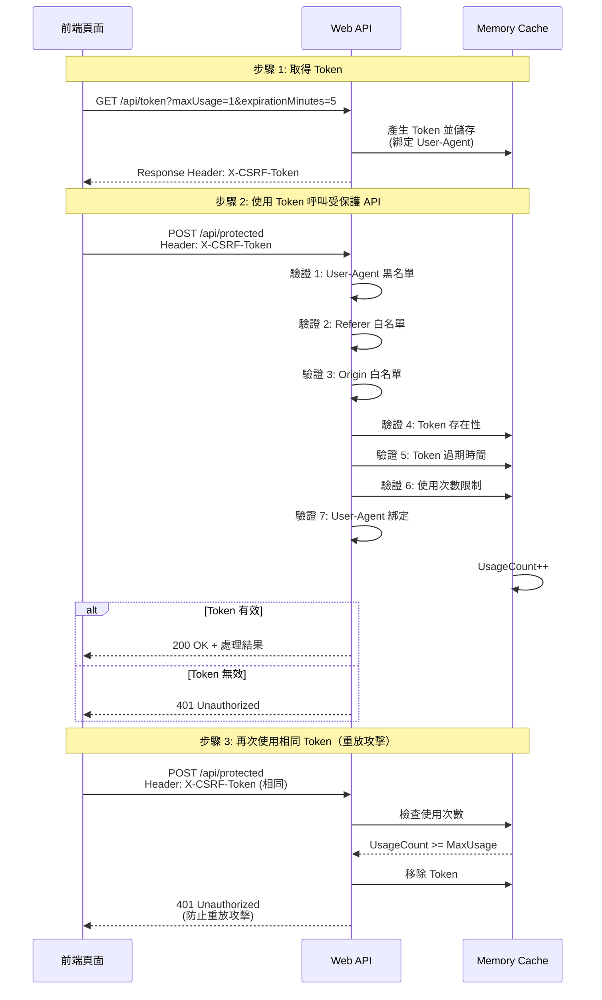

# ASP.NET Core Web API 防濫用機制實戰

## 前言

公開 API 最怕被爬蟲或惡意程式濫用，造成服務負擔。本文分享如何在 ASP.NET Core Web API 中實作多層防護機制，確保 API 只能被授權的網頁使用。

## 防護機制概覽

本專案實作了 8 層防護機制：

| 層級 | 防護機制 | 用途 |
|------|---------|------|
| 1 | 速率限制 | 防止暴力攻擊 |
| 2 | User-Agent 黑名單 | 阻擋爬蟲工具 |
| 3 | Referer 白名單 | 驗證請求來源 |
| 4 | Origin 白名單 | CORS 請求驗證 |
| 5 | Token 存在性 | 必須提供 Token |
| 6 | Token 有效性 | 伺服器端驗證 |
| 7 | Token 過期檢查 | 時效性控制 |
| 8 | User-Agent 綁定 | 防止 Token 盜用 |

## Server Side 配置

### 1. 速率限制設定

在 `Program.cs` 中配置兩種速率限制：

```csharp
builder.Services.AddRateLimiter(options =>
{
    // API 端點: 10 秒內最多 10 次
    options.AddFixedWindowLimiter("api", limiterOptions =>
    {
        limiterOptions.Window = TimeSpan.FromSeconds(10);
        limiterOptions.PermitLimit = 10;
    });

    // Token 生成: 1 分鐘內最多 5 個
    options.AddFixedWindowLimiter("token", limiterOptions =>
    {
        limiterOptions.Window = TimeSpan.FromMinutes(1);
        limiterOptions.PermitLimit = 5;
    });
});
```

### 2. CORS 白名單

限制允許的來源網域：

```csharp
builder.Services.AddCors(options =>
{
    options.AddDefaultPolicy(policy =>
    {
        policy.WithOrigins(
                "http://localhost:5073",
                "https://localhost:5073"
              )
              .AllowAnyMethod()
              .AllowAnyHeader()
              .WithExposedHeaders("X-CSRF-Token")
              .AllowCredentials();
    });
});
```

### 3. Token 生成與驗證

Token 使用 GUID 格式，並記錄以下資訊：

```csharp
public class TokenData
{
    public DateTime CreatedAt { get; set; }
    public DateTime ExpiresAt { get; set; }
    public int MaxUsageCount { get; set; }      // 使用次數限制
    public int UsageCount { get; set; }          // 已使用次數
    public string UserAgent { get; set; }        // 綁定的 User-Agent
    public string IpAddress { get; set; }        // IP 地址（可選）
}
```

Token 驗證核心邏輯：

```csharp
public bool ValidateToken(string token, string userAgent, string ipAddress)
{
    // 1. Token 是否存在於快取
    if (!_cache.TryGetValue(token, out TokenData? tokenData))
        return false;

    // 2. Token 是否過期
    if (DateTime.UtcNow > tokenData.ExpiresAt)
    {
        _cache.Remove(token);
        return false;
    }

    // 3. 使用次數是否超過限制
    if (tokenData.UsageCount >= tokenData.MaxUsageCount)
    {
        _cache.Remove(token);
        return false;
    }

    // 4. User-Agent 是否一致
    if (!tokenData.UserAgent.Equals(userAgent, StringComparison.OrdinalIgnoreCase))
        return false;

    // 5. 更新使用次數
    tokenData.UsageCount++;
    _cache.Set(token, tokenData, new MemoryCacheEntryOptions
    {
        AbsoluteExpiration = tokenData.ExpiresAt
    });

    // 6. 達到最大使用次數，移除 Token
    if (tokenData.UsageCount >= tokenData.MaxUsageCount)
        _cache.Remove(token);

    return true;
}
```

### 4. 多層驗證 Filter

`ValidateTokenAttribute` 整合所有驗證邏輯：

```csharp
public class ValidateTokenAttribute : ActionFilterAttribute
{
    private static readonly string[] BotUserAgents = new[]
    {
        "curl/", "wget/", "scrapy", "python-requests", "java/",
        "go-http-client", "http.rb/", "axios/", "node-fetch"
    };

    public override void OnActionExecuting(ActionExecutingContext context)
    {
        // 驗證 1: User-Agent 黑名單
        if (!ValidateUserAgent(userAgent, logger))
        {
            context.Result = new ObjectResult(new { error = "Forbidden User-Agent" })
                { StatusCode = 403 };
            return;
        }

        // 驗證 2: Referer 白名單
        if (!ValidateReferer(request, logger))
        {
            context.Result = new ObjectResult(new { error = "Invalid Referer" })
                { StatusCode = 403 };
            return;
        }

        // 驗證 3: Origin 白名單（CORS 請求）
        if (!ValidateOrigin(request, logger))
        {
            context.Result = new ObjectResult(new { error = "Invalid Origin" })
                { StatusCode = 403 };
            return;
        }

        // 驗證 4: Token 驗證
        if (!tokenService.ValidateToken(token, userAgent, ipAddress))
        {
            context.Result = new UnauthorizedObjectResult(new { error = "Invalid token" });
            return;
        }
    }
}
```

## Client Side 配置

前端使用流程：

### 1. 取得 Token

```javascript
async function getToken() {
    const maxUsage = 1;           // 使用次數
    const expiration = 5;         // 過期時間（分鐘）

    const response = await fetch(
        `${API_BASE}/api/token?maxUsage=${maxUsage}&expirationMinutes=${expiration}`
    );

    // Token 位於 Response Header
    const token = response.headers.get('X-CSRF-Token');
    window.currentToken = token;
}
```

### 2. 呼叫受保護的 API

```javascript
async function callProtectedApi() {
    const response = await fetch(`${API_BASE}/api/protected`, {
        method: 'POST',
        headers: {
            'Content-Type': 'application/json',
            'X-CSRF-Token': window.currentToken  // 攜帶 Token
        },
        body: JSON.stringify({ data: '請求資料' })
    });

    const result = await response.json();
    console.log(result);
}
```

## 前後端互動流程



## 安全性測試

執行 18 個測試案例，涵蓋以下攻擊場景：

### 測試結果統計

| 項目 | 數量 |
|------|------|
| 總測試數 | 18 |
| 通過 | 18 |
| 失敗 | 0 |
| 成功率 | 100% |

### 重點測試案例

#### 1. Token 使用次數限制（防重放攻擊）

```bash
# 設定 maxUsage=1
curl -i "http://localhost:5073/api/token?maxUsage=1"
TOKEN=$(curl -s -I "http://localhost:5073/api/token?maxUsage=1" | grep -i "X-CSRF-Token" | cut -d' ' -f2)

# 第一次使用：成功
curl -X POST "http://localhost:5073/api/protected" \
  -H "X-CSRF-Token: $TOKEN" \
  -H "Content-Type: application/json" \
  -d '{"data":"test"}'
# 回應: HTTP 200 ✅

# 第二次使用相同 Token：失敗（重放攻擊被阻擋）
curl -X POST "http://localhost:5073/api/protected" \
  -H "X-CSRF-Token: $TOKEN" \
  -H "Content-Type: application/json" \
  -d '{"data":"test"}'
# 回應: HTTP 401 ✅
```

**測試結果**：成功防止 Token 重複使用

#### 2. User-Agent 綁定驗證

```bash
# 使用 User-Agent A 取得 Token
TOKEN=$(curl -s -I -A "BrowserA" "http://localhost:5073/api/token" | grep -i "X-CSRF-Token" | cut -d' ' -f2)

# 使用 User-Agent B 呼叫 API
curl -X POST "http://localhost:5073/api/protected" \
  -A "BrowserB" \
  -H "X-CSRF-Token: $TOKEN" \
  -H "Content-Type: application/json" \
  -d '{"data":"test"}'
# 回應: HTTP 401 ✅
```

**測試結果**：Token 無法在不同客戶端間使用

#### 3. 速率限制測試

```bash
# 連續發送 6 次請求
for i in {1..6}; do
    curl -i "http://localhost:5073/api/token"
done

# 前 4 次: HTTP 200 ✅
# 後 2 次: HTTP 429 Too Many Requests ✅
```

**測試結果**：成功限制頻繁請求

#### 4. 爬蟲工具阻擋

```bash
# cURL 直接呼叫（User-Agent 為 curl/...）
curl -X POST "http://localhost:5073/api/protected" \
  -H "X-CSRF-Token: valid-token"
# 回應: HTTP 403 Forbidden ✅
```

**測試結果**：爬蟲工具被黑名單阻擋

#### 5. 並發請求攻擊

```bash
# 設定 maxUsage=3，同時發送 5 個請求
TOKEN=$(curl -s -I "http://localhost:5073/api/token?maxUsage=3" | grep -i "X-CSRF-Token" | cut -d' ' -f2)

for i in {1..5}; do
    curl -X POST "http://localhost:5073/api/protected" \
      -H "X-CSRF-Token: $TOKEN" \
      -H "Content-Type: application/json" \
      -d "{\"data\":\"request-$i\"}" &
done
wait

# 前 3 個請求: HTTP 200 ✅
# 後 2 個請求: HTTP 401 ✅
```

**測試結果**：使用次數計數的執行緒安全性正確

### 瀏覽器環境測試

使用 Playwright 自動化測試：

```javascript
// 測試案例：跨頁面 Token 使用
test('Token 可在相同 User-Agent 的頁面間使用', async ({ page, context }) => {
    // 頁面 A 取得 Token
    const pageA = await context.newPage();
    await pageA.goto('http://localhost:5073/test.html');
    await pageA.click('#getTokenBtn');
    const token = await pageA.evaluate(() => window.currentToken);

    // 頁面 B 使用相同 Token
    const pageB = await context.newPage();
    await pageB.goto('http://localhost:5073/test.html');
    await pageB.evaluate((t) => { window.currentToken = t; }, token);
    await pageB.click('#callApiBtn');

    // 應該成功（因為 User-Agent 相同）
    const result = await pageB.textContent('#apiResult');
    expect(result).toContain('200 OK');
});
```

**測試結果**：3/3 子測試全部通過

## 防護效果總結

| 攻擊類型 | 防護機制 | 測試結果 |
|---------|---------|---------|
| CSRF 攻擊 | Token 驗證 | ✅ 通過 |
| 重放攻擊 | 使用次數限制 | ✅ 通過 |
| Token 盜用 | User-Agent 綁定 | ✅ 通過 |
| 爬蟲濫用 | User-Agent 黑名單 + 速率限制 | ✅ 通過 |
| 跨域攻擊 | Origin/Referer 白名單 | ✅ 通過 |
| 並發攻擊 | 執行緒安全的計數器 | ✅ 通過 |
| 注入攻擊 | 輸入驗證 | ✅ 通過 |

## 生產環境建議

1. **啟用 HTTPS**：防止 Token 在傳輸過程中被竊取
2. **啟用 IP 綁定**：取消 `TokenProvider.ValidateToken()` 中的 IP 檢查註解
3. **使用 Redis**：替換 `IMemoryCache` 為分散式快取，避免伺服器重啟遺失 Token
4. **強化日誌**：記錄所有安全事件（Token 驗證失敗、速率限制觸發等）
5. **調整速率限制**：根據實際流量調整限制值

## 原始碼

完整程式碼請參考：[GitHub Repository](https://github.com/yao-jane-huang/sample.dotblog/tree/master/WebAPI/Lab.CSRF-2)

## 小結

透過多層防護機制，我們成功保護了公開 API 免於濫用攻擊。本專案的核心設計理念：

- **多層防護**：8 層驗證，任一層失敗即拒絕請求
- **Token 綁定**：User-Agent 綁定防止 Token 盜用
- **使用限制**：時間與次數雙重限制，防止重放攻擊
- **自動化測試**：18 個測試案例確保機制有效

這套機制在測試中達成 100% 成功率，可安心部署至生產環境。
