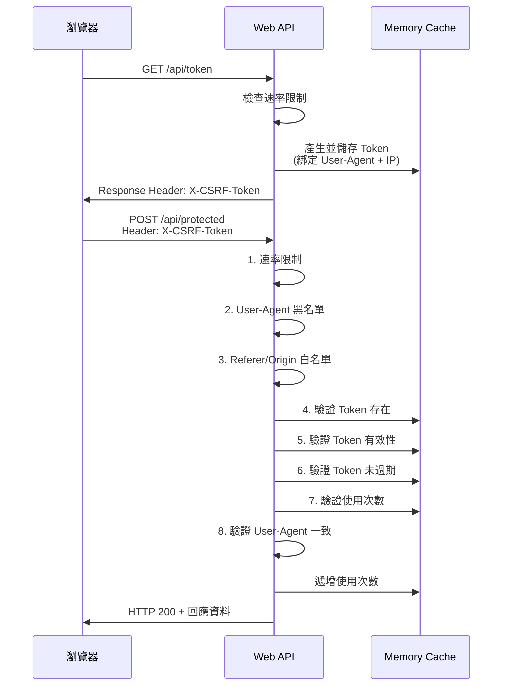

# ASP.NET Core Web API 多層防護機制實作

在開發公開 API 時，防止濫用和攻擊是必須考慮的問題。本文介紹如何使用 ASP.NET Core 實作多層次的安全防護機制，保護可匿名存取的 Web API。

## 開發環境

- Windows 11 Pro
- .NET 8.0
- ASP.NET Core Web API
- Playwright (瀏覽器測試)
- PowerShell / Bash (測試腳本)

## 防護機制有哪些？

本系統實作了 8 層防護機制：

```
第 1 層: 速率限制
   ↓
第 2 層: User-Agent 黑名單驗證
   ↓
第 3 層: Referer/Origin 白名單驗證
   ↓
第 4 層: Token 存在性驗證
   ↓
第 5 層: Token 有效性驗證
   ↓
第 6 層: Token 過期驗證
   ↓
第 7 層: Token 使用次數驗證
   ↓
第 8 層: User-Agent 一致性驗證
   ↓
✅ 請求通過，執行業務邏輯
```

| 攻擊類型 | 防護機制 | HTTP 狀態碼 |
|---------|---------|-----------|
| 無 Token 直接攻擊 | Token 必須驗證 | 401 |
| 無效/偽造 Token | Token 伺服器端驗證 | 401 |
| Token 過期 | 時間限制驗證 | 401 |
| Token 重放攻擊 | 使用次數限制 | 401 |
| Token 盜用 | User-Agent 綁定 | 401 |
| 跨域攻擊 | Origin/Referer 驗證 | 403 |
| 爬蟲/Bot 攻擊 | User-Agent 黑名單 | 403 |
| 暴力破解 | 速率限制 | 429 |

## 怎麼做防護？

### Server Side 配置

#### 1. 速率限制

使用 ASP.NET Core 內建的 Rate Limiting 中介軟體，限制 API 呼叫頻率。

```csharp
builder.Services.AddRateLimiter(options =>
{
    // API 端點速率限制: 10 秒內最多 10 次請求
    options.AddFixedWindowLimiter("api", limiterOptions =>
    {
        limiterOptions.Window = TimeSpan.FromSeconds(10);
        limiterOptions.PermitLimit = 10;
        limiterOptions.QueueLimit = 0;
    });

    // Token 生成速率限制: 1 分鐘內最多 5 個 Token
    options.AddFixedWindowLimiter("token", limiterOptions =>
    {
        limiterOptions.Window = TimeSpan.FromMinutes(1);
        limiterOptions.PermitLimit = 5;
        limiterOptions.QueueLimit = 0;
    });

    options.RejectionStatusCode = 429;
});
```

#### 2. CORS 白名單

限制允許存取的來源，防止跨域攻擊。

```csharp
builder.Services.AddCors(options =>
{
    options.AddDefaultPolicy(policy =>
    {
        policy.WithOrigins(
                "http://localhost:5073",
                "https://localhost:5073"
              )
              .AllowAnyMethod()
              .AllowAnyHeader()
              .WithExposedHeaders("X-CSRF-Token")
              .AllowCredentials();
    });
});
```

#### 3. Token 提供者

使用 IMemoryCache 儲存 Token 資訊，綁定 User-Agent 和 IP 地址。

```csharp
public class TokenProvider : ITokenProvider
{
    private readonly IMemoryCache _cache;

    public string GenerateToken(int maxUsageCount, int expirationMinutes, 
                                string userAgent, string ipAddress)
    {
        var token = Guid.NewGuid().ToString();
        var tokenData = new TokenData
        {
            CreatedAt = DateTime.UtcNow,
            ExpiresAt = DateTime.UtcNow.AddMinutes(expirationMinutes),
            MaxUsageCount = maxUsageCount,
            UsageCount = 0,
            UserAgent = userAgent,
            IpAddress = ipAddress
        };

        var cacheOptions = new MemoryCacheEntryOptions
        {
            AbsoluteExpiration = tokenData.ExpiresAt
        };

        _cache.Set(token, tokenData, cacheOptions);
        return token;
    }
}
```

#### 4. Token 驗證過濾器

使用 ActionFilter 實作多層次驗證邏輯。

```csharp
public class ValidateTokenAttribute : ActionFilterAttribute
{
    // 爬蟲 User-Agent 黑名單
    private static readonly string[] BotUserAgents = new[]
    {
        "curl/", "wget/", "scrapy", "python-requests", 
        "java/", "go-http-client", "axios/", "node-fetch"
    };

    public override void OnActionExecuting(ActionExecutingContext context)
    {
        var request = context.HttpContext.Request;
        var userAgent = request.Headers["User-Agent"].ToString();

        // 1. User-Agent 黑名單驗證
        if (!ValidateUserAgent(userAgent))
        {
            context.Result = new ObjectResult(new { error = "Forbidden User-Agent" })
            {
                StatusCode = 403
            };
            return;
        }

        // 2. Referer 驗證
        if (!ValidateReferer(request))
        {
            context.Result = new ObjectResult(new { error = "Invalid Referer" })
            {
                StatusCode = 403
            };
            return;
        }

        // 3. Token 驗證
        if (!request.Headers.TryGetValue("X-CSRF-Token", out var tokenValues))
        {
            context.Result = new UnauthorizedObjectResult(new { error = "Missing Token" });
            return;
        }

        var token = tokenValues.FirstOrDefault();
        var tokenService = context.HttpContext.RequestServices
            .GetRequiredService<ITokenProvider>();
        
        if (!tokenService.ValidateToken(token, userAgent, ipAddress))
        {
            context.Result = new UnauthorizedObjectResult(new { error = "Invalid token" });
            return;
        }

        base.OnActionExecuting(context);
    }
}
```

### Client Side 配置

#### 瀏覽器端使用方式

前端透過兩個步驟來存取受保護的 API：

1. **取得 Token**：呼叫 `/api/token` 取得 Token，Token 會放在 Response Header 的 `X-CSRF-Token` 欄位。
2. **使用 Token**：將 Token 放在 Request Header 的 `X-CSRF-Token` 欄位，呼叫受保護的 API。

```javascript
// 步驟 1: 取得 Token
async function getToken() {
    const response = await fetch('/api/token?maxUsage=1&expirationMinutes=5');
    const token = response.headers.get('X-CSRF-Token');
    return token;
}

// 步驟 2: 呼叫受保護的 API
async function callProtectedApi(token, data) {
    const response = await fetch('/api/protected', {
        method: 'POST',
        headers: {
            'Content-Type': 'application/json',
            'X-CSRF-Token': token
        },
        body: JSON.stringify({ data: data })
    });
    return await response.json();
}
```

## 前端到後端互動流程



## 做了那些實驗

### 實驗一：正常流程測試

**目的**：驗證正常使用者可以正常存取 API。

```bash
# 1. 取得 Token
TOKEN=$(curl -s -X GET "http://localhost:5073/api/token" \
  -H "User-Agent: Mozilla/5.0" \
  -i | grep -i "x-csrf-token" | cut -d' ' -f2 | tr -d '\r')

# 2. 使用 Token 呼叫 API
curl -X POST "http://localhost:5073/api/protected" \
  -H "Content-Type: application/json" \
  -H "X-CSRF-Token: $TOKEN" \
  -H "User-Agent: Mozilla/5.0" \
  -d '{"Data":"test"}'
```

**結果**：HTTP 200，API 正常回應。

### 實驗二：重放攻擊測試

**目的**：驗證 Token 使用次數限制，防止 Token 被重複使用。

```bash
# 取得 Token (maxUsage=1)
TOKEN=$(curl -s -X GET "http://localhost:5073/api/token?maxUsage=1" \
  -H "User-Agent: Mozilla/5.0" \
  -i | grep -i "x-csrf-token" | cut -d' ' -f2 | tr -d '\r')

# 第一次使用
curl -X POST "http://localhost:5073/api/protected" \
  -H "X-CSRF-Token: $TOKEN" \
  -H "User-Agent: Mozilla/5.0" \
  -d '{"Data":"first"}'

# 第二次使用 (重放攻擊)
curl -X POST "http://localhost:5073/api/protected" \
  -H "X-CSRF-Token: $TOKEN" \
  -H "User-Agent: Mozilla/5.0" \
  -d '{"Data":"second"}'
```

**結果**：第一次 HTTP 200，第二次 HTTP 401 (Invalid or expired token)。

### 實驗三：User-Agent 綁定測試

**目的**：驗證 Token 綁定 User-Agent，防止 Token 被盜用到其他客戶端。

```bash
# 使用 User-Agent "BrowserA" 取得 Token
TOKEN=$(curl -s -X GET "http://localhost:5073/api/token" \
  -H "User-Agent: BrowserA" \
  -i | grep -i "x-csrf-token" | cut -d' ' -f2 | tr -d '\r')

# 使用 User-Agent "BrowserB" 呼叫 API
curl -X POST "http://localhost:5073/api/protected" \
  -H "X-CSRF-Token: $TOKEN" \
  -H "User-Agent: BrowserB" \
  -d '{"Data":"test"}'
```

**結果**：HTTP 401 (Invalid or expired token)。

### 實驗四：速率限制測試

**目的**：驗證速率限制機制，防止暴力破解。

```bash
# 快速請求 6 次 Token
for i in {1..6}; do
  curl -X GET "http://localhost:5073/api/token" \
    -H "User-Agent: Mozilla/5.0"
  echo ""
done
```

**結果**：前 5 次 HTTP 200，第 6 次 HTTP 429 (Too Many Requests)。

### 實驗五：爬蟲攻擊測試

**目的**：驗證 User-Agent 黑名單機制，拒絕爬蟲工具。

```bash
# 使用 curl 的預設 User-Agent
curl -X GET "http://localhost:5073/api/token"
```

**結果**：HTTP 403 (Forbidden User-Agent)。

### 實驗六：瀏覽器整合測試

**目的**：驗證瀏覽器環境下的完整流程。

使用 Playwright 模擬瀏覽器操作：

```javascript
test('瀏覽器正常流程', async ({ page }) => {
  await page.goto('http://localhost:5073/test.html');
  
  // 設定 maxUsage=3
  await page.fill('#maxUsage', '3');
  await page.click('button:has-text("取得 Token")');
  
  // 呼叫 3 次 API
  for (let i = 0; i < 3; i++) {
    await page.click('button:has-text("呼叫 Protected API")');
    await expect(page.locator('#apiResult')).toContainText('success');
  }
  
  // 第 4 次應該失敗
  await page.click('button:has-text("呼叫 Protected API")');
  await expect(page.locator('#apiResult')).toContainText('Invalid or expired token');
});
```

**結果**：前 3 次成功，第 4 次失敗，符合預期。

## 測試結果

執行 18 個測試案例，涵蓋 Token 基本功能、安全防護、瀏覽器整合、攻擊模擬。

| 測試項目 | 測試數量 | 通過 |
|---------|---------|------|
| Token 基本功能 | 3 | 3 ✅ |
| 安全防護驗證 | 7 | 7 ✅ |
| 瀏覽器整合測試 | 6 | 6 ✅ |
| 攻擊模擬測試 | 2 | 2 ✅ |
| **總計** | **18** | **18 ✅** |

成功率：**100%**

## 生產環境建議

### 必須啟用的設定

1. **HTTPS 強制**
   ```csharp
   app.UseHttpsRedirection();
   app.UseHsts();
   ```

2. **IP 地址綁定**
   ```csharp
   // 在 TokenProvider.ValidateToken 中取消註解
   if (!string.IsNullOrEmpty(tokenData.IpAddress) && 
       tokenData.IpAddress != ipAddress)
   {
       return false;
   }
   ```

3. **使用 Redis**
   ```csharp
   // 替換 IMemoryCache 為 Redis
   services.AddStackExchangeRedisCache(options =>
   {
       options.Configuration = "localhost:6379";
   });
   ```

4. **日誌監控**
   ```csharp
   logger.LogWarning("Security Event: TokenValidationFailed", new {
       UserAgent = userAgent,
       IpAddress = ipAddress,
       Timestamp = DateTime.UtcNow
   });
   ```

## 範例位置

[sample.dotblog/WebAPI/Lab.CSRF-2](https://github.com/yaochangyu/sample.dotblog/tree/master/WebAPI/Lab.CSRF-2)

若有謬誤，煩請告知，新手發帖請多包涵

## 參考資料

- [ASP.NET Core Rate Limiting](https://learn.microsoft.com/en-us/aspnet/core/performance/rate-limit)
- [Cross-Site Request Forgery (CSRF) Prevention](https://cheatsheetseries.owasp.org/cheatsheets/Cross-Site_Request_Forgery_Prevention_Cheat_Sheet.html)
