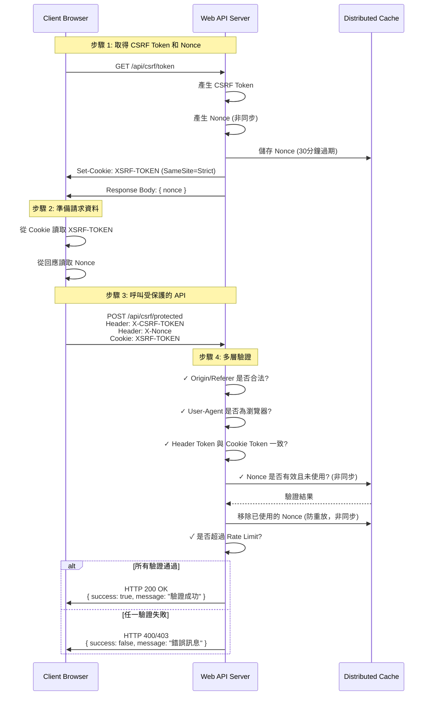

# 如何實作 ASP.NET Core Web API 的 CSRF 防護機制

## 前言

最近在開發一個公開的 Web API 時，遇到一個需求：「API 不需要驗證，但只能從我們自己的網頁呼叫，避免被爬蟲濫用」。本文將分享如何在 ASP.NET Core Web API 中實作完整的 CSRF 防護機制，並透過實際測試驗證防護效果。

## 開發環境

* Windows 11 Pro
* Rider 2025.3
* .NET 10
* Node.js 20
  
## 為什麼需要 CSRF 防護？

在公開 API 的場景下，我們需要考慮以下問題：

1. **跨站請求攻擊**：惡意網站嵌入我們的 API 呼叫
2. **爬蟲濫用**：自動化工具大量抓取資料
3. **DDoS 攻擊**：短時間內大量請求造成服務癱瘓
4. **重放攻擊**：攔截並重複使用已使用的 Token

## 整體架構

本專案採用多層防護機制：

- **Double Submit Cookie Pattern**：CSRF Token 驗證
- **Nonce 機制**：防止 Token 重放攻擊
- **Origin/Referer 驗證**：確保請求來源合法
- **User-Agent 驗證**：阻擋已知的爬蟲工具
- **Rate Limiting**：限制請求頻率

### 流程圖



## 核心觀念

### IAntiforgery 介面

`IAntiforgery` 是 ASP.NET Core 提供的核心介面，用於產生和驗證 Anti-Forgery Token。主要方法包括：

- **GetAndStoreTokens(HttpContext)**：產生新的 CSRF Token 並儲存到 Cookie 中，返回 Token 資訊供前端使用
- **ValidateRequestAsync(HttpContext)**：驗證請求中的 Token 是否有效，比對 Header 中的 Token 與 Cookie 中的 Token

### ValidateAntiForgeryToken 屬性

`[ValidateAntiForgeryToken]` 是一個 Action Filter 屬性，用於標記需要 CSRF 防護的 Controller 或 Action。當請求進入時，會自動驗證：

1. Cookie 中的 `XSRF-TOKEN` 是否存在
2. Header 中的 `X-CSRF-TOKEN` 是否存在
3. 兩者的值是否一致且有效

如果驗證失敗，會自動回傳 HTTP 400 Bad Request。

相關屬性：
- `[IgnoreAntiforgeryToken]`：標記不需要驗證 Token 的 Action (如 GetToken API)
- `[AutoValidateAntiforgeryToken]`：Controller 層級的自動驗證，僅對 POST/PUT/DELETE 等方法生效

## Server Side 實作

### 1. Program.cs - 核心配置

```csharp
// Anti-Forgery 配置 (用於 CSRF 防護)
builder.Services.AddAntiforgery(options =>
{
    options.HeaderName = "X-CSRF-TOKEN";        // 前端需在 Header 帶此欄位
    options.Cookie.Name = "XSRF-TOKEN";         // Cookie 名稱
    options.Cookie.HttpOnly = false;            // 允許 JavaScript 讀取
    options.Cookie.SameSite = SameSiteMode.Strict;  // 嚴格模式，阻擋跨站請求
    options.Cookie.SecurePolicy = CookieSecurePolicy.SameAsRequest;
});
```

**重點說明**：
- `HttpOnly = false`：必須允許 JavaScript 讀取 Cookie，才能實現 Double Submit Cookie Pattern
- `SameSite = Strict`：這是關鍵設定，瀏覽器會自動阻擋跨站請求攜帶此 Cookie
- `HeaderName`：前端需要從 Cookie 讀取 Token 後，放入此 Header 中

完整程式碼：[Program.cs](https://github.com/yaochangyu/sample.dotblog/blob/master/WebAPI/Lab.CSRF/Lab.CSRF.WebApi/Program.cs)

### 2. CORS 配置

```csharp
builder.Services.AddCors(options =>
{
    options.AddPolicy("RestrictedCors", policy =>
    {
        policy.WithOrigins("http://localhost:5173", "https://localhost:5173")
              .WithMethods("GET", "POST", "OPTIONS")
              .WithHeaders("Content-Type", "X-CSRF-TOKEN", "X-Nonce")
              .AllowCredentials();  // 允許攜帶 Cookie
    });
});
```

**重點**：`AllowCredentials()` 允許攜帶 Cookie，這是 Double Submit Cookie Pattern 的必要條件。

### 3. Rate Limiting 設定

在 `appsettings.json` 中設定速率限制：

```json
{
  "IpRateLimiting": {
    "EnableEndpointRateLimiting": true,
    "GeneralRules": [
      {
        "Endpoint": "GET:/api/csrf/token",
        "Period": "1m",
        "Limit": 5
      },
      {
        "Endpoint": "POST:/api/csrf/protected",
        "Period": "1m",
        "Limit": 10
      },
      {
        "Endpoint": "*",
        "Period": "1m",
        "Limit": 30
      }
    ]
  }
}
```

然後在 `Program.cs` 中註冊服務：

```csharp
// Rate Limiting 設定 (使用 IDistributedCache)
builder.Services.AddDistributedMemoryCache();
builder.Services.Configure<IpRateLimitOptions>(builder.Configuration.GetSection("IpRateLimiting"));
builder.Services.AddSingleton<IIpPolicyStore, DistributedCacheIpPolicyStore>();
builder.Services.AddSingleton<IClientPolicyStore, DistributedCacheClientPolicyStore>();
builder.Services.AddSingleton<IRateLimitCounterStore, DistributedCacheRateLimitCounterStore>();
builder.Services.AddSingleton<IProcessingStrategy, AsyncKeyLockProcessingStrategy>();
builder.Services.AddSingleton<IRateLimitConfiguration, RateLimitConfiguration>();
```

**重點說明**：
- GET /api/csrf/token：每分鐘限制 5 次
- POST /api/csrf/protected：每分鐘限制 10 次
- 其他端點：每分鐘限制 30 次
- 使用 `IDistributedCache` 支援分散式部署

完整程式碼：[Program.cs](https://github.com/yaochangyu/sample.dotblog/blob/master/WebAPI/Lab.CSRF/Lab.CSRF.WebApi/Program.cs) 和 [appsettings.json](https://github.com/yaochangyu/sample.dotblog/blob/master/WebAPI/Lab.CSRF/Lab.CSRF.WebApi/appsettings.json)

### 4. Nonce Provider - 防止重放攻擊

```csharp
using Microsoft.Extensions.Caching.Distributed;

public interface ITokenNonceProvider
{
    Task<string> GenerateNonceAsync();
    Task<bool> ValidateAndConsumeNonceAsync(string nonce);
}

public class TokenNonceProvider : ITokenNonceProvider
{
    private readonly IDistributedCache _cache;
    private readonly TimeSpan _expirationTime = TimeSpan.FromMinutes(30);

    public async Task<string> GenerateNonceAsync()
    {
        var nonce = Guid.NewGuid().ToString("N");
        var options = new DistributedCacheEntryOptions
        {
            AbsoluteExpirationRelativeToNow = _expirationTime
        };
        await _cache.SetStringAsync($"nonce:{nonce}", "true", options);
        return nonce;
    }

    public async Task<bool> ValidateAndConsumeNonceAsync(string nonce)
    {
        if (string.IsNullOrEmpty(nonce))
            return false;

        var key = $"nonce:{nonce}";
        var value = await _cache.GetStringAsync(key);
        if (value != null)
        {
            await _cache.RemoveAsync(key);
            return true;
        }
        return false;
    }
}
```

**重點說明**：
- 使用 `IDistributedCache` 取代 `IMemoryCache`，支援分散式部署
- 所有方法改為非同步操作（`async/await`）
- Nonce 是一次性使用的隨機值
- 驗證成功後立即從 Cache 移除，防止 Token 被重複使用
- 設定 30 分鐘過期時間，平衡安全性與使用者體驗

完整程式碼：[TokenNonceProvider.cs](https://github.com/yaochangyu/sample.dotblog/blob/master/WebAPI/Lab.CSRF/Lab.CSRF.WebApi/Providers/TokenNonceProvider.cs)

### 5. Controller 實作

```csharp
[ApiController]
[Route("api/[controller]")]
public class CsrfController : ControllerBase
{
    [HttpGet("token")]
    [IgnoreAntiforgeryToken]
    [OriginValidation]
    [UserAgentValidation]
    public async Task<IActionResult> GetToken()
    {
        var tokens = _antiforgery.GetAndStoreTokens(HttpContext);
        var nonce = await _nonceProvider.GenerateNonceAsync();
        
        return Ok(new { 
            message = "CSRF Token 已設定在 Cookie 中",
            nonce = nonce
        });
    }

    [HttpPost("protected")]
    [ValidateAntiForgeryToken]
    [OriginValidation]
    [UserAgentValidation]
    public async Task<IActionResult> ProtectedAction([FromBody] DataRequest request)
    {
        var nonce = Request.Headers["X-Nonce"].ToString();
        
        if (!await _nonceProvider.ValidateAndConsumeNonceAsync(nonce))
        {
            return BadRequest(new { 
                success = false, 
                message = "Nonce 無效或已使用(防止重放攻擊)" 
            });
        }

        return Ok(new { 
            success = true, 
            message = "CSRF 驗證成功！", 
            data = request.Data,
            timestamp = DateTime.Now 
        });
    }
}
```

完整程式碼：[CsrfController.cs](https://github.com/yaochangyu/sample.dotblog/blob/master/WebAPI/Lab.CSRF/Lab.CSRF.WebApi/Controllers/CsrfController.cs)

## Client Side 實作

### HTML 頁面實作

關鍵程式碼片段：

```html
<div>
    <h2>步驟 1: 取得 CSRF Token</h2>
    <button onclick="getToken()">取得 Token</button>
    <div id="tokenResult"></div>
</div>

<div>
    <h2>步驟 2: 測試受保護的 API</h2>
    <input type="text" id="dataInput" placeholder="輸入測試資料" value="Hello CSRF!">
    <button onclick="callProtectedApi(true)">✅ 使用 Token 呼叫 API (正常)</button>
    <button onclick="callProtectedApi(false)">❌ 不使用 Token 呼叫 API (應失敗)</button>
    <div id="apiResult"></div>
</div>
```

關鍵 JavaScript 函式：

```javascript
async function getToken() {
    const response = await fetch('/api/csrf/token', {
        method: 'GET',
        credentials: 'include'  // 重要：必須攜帶 Cookie
    });

    if (response.ok) {
        const data = await response.json();
        const csrfToken = getCookie('XSRF-TOKEN');
        currentNonce = data.nonce;
    }
}

async function callProtectedApi(useToken) {
    const csrfToken = getCookie('XSRF-TOKEN');
    
    const headers = { 'Content-Type': 'application/json' };
    
    if (useToken) {
        headers['X-CSRF-TOKEN'] = csrfToken;  // 從 Cookie 讀取 Token 並放入 Header
        headers['X-Nonce'] = currentNonce;
    }

    const response = await fetch('/api/csrf/protected', {
        method: 'POST',
        headers: headers,
        credentials: 'include',
        body: JSON.stringify({ data: dataInput })
    });
}
```

完整程式碼：[index.html](https://github.com/yaochangyu/sample.dotblog/blob/master/WebAPI/Lab.CSRF/Lab.CSRF.WebApi/wwwroot/index.html)

### 前端流程說明

1. **取得 Token**：
   - 呼叫 `GET /api/csrf/token`
   - 伺服器將 Token 設定在 Cookie (名稱為 `XSRF-TOKEN`)
   - 前端從回應中取得 Nonce 值

2. **使用 Token 呼叫 API**：
   - 從 Cookie 讀取 `XSRF-TOKEN`
   - 將 Token 放入 `X-CSRF-TOKEN` Header
   - 將 Nonce 放入 `X-Nonce` Header
   - 發送 POST 請求到 `/api/csrf/protected`

3. **重要設定**：
   - `credentials: 'include'`：這是關鍵，必須攜帶 Cookie
   - Cookie 的 `SameSite=Strict` 會自動阻擋跨站請求

## 測試結果摘要

### ✅ 成功防護的攻擊

1. **傳統 CSRF 攻擊**：100% 阻擋
   - `SameSite=Strict` Cookie 有效防止跨站請求
   - Double Submit Cookie Pattern 驗證正確

2. **基礎爬蟲工具**：有效阻擋
   - curl、Python requests、Postman 被 User-Agent 黑名單初步過濾
   - **但此機制容易被繞過，真正的防護依賴 Rate Limiting**

3. **Token 重放攻擊**：100% 阻擋
   - Nonce 一次性使用機制有效運作

4. **DDoS 與爬蟲濫用**：透過 Rate Limiting 有效控制
   - **關鍵防護機制**：IP 限流設定
     - GET /api/csrf/token：每分鐘 5 次
     - POST /api/csrf/protected：每分鐘 10 次
     - 其他端點：每分鐘 30 次
   - 即使爬蟲偽造 User-Agent 和其他 Headers，仍受限於 IP 頻率限制
   - 超過限制回傳 HTTP 429 (Too Many Requests)
   - **避免誤阻擋**：限流閾值可根據實際使用情境調整

### ⚠️ 潛在風險

1. **進階爬蟲**：中等風險
   - User-Agent 黑名單容易被偽造繞過
   - **真正防護依賴 Rate Limiting**
   - 建議：搭配 Browser Fingerprinting、CAPTCHA

2. **分散式爬蟲**：中高風險
   - 使用多個 IP 可繞過單 IP 限流
   - 建議：行為分析、CAPTCHA 挑戰

### 實際運行結果

**正常流程**：

```
請求: GET /api/csrf/token
回應: HTTP 200 OK
{
  "message": "CSRF Token 已設定在 Cookie 中",
  "nonce": "a1b2c3d4e5f6..."
}
Cookie: XSRF-TOKEN=CfDJ8N...
```

```
請求: POST /api/csrf/protected
Header: X-CSRF-TOKEN: CfDJ8N...
Header: X-Nonce: a1b2c3d4e5f6...

回應: HTTP 200 OK
{
  "success": true,
  "message": "CSRF 驗證成功！"
}
```

**異常流程**：

```bash
# 使用 curl 嘗試呼叫
$ curl -X GET "http://localhost:5073/api/csrf/token"

回應: HTTP 403 Forbidden
{
  "success": false,
  "message": "User-Agent 包含不允許的關鍵字，請求被拒絕"
}
```

```
# 重複使用 Nonce
第一次請求: HTTP 200 OK ✅
第二次請求: HTTP 400 Bad Request ❌
{
  "success": false,
  "message": "Nonce 無效或已使用(防止重放攻擊)"
}
```

## 心得與建議

### 優點

1. **多層防護**：結合多種機制，提供深度防禦
2. **使用者體驗**：對正常使用者透明，無需額外操作
3. **易於整合**：基於 ASP.NET Core 內建機制，容易維護

### 需要注意的地方

1. **HttpOnly = false**：雖然允許 JavaScript 讀取 Cookie 會增加 XSS 風險，但這是 Double Submit Cookie Pattern 的必要條件。建議搭配 CSP (Content Security Policy) 降低 XSS 風險。

2. **User-Agent 驗證的局限性**：
   - 黑名單機制**容易被繞過**，不應作為主要防護手段
   - 僅用於初步過濾，**真正的防護依賴 Rate Limiting**
   - 進階建議：搭配 Browser Fingerprinting、CAPTCHA

3. **Rate Limiting 閾值調整**：
   - 需要根據實際使用情境調整，避免誤傷正常使用者
   - 監控 HTTP 429 回應比例，適時調整參數

4. **分散式快取**：目前使用 `IDistributedCache` 的記憶體實作，可輕鬆切換到 Redis 或 SQL Server。

### 進階改善方向

1. **加入 CAPTCHA**：對超過限流次數的 IP 或可疑請求要求驗證碼
2. **Browser Fingerprinting**：更精確識別真實瀏覽器特徵
3. **行為分析**：分析請求模式（時間間隔、順序），識別異常行為
4. **IP 信譽系統**：針對可信 IP 放寬限制，對可疑 IP 加嚴
5. **動態調整限流**：根據流量狀況自動調整閾值

## 結論

透過結合 CSRF Token、Nonce、Origin/Referer 驗證、User-Agent 驗證、Rate Limiting 等多層防護機制，我們成功實作了一個強固的 API 防護系統。雖然無法 100% 阻擋所有攻擊，但已經能有效防止大部分的濫用情境。

實際測試結果顯示，傳統 CSRF 攻擊、已知爬蟲工具、Token 重放攻擊都能被有效阻擋，同時對正常使用者的體驗影響極小。這個方案適合用於公開但希望限制存取方式的 API 場景。

## 範例位置

[sample.dotblog/WebAPI/Lab.CSRF at master · yaochangyu/sample.dotblog](https://github.com/yaochangyu/sample.dotblog/tree/master/WebAPI/Lab.CSRF)

若有謬誤，煩請告知，新手發帖請多包涵

## 參考資料

- [ASP.NET Core Anti-Forgery](https://learn.microsoft.com/en-us/aspnet/core/security/anti-request-forgery)
- [SameSite Cookie](https://developer.mozilla.org/en-US/docs/Web/HTTP/Headers/Set-Cookie/SameSite)
- [OWASP CSRF Prevention Cheat Sheet](https://cheatsheetseries.owasp.org/cheatsheets/Cross-Site_Request_Forgery_Prevention_Cheat_Sheet.html)
- [AspNetCoreRateLimit](https://github.com/stefanprodan/AspNetCoreRateLimit)

---

以上就是本次的分享，如果有任何問題或建議，歡迎在下方留言討論！
