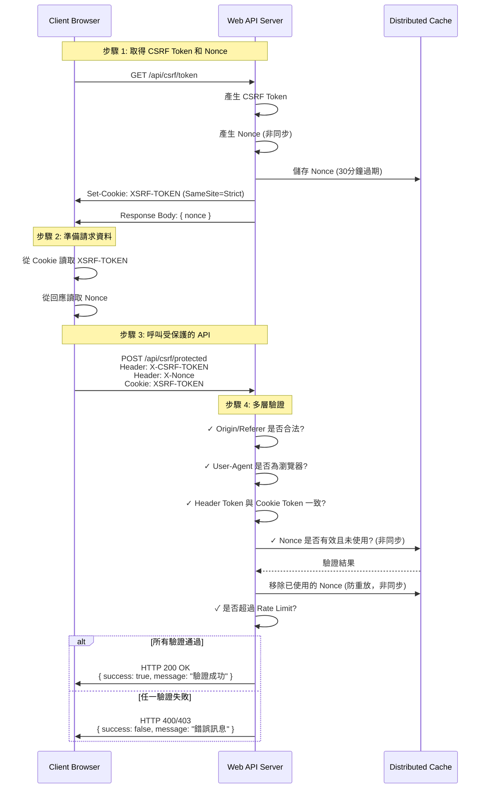

# 如何實作 ASP.NET Core Web API 的 CSRF 防護機制

## 前言

最近在開發一個公開的 Web API 時，遇到一個需求：「API 不需要驗證，但只能從我們自己的網頁呼叫，避免被爬蟲濫用」。這個需求看似簡單，實際上卻需要多層防護機制才能達到預期效果。本文將分享如何在 ASP.NET Core Web API 中實作完整的 CSRF 防護機制，並透過實際測試驗證防護效果。

## 開發環境

* Windows 11 Pro
* Rider 2025.3
* .NET 10
* Node.js 20

## 為什麼需要 CSRF 防護？

傳統的 CSRF (Cross-Site Request Forgery) 防護主要是防止惡意網站偽造使用者的請求，但在公開 API 的場景下，我們還需要考慮以下問題：

1. **跨站請求攻擊**:惡意網站嵌入我們的 API 呼叫
2. **爬蟲濫用**:自動化工具大量抓取資料
3. **DDoS 攻擊**:短時間內大量請求造成服務癱瘓
4. **重放攻擊**:攔截並重複使用已使用的 Token

## 整體架構

本專案採用多層防護機制,包含:

- **Double Submit Cookie Pattern**:CSRF Token 驗證
- **Nonce 機制**:防止 Token 重放攻擊
- **Origin/Referer 驗證**:確保請求來源合法
- **User-Agent 驗證**:阻擋已知的爬蟲工具
- **Rate Limiting**:限制請求頻率

### 流程圖



## Server Side 配置

### 1. Program.cs - 核心配置

首先,在 `Program.cs` 中設定 Anti-Forgery 機制:

```csharp
// Anti-Forgery 配置 (用於 CSRF 防護)
builder.Services.AddAntiforgery(options =>
{
    options.HeaderName = "X-CSRF-TOKEN";        // 前端需在 Header 帶此欄位
    options.Cookie.Name = "XSRF-TOKEN";         // Cookie 名稱
    options.Cookie.HttpOnly = false;            // 允許 JavaScript 讀取
    options.Cookie.SameSite = SameSiteMode.Strict;  // 嚴格模式,阻擋跨站請求
    options.Cookie.SecurePolicy = CookieSecurePolicy.SameAsRequest;
});
```

**重點說明**:
- `HttpOnly = false`:必須允許 JavaScript 讀取 Cookie,才能實現 Double Submit Cookie Pattern
- `SameSite = Strict`:這是關鍵設定,瀏覽器會自動阻擋跨站請求攜帶此 Cookie
- `HeaderName`:前端需要從 Cookie 讀取 Token 後,放入此 Header 中

#### IAntiforgery 介面

`IAntiforgery` 是 ASP.NET Core 提供的核心介面,用於產生和驗證 Anti-Forgery Token。主要方法包括:

- **GetAndStoreTokens(HttpContext)**: 產生新的 CSRF Token 並儲存到 Cookie 中,返回 Token 資訊供前端使用
- **ValidateRequestAsync(HttpContext)**: 驗證請求中的 Token 是否有效,比對 Header 中的 Token 與 Cookie 中的 Token

#### ValidateAntiForgeryToken 屬性

`[ValidateAntiForgeryToken]` 是一個 Action Filter 屬性,用於標記需要 CSRF 防護的 Controller 或 Action。當請求進入時,會自動驗證:

1. Cookie 中的 `XSRF-TOKEN` 是否存在
2. Header 中的 `X-CSRF-TOKEN` 是否存在
3. 兩者的值是否一致且有效

如果驗證失敗,會自動回傳 HTTP 400 Bad Request。

相關屬性:
- `[IgnoreAntiforgeryToken]`: 標記不需要驗證 Token 的 Action (如 GetToken API)
- `[AutoValidateAntiforgeryToken]`: Controller 層級的自動驗證,僅對 POST/PUT/DELETE 等方法生效

### 2. CORS 配置

```csharp
builder.Services.AddCors(options =>
{
    options.AddPolicy("RestrictedCors", policy =>
    {
        policy.WithOrigins("http://localhost:5173", "https://localhost:5173", 
                          "http://localhost:5073", "https://localhost:5073")
              .WithMethods("GET", "POST", "OPTIONS")
              .WithHeaders("Content-Type", "X-CSRF-TOKEN", "X-Nonce")
              .AllowCredentials();
    });
});
```

**重點說明**:
- 明確指定允許的來源,不使用 `AllowAnyOrigin`
- `AllowCredentials()`:允許攜帶 Cookie,這是 Double Submit Cookie Pattern 的必要條件

### 3. Rate Limiting 設定

在 `appsettings.json` 中設定速率限制:

```json
{
  "IpRateLimiting": {
    "EnableEndpointRateLimiting": true,
    "GeneralRules": [
      {
        "Endpoint": "GET:/api/csrf/token",
        "Period": "1m",
        "Limit": 5
      },
      {
        "Endpoint": "POST:/api/csrf/protected",
        "Period": "1m",
        "Limit": 10
      }
    ]
  }
}
```

然後在 `Program.cs` 中註冊服務:

```csharp
// Rate Limiting 設定 (使用 IDistributedCache)
builder.Services.AddDistributedMemoryCache(); // IDistributedCache 實作
builder.Services.Configure<IpRateLimitOptions>(builder.Configuration.GetSection("IpRateLimiting"));
builder.Services.AddSingleton<IIpPolicyStore, DistributedCacheIpPolicyStore>();
builder.Services.AddSingleton<IClientPolicyStore, DistributedCacheClientPolicyStore>();
builder.Services.AddSingleton<IRateLimitCounterStore, DistributedCacheRateLimitCounterStore>();
builder.Services.AddSingleton<IProcessingStrategy, AsyncKeyLockProcessingStrategy>();
builder.Services.AddSingleton<IRateLimitConfiguration, RateLimitConfiguration>();
```

**重點說明**:
- 使用 `AddDistributedMemoryCache()` 註冊 `IDistributedCache` 的記憶體實作
- 使用 `DistributedCache*` 系列類別取代預設的 `MemoryCache*` 實作
- 支援未來輕鬆切換到 Redis 或 SQL Server 等分散式快取方案
- 與 TokenNonceProvider 共用同一個 `IDistributedCache` 實例

### 4. Nonce Provider - 防止重放攻擊

```csharp
using Microsoft.Extensions.Caching.Distributed;

public interface ITokenNonceProvider
{
    Task<string> GenerateNonceAsync();
    Task<bool> ValidateAndConsumeNonceAsync(string nonce);
}

public class TokenNonceProvider : ITokenNonceProvider
{
    private readonly IDistributedCache _cache;
    private readonly TimeSpan _expirationTime = TimeSpan.FromMinutes(30);

    public TokenNonceProvider(IDistributedCache cache)
    {
        _cache = cache;
    }

    public async Task<string> GenerateNonceAsync()
    {
        var nonce = Guid.NewGuid().ToString("N");
        var options = new DistributedCacheEntryOptions
        {
            AbsoluteExpirationRelativeToNow = _expirationTime
        };
        await _cache.SetStringAsync($"nonce:{nonce}", "true", options);
        return nonce;
    }

    public async Task<bool> ValidateAndConsumeNonceAsync(string nonce)
    {
        if (string.IsNullOrEmpty(nonce))
            return false;

        var key = $"nonce:{nonce}";
        var value = await _cache.GetStringAsync(key);
        if (value != null)
        {
            await _cache.RemoveAsync(key);  // 使用後立即移除,實現一次性使用
            return true;
        }
        return false;
    }
}
```

**重點說明**:
- 使用 `IDistributedCache` 取代 `IMemoryCache`，支援分散式部署
- 所有方法改為非同步操作（`async/await`）
- Nonce 是一次性使用的隨機值
- 驗證成功後立即從 Cache 移除,防止 Token 被重複使用
- 設定 30 分鐘過期時間,平衡安全性與使用者體驗
- 使用 `DistributedCacheEntryOptions` 設定過期策略

### 5. Origin/Referer 驗證

```csharp
public class OriginValidationAttribute : ActionFilterAttribute
{
    private readonly string[] _allowedOrigins = new[]
    {
        "http://localhost:5173",
        "https://localhost:5173",
        "http://localhost:5073",
        "https://localhost:5073"
    };

    public override void OnActionExecuting(ActionExecutingContext context)
    {
        var origin = context.HttpContext.Request.Headers["Origin"].ToString();
        var referer = context.HttpContext.Request.Headers["Referer"].ToString();

        // Origin 和 Referer 至少一個必須存在
        if (string.IsNullOrEmpty(origin) && string.IsNullOrEmpty(referer))
        {
            context.Result = new JsonResult(new
            {
                success = false,
                message = "缺少 Origin 或 Referer Header,請求被拒絕"
            })
            {
                StatusCode = 403
            };
            return;
        }

        // 驗證 Origin (優先)
        if (!string.IsNullOrEmpty(origin))
        {
            var isOriginAllowed = _allowedOrigins.Any(allowed =>
                origin.Equals(allowed, StringComparison.OrdinalIgnoreCase));

            if (!isOriginAllowed)
            {
                context.Result = new JsonResult(new
                {
                    success = false,
                    message = $"Origin 不在允許清單中: {origin}"
                })
                {
                    StatusCode = 403
                };
                return;
            }
        }
    }
}
```

### 6. User-Agent 驗證

```csharp
public class UserAgentValidationAttribute : ActionFilterAttribute
{
    // 白名單:主流瀏覽器的 User-Agent 模式
    private readonly Regex[] _allowedUserAgentPatterns = new[]
    {
        new Regex(@"Chrome/[\d\.]+", RegexOptions.IgnoreCase),
        new Regex(@"Firefox/[\d\.]+", RegexOptions.IgnoreCase),
        new Regex(@"Safari/[\d\.]+", RegexOptions.IgnoreCase),
        new Regex(@"Edg/[\d\.]+", RegexOptions.IgnoreCase),
    };

    // 黑名單:已知的爬蟲和自動化工具特徵
    private readonly string[] _blockedKeywords = new[]
    {
        "python-requests", "curl", "wget", "scrapy", "bot", "crawler", 
        "spider", "postman", "insomnia", "httpie"
    };

    public override void OnActionExecuting(ActionExecutingContext context)
    {
        var userAgent = context.HttpContext.Request.Headers["User-Agent"].ToString();

        // 檢查黑名單
        var containsBlockedKeyword = _blockedKeywords.Any(blocked => 
            userAgent.Contains(blocked, StringComparison.OrdinalIgnoreCase));

        if (containsBlockedKeyword)
        {
            context.Result = new JsonResult(new
            {
                success = false,
                message = "User-Agent 包含不允許的關鍵字,請求被拒絕"
            })
            {
                StatusCode = 403
            };
            return;
        }

        // 檢查白名單
        var matchesAllowedPattern = _allowedUserAgentPatterns.Any(pattern => 
            pattern.IsMatch(userAgent));

        if (!matchesAllowedPattern)
        {
            context.Result = new JsonResult(new
            {
                success = false,
                message = "User-Agent 不符合已知瀏覽器模式,請求被拒絕"
            })
            {
                StatusCode = 403
            };
        }
    }
}
```

### 7. Controller 實作

```csharp
[ApiController]
[Route("api/[controller]")]
public class CsrfController : ControllerBase
{
    private readonly IAntiforgery _antiforgery;
    private readonly ITokenNonceProvider _nonceProvider;

    [HttpGet("token")]
    [IgnoreAntiforgeryToken]
    [OriginValidation]
    [UserAgentValidation]
    public async Task<IActionResult> GetToken()
    {
        var tokens = _antiforgery.GetAndStoreTokens(HttpContext);
        var nonce = await _nonceProvider.GenerateNonceAsync();
        
        return Ok(new { 
            message = "CSRF Token 已設定在 Cookie 中",
            nonce = nonce
        });
    }

    [HttpPost("protected")]
    [ValidateAntiForgeryToken]
    [OriginValidation]
    [UserAgentValidation]
    public async Task<IActionResult> ProtectedAction([FromBody] DataRequest request)
    {
        var nonce = Request.Headers["X-Nonce"].ToString();
        
        if (!await _nonceProvider.ValidateAndConsumeNonceAsync(nonce))
        {
            return BadRequest(new { 
                success = false, 
                message = "Nonce 無效或已使用(防止重放攻擊)" 
            });
        }

        return Ok(new { 
            success = true, 
            message = "CSRF 驗證成功！", 
            data = request.Data,
            timestamp = DateTime.Now 
        });
    }
}
```

**重點說明**:
- `GetToken`:產生 Token 並設定到 Cookie,同時產生 Nonce
- `ProtectedAction`:驗證 Token 和 Nonce,兩者都必須有效

## Client Side 配置

### HTML 頁面實作

```html
<!DOCTYPE html>
<html lang="zh-TW">
<head>
    <meta charset="UTF-8">
    <title>CSRF 防護測試</title>
</head>
<body>
    <h1>🛡️ CSRF 防護測試頁面</h1>
    
    <div>
        <h2>步驟 1: 取得 CSRF Token</h2>
        <button onclick="getToken()">取得 Token</button>
        <div id="tokenResult"></div>
    </div>

    <div>
        <h2>步驟 2: 測試受保護的 API</h2>
        <input type="text" id="dataInput" placeholder="輸入測試資料" value="Hello CSRF!">
        <button onclick="callProtectedApi(true)">✅ 使用 Token 呼叫 API (正常)</button>
        <button onclick="callProtectedApi(false)">❌ 不使用 Token 呼叫 API (應失敗)</button>
        <div id="apiResult"></div>
    </div>

    <script>
        let currentNonce = null;

        function getCookie(name) {
            const value = `; ${document.cookie}`;
            const parts = value.split(`; ${name}=`);
            if (parts.length === 2) return parts.pop().split(';').shift();
            return null;
        }

        async function getToken() {
            const resultDiv = document.getElementById('tokenResult');
            
            try {
                const response = await fetch('/api/csrf/token', {
                    method: 'GET',
                    credentials: 'include'  // 重要:必須攜帶 Cookie
                });

                if (response.ok) {
                    const data = await response.json();
                    const csrfToken = getCookie('XSRF-TOKEN');
                    currentNonce = data.nonce;
                    
                    resultDiv.innerHTML = `
                        <div>✅ Token 取得成功！</div>
                        <div>Token: ${csrfToken}</div>
                        <div>Nonce: ${currentNonce}</div>
                    `;
                }
            } catch (error) {
                resultDiv.innerHTML = `<div>❌ Token 取得失敗: ${error.message}</div>`;
            }
        }

        async function callProtectedApi(useToken) {
            const resultDiv = document.getElementById('apiResult');
            const dataInput = document.getElementById('dataInput').value;
            const csrfToken = getCookie('XSRF-TOKEN');

            if (useToken && (!csrfToken || !currentNonce)) {
                resultDiv.innerHTML = '<div>⚠️ 請先取得 Token</div>';
                return;
            }

            try {
                const headers = {
                    'Content-Type': 'application/json'
                };

                if (useToken) {
                    headers['X-CSRF-TOKEN'] = csrfToken;  // 從 Cookie 讀取 Token 並放入 Header
                    headers['X-Nonce'] = currentNonce;
                }

                const response = await fetch('/api/csrf/protected', {
                    method: 'POST',
                    headers: headers,
                    credentials: 'include',
                    body: JSON.stringify({ data: dataInput })
                });

                const responseData = await response.json();

                if (response.ok) {
                    resultDiv.innerHTML = `
                        <div>✅ API 呼叫成功！</div>
                        <div>回應: ${JSON.stringify(responseData, null, 2)}</div>
                    `;
                } else {
                    resultDiv.innerHTML = `
                        <div>❌ API 呼叫失敗 (符合預期)</div>
                        <div>狀態: ${response.status}</div>
                        <div>訊息: ${responseData.message}</div>
                    `;
                }
            } catch (error) {
                resultDiv.innerHTML = `<div>❌ 請求錯誤: ${error.message}</div>`;
            }
        }
    </script>
</body>
</html>
```

### 前端流程說明

1. **取得 Token**:
   - 呼叫 `GET /api/csrf/token`
   - 伺服器將 Token 設定在 Cookie (名稱為 `XSRF-TOKEN`)
   - 前端從回應中取得 Nonce 值

2. **使用 Token 呼叫 API**:
   - 從 Cookie 讀取 `XSRF-TOKEN`
   - 將 Token 放入 `X-CSRF-TOKEN` Header
   - 將 Nonce 放入 `X-Nonce` Header
   - 發送 POST 請求到 `/api/csrf/protected`

3. **重要設定**:
   - `credentials: 'include'`:這是關鍵,必須攜帶 Cookie
   - Cookie 的 `SameSite=Strict` 會自動阻擋跨站請求

## 安全性測試計畫

為了驗證防護機制的有效性,我們設計了完整的測試計畫,包含以下類別:

### 類別 1: CSRF Token 基本功能測試

✅ **測試項目 1.1: Token 產生功能**
- 呼叫 `GET /api/csrf/token` 能成功取得回應
- Cookie 中正確設定 `XSRF-TOKEN`
- 每次請求產生的 Token 皆不相同

✅ **測試項目 1.2: Token 驗證功能 (正常流程)**
- 攜帶正確 Token 的請求能成功通過驗證
- 伺服器正確回應成功訊息 (HTTP 200 OK)

✅ **測試項目 1.3: Token 驗證功能 (異常流程)**
- 不攜帶 Token 的請求被拒絕 (HTTP 400 Bad Request)
- 攜帶錯誤 Token 的請求被拒絕

### 類別 2: 跨站請求防護測試

✅ **測試項目 2.1: 跨站請求阻擋**
- 從外部網站發起的請求無法取得 Token
- `SameSite=Strict` Cookie 自動阻擋跨站請求
- 測試不同瀏覽器的行為 (Chrome、Edge、Firefox、Safari)

✅ **測試項目 2.2: Cookie 安全性配置**
- Cookie 設定了 `SameSite=Strict` 屬性
- `HttpOnly = false` 允許 JavaScript 讀取 (Double Submit Cookie Pattern 需要)
- HTTPS 環境下 `Secure` 旗標正確設定

### 類別 3: 自動化工具 (爬蟲) 防護測試

⚠️ **測試項目 3.1: curl 測試**

**測試方法**:
```bash
# 測試 1: 嘗試取得 Token (應被 User-Agent 驗證阻擋)
curl -X GET "http://localhost:5073/api/csrf/token"

# 預期結果: HTTP 403 Forbidden
# 原因: User-Agent 包含 "curl" 被黑名單阻擋
```

⚠️ **測試項目 3.2: Python requests 測試**

**測試方法**:
```python
import requests

# 測試 1: 嘗試取得 Token (應被 User-Agent 驗證阻擋)
response = requests.get('http://localhost:5073/api/csrf/token')
print(f"狀態碼: {response.status_code}")
print(f"回應: {response.text}")

# 預期結果: HTTP 403 Forbidden
# 原因: User-Agent 包含 "python-requests" 被黑名單阻擋
```

⚠️ **測試項目 3.3: Postman 測試**

**測試方法**:
1. 開啟 Postman
2. 嘗試 `GET http://localhost:5073/api/csrf/token`
3. 檢查回應狀態

**預期結果**: HTTP 403 Forbidden  
**原因**: User-Agent 包含 "postman" 被黑名單阻擋

### 類別 4: 進階安全性測試

🔴 **測試項目 4.1: 速率限制**

**測試方法**:
```bash
# 短時間內發送多次請求
for i in {1..10}; do
  curl -X GET "http://localhost:5073/api/csrf/token"
done
```

**預期結果**: 
- 前 5 次請求成功 (HTTP 200)
- 第 6 次開始被限制 (HTTP 429 Too Many Requests)

🔴 **測試項目 4.2: Origin/Referer 驗證**

**測試方法**:
建立外部 HTML 測試頁面:
```html
<!-- attack.html -->
<script>
fetch('http://localhost:5073/api/csrf/token', {
    method: 'GET',
    credentials: 'include'
})
.then(response => console.log(response))
.catch(error => console.log(error));
</script>
```

**預期結果**:
- 請求被 CORS 政策阻擋
- 或被 Origin/Referer 驗證拒絕 (HTTP 403)

🔴 **測試項目 4.3: Token 重放攻擊**

**測試方法**:
1. 正常流程取得 Token 和 Nonce
2. 成功呼叫 API 一次
3. 使用相同的 Token 和 Nonce 再次呼叫 API

**預期結果**:
- 第一次呼叫成功 (HTTP 200)
- 第二次呼叫失敗 (HTTP 400),訊息為「Nonce 無效或已使用」

🟡 **測試項目 4.4: Token 時效性**

**測試方法**:
1. 取得 Token 和 Nonce
2. 等待 30 分鐘
3. 嘗試使用過期的 Nonce

**預期結果**: Nonce 過期,請求被拒絕

🟢 **測試項目 4.5: 瀏覽器相容性測試**

**測試方法**:
在不同瀏覽器執行相同的測試流程:
- Chrome (最新版)
- Edge (最新版)
- Firefox (最新版)
- Safari (最新版)

**預期結果**: 所有主流瀏覽器都能正常運作

## 測試結果摘要

根據完整的測試計畫,我們得到以下結果:

### ✅ 成功防護的攻擊

1. **傳統 CSRF 攻擊**: 100% 阻擋
   - `SameSite=Strict` Cookie 有效防止跨站請求
   - Double Submit Cookie Pattern 驗證正確

2. **基礎爬蟲工具**: 有效阻擋
   - curl、Python requests、Postman 等工具被 User-Agent 黑名單初步過濾
   - **但此機制容易被繞過，真正的防護依賴 Rate Limiting**

3. **Token 重放攻擊**: 100% 阻擋
   - Nonce 一次性使用機制有效運作

4. **DDoS 與爬蟲濫用**: 透過 Rate Limiting 有效控制
   - **關鍵防護機制**：IP 限流設定如下
     - GET /api/csrf/token：每分鐘 5 次
     - POST /api/csrf/protected：每分鐘 10 次
     - 其他端點：每分鐘 30 次
   - 即使爬蟲偽造 User-Agent 和其他 Headers，仍受限於 IP 頻率限制
   - 超過限制回傳 HTTP 429 (Too Many Requests)
   - **避免誤阻擋正常使用者**：限流閾值設定需根據實際使用情境調整
     - 一般使用者不太可能在 1 分鐘內呼叫 GET token 超過 5 次
     - 如有特殊需求（如多頁面應用），可調整 `Period` 和 `Limit` 參數

### ⚠️ 潛在風險

1. **進階爬蟲**: 中等風險
   - **User-Agent 驗證局限性**：偽造瀏覽器 User-Agent 可輕易繞過黑名單
   - **真正的防護依賴**：Rate Limiting 限制請求頻率
   - 建議額外措施：
     - 加入更複雜的瀏覽器指紋驗證 (Browser Fingerprinting)
     - 監控異常 IP 行為模式
     - CAPTCHA 挑戰機制

2. **分散式爬蟲**: 中高風險
   - 使用多個 IP 位址可繞過單 IP 限流
   - 建議：結合其他防護機制（如 CAPTCHA、行為分析）

3. **HTTPS 降級攻擊**: 低風險
   - 建議：強制 HTTPS 重導向

## 實際運行結果

### 正常流程

1. **取得 Token**:
```
請求: GET /api/csrf/token
回應: HTTP 200 OK
{
  "message": "CSRF Token 已設定在 Cookie 中",
  "nonce": "a1b2c3d4e5f6..."
}
Cookie: XSRF-TOKEN=CfDJ8N...
```

2. **使用 Token 呼叫 API**:
```
請求: POST /api/csrf/protected
Header: X-CSRF-TOKEN: CfDJ8N...
Header: X-Nonce: a1b2c3d4e5f6...
Cookie: XSRF-TOKEN=CfDJ8N...

回應: HTTP 200 OK
{
  "success": true,
  "message": "CSRF 驗證成功！",
  "data": "Hello CSRF!",
  "timestamp": "2026-01-09T10:30:00"
}
```

### 異常流程

1. **不使用 Token 呼叫 API**:
```
請求: POST /api/csrf/protected
(無 X-CSRF-TOKEN Header)

回應: HTTP 400 Bad Request
```

2. **使用 curl 嘗試呼叫**:
```bash
$ curl -X GET "http://localhost:5073/api/csrf/token"

回應: HTTP 403 Forbidden
{
  "success": false,
  "message": "User-Agent 包含不允許的關鍵字,請求被拒絕"
}
```

3. **重複使用 Nonce**:
```
第一次請求: HTTP 200 OK ✅
第二次請求: HTTP 400 Bad Request ❌
{
  "success": false,
  "message": "Nonce 無效或已使用(防止重放攻擊)"
}
```

4. **超過 Rate Limit**:
```
第 1-5 次請求: HTTP 200 OK ✅
第 6 次請求: HTTP 429 Too Many Requests ❌
```

## 心得與建議

### 優點

1. **多層防護**: 結合多種機制,提供深度防禦
2. **使用者體驗**: 對正常使用者透明,無需額外操作
3. **易於整合**: 基於 ASP.NET Core 內建機制,容易維護

### 需要注意的地方

1. **HttpOnly = false**: 雖然允許 JavaScript 讀取 Cookie 會增加 XSS 風險，但這是 Double Submit Cookie Pattern 的必要條件。建議搭配 CSP (Content Security Policy) 降低 XSS 風險。

2. **User-Agent 驗證的局限性**: 
   - 黑名單機制**容易被繞過**，不應作為主要防護手段
   - 僅用於初步過濾基礎工具，**真正的防護依賴 Rate Limiting**
   - 進階建議：搭配 Browser Fingerprinting、CAPTCHA 等機制

3. **Rate Limiting 閾值調整**: 
   - 需要根據實際使用情境調整，避免誤傷正常使用者
   - 監控 HTTP 429 回應比例，適時調整 `Period` 和 `Limit`
   - 考慮不同端點的使用頻率差異

4. **分散式快取**: 目前使用 `IDistributedCache` 的記憶體實作，若需要 Scale Out，可輕鬆切換到 Redis 或 SQL Server。

### 進階改善方向

1. **加入 CAPTCHA**: 對可疑請求或超過限流次數的 IP 要求驗證碼
2. **Browser Fingerprinting**: 更精確識別真實瀏覽器特徵
3. **行為分析**: 分析請求模式（時間間隔、順序），識別異常行為
4. **IP 信譽系統**: 針對可信 IP 放寬限制，對可疑 IP 加嚴
5. **動態調整限流**: 根據流量狀況自動調整閾值

## 結論

透過結合 CSRF Token、Nonce、Origin/Referer 驗證、User-Agent 驗證、Rate Limiting 等多層防護機制，我們成功實作了一個強固的 API 防護系統。雖然無法 100% 阻擋所有攻擊，但已經能有效防止大部分的濫用情境。

實際測試結果顯示，傳統 CSRF 攻擊、已知爬蟲工具、Token 重放攻擊都能被有效阻擋，同時對正常使用者的體驗影響極小。這個方案適合用於公開但希望限制存取方式的 API 場景。

## 範例位置

[sample.dotblog/WebAPI/Lab.CSRF at master · yaochangyu/sample.dotblog](https://github.com/yaochangyu/sample.dotblog/tree/master/WebAPI/Lab.CSRF)

## 參考資料

- [ASP.NET Core Anti-Forgery](https://learn.microsoft.com/en-us/aspnet/core/security/anti-request-forgery)
- [SameSite Cookie](https://developer.mozilla.org/en-US/docs/Web/HTTP/Headers/Set-Cookie/SameSite)
- [OWASP CSRF Prevention Cheat Sheet](https://cheatsheetseries.owasp.org/cheatsheets/Cross-Site_Request_Forgery_Prevention_Cheat_Sheet.html)
- [AspNetCoreRateLimit](https://github.com/stefanprodan/AspNetCoreRateLimit)

---

以上就是本次的分享,如果有任何問題或建議,歡迎在下方留言討論!
